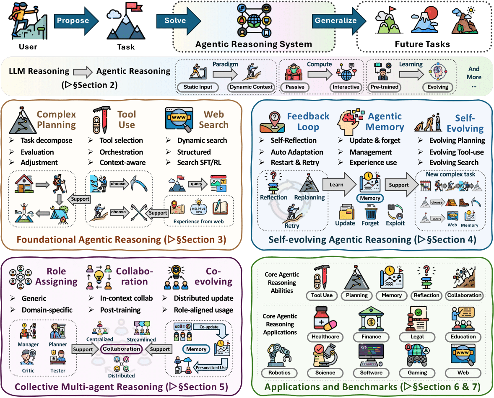
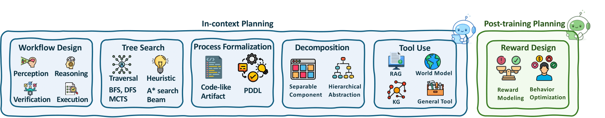
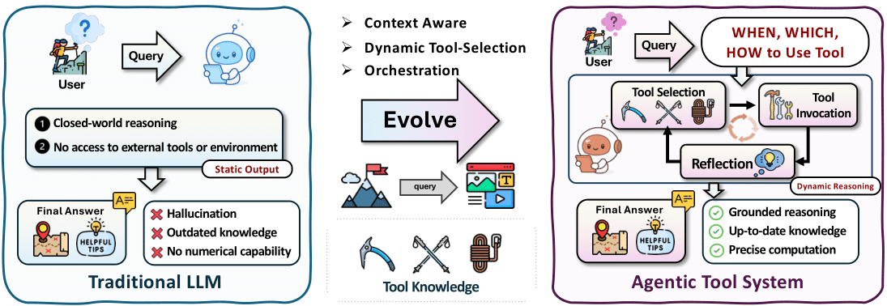
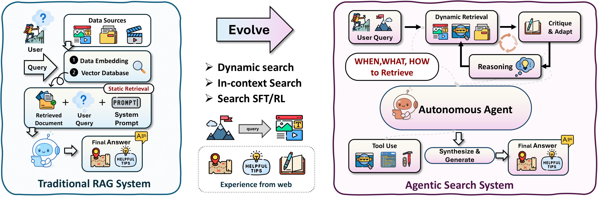
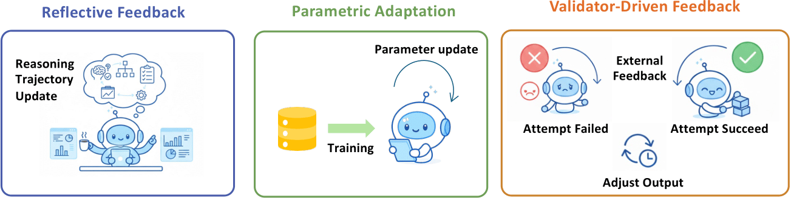
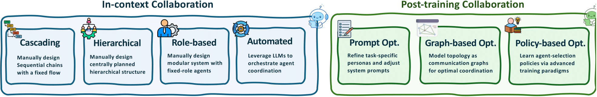
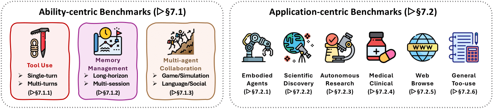

# Awesome Agentic Reasoning Papers

[](https://awesome.re)
[](https://arxiv.org/abs/2601.12538)
[](https://x.com/wei_tianxin/status/2014133714976985538)
[](https://huggingface.co/papers/2601.12538)

[](https://opensource.org/licenses/MIT)
[](https://github.com/weitianxin/Awesome-Agentic-Reasoning/blob/main/CONTRIBUTING.md)


This repository organizes research by thematic areas that integrate reasoning with action, including planning, tool use, search, self-evolution through memory and feedback, multi-agent systems, and real-world applications and benchmarks.

> 📄 **Based on the survey**: *[Agentic Reasoning for Large Language Models: A Survey](https://arxiv.org/abs/2601.12538)*



## 🔔 News
**[01/21/26]** 🚀 We have released a comprehensive survey on ***Agentic Reasoning for Large Language Models***! The paper is now available on [arxiv](https://arxiv.org/abs/2601.12538) and [HuggingFace](https://huggingface.co/papers/2601.12538). We welcome contributions from the community to help expand and improve our survey 🤗!

## 📋 Table of Contents
- [🔔 News](#-news)
- [📋 Table of Contents](#-table-of-contents)
- [🌟 Introduction](#-introduction)
- [🤝 Contributing](#-contributing)
- [📝 Citation](#-citation)
- [🏗️ Foundational Agentic Reasoning](#%EF%B8%8F-foundational-agentic-reasoning)
  - [🗺️ Planning Reasoning](#%EF%B8%8F-planning-reasoning)
  - [🛠️ Tool-Use Optimization](#%EF%B8%8F-tool-use-optimization)
  - [🔍 Agentic Search](#-agentic-search)
- [🧬 Self-evolving Agentic Reasoning](#-self-evolving-agentic-reasoning)
  - [🔄 Agentic Feedback Mechanisms](#-agentic-feedback-mechanisms)
  - [🧠 Agentic Memory](#-agentic-memory)
  - [🚀 Evolving Foundational Agentic Capabilities](#-evolving-foundational-agentic-capabilities)
- [👥 Collective Multi-agent Reasoning](#-collective-multi-agent-reasoning)
  - [🎭 Role Taxonomy of Multi-Agent Systems (MAS)](#-role-taxonomy-of-multi-agent-systems-mas)
  - [🤝 Collaboration and Division of Labor](#-collaboration-and-division-of-labor)
  - [🌱 Multi-Agent Memory and Evolution](#-multi-agent-memory-and-evolution)
- [🎨 Applications](#-applications)
  - [💻 Math Exploration & Vibe Coding Agents](#-math-exploration--vibe-coding-agents)
  - [🔬 Scientific Discovery Agents](#-scientific-discovery-agents)
  - [🤖 Embodied Agents](#-embodied-agents)
  - [🏥 Healthcare & Medicine Agents](#-healthcare--medicine-agents)
  - [🌐 Autonomous Web Exploration & Research Agents](#-autonomous-web-exploration--research-agents)
- [📊 Benchmarks](#-benchmarks)
  - [⚙️ Core Mechanisms of Agentic Reasoning](#-core-mechanisms-of-agentic-reasoning)
    - [Tool Use](#tool-use)
    - [Search](#search)
    - [Memory and Planning](#memory-and-planning)
    - [Multi-Agent System](#multi-agent-system)
  - [🎯 Applications of Agentic Reasoning](#-applications-of-agentic-reasoning)
    - [Embodied Agents](#embodied-agents-1)
    - [Scientific Discovery Agents](#scientific-discovery-agents-1)
    - [Autonomous Research Agents](#autonomous-research-agents)
    - [Medical and Clinical Agents](#medical-and-clinical-agents)
    - [Web Agents](#web-agents)
    - [General Tool-Use Agents](#general-tool-use-agents)

---

## 🌟 Introduction

Bridging thought and action through autonomous agents that reason, act, and learn via continual interaction with their environments. The goal is to enhance agent capabilities by grounding reasoning in action.

We organize agentic reasoning into three layers, each corresponding to a distinct reasoning paradigm under different *environmental dynamics*:

🔹 **Foundational Reasoning.** Core single-agent abilities (planning, tool-use, search) in environments

🔹 **Self-Evolving Reasoning.** Adaptation through feedback, memory, and learning in dynamic settings

🔹 **Collective Reasoning.** Multi-agent coordination, role specialization, and collaborative intelligence

Across these layers, we further identify complementary reasoning paradigms defined by their *optimization settings*.

🔸 **In-Context Reasoning.** Test-time scaling through structured orchestration and adaptive workflows

🔸 **Post-Training Reasoning.** Behavior optimization via RL and supervised fine-tuning


## 🤝 Contributing
This collection is an ongoing effort. We are actively expanding and refining its coverage, and welcome contributions from the community. You can:

- Submit a pull request to add papers or resources
- Open an issue to suggest additional papers or resources
- Email us at twei10@illinois.edu, twli@illinois.edu, liu326@illinois.edu

We regularly update the repository to include new research.


## 📝 Citation

If you find this repository or paper useful, please consider citing the survey paper:

```bibtex
@article{wei2026agentic,
  title={Agentic Reasoning for Large Language Models},
  author={Wei, Tianxin and Li, Ting-Wei and Liu, Zhining and Ning, Xuying and Yang, Ze and Zou, Jiaru and Zeng, Zhichen and Qiu, Ruizhong and Lin, Xiao and Fu, Dongqi and others},
  journal={arXiv preprint arXiv:2601.12538},
  year={2026}
}
```


---

## 🏗️ Foundational Agentic Reasoning

### 🗺️ Planning Reasoning




#### In-context Planning

##### Workflow Design

| Paper | Year |
| --- | --- |
| [LLM+P: Empowering Large Language Models with Optimal Planning Proficiency](https://arxiv.org/abs/2304.11477) | 2023 |
| [PlanBench: An Extensible Benchmark for Evaluating Large Language Models on Planning and Reasoning about Change](https://arxiv.org/abs/2206.10498) | NeurIPS 2023 DB Track |
| [ReWOO: Decoupling Reasoning from Observations for Efficient Augmented Language Models](https://arxiv.org/abs/2305.18323) | 2023 |
| [LLM Reasoners: New Evaluation, Library, and Analysis of Step-by-Step Reasoning with Large Language Models](https://arxiv.org/abs/2404.05221) | 2024 |
| [Least-to-Most Prompting Enables Complex Reasoning in Large Language Models](https://arxiv.org/abs/2205.10625) | ICLR 2023 |
| [Plan-and-Solve Prompting: Improving Zero-Shot Chain-of-Thought Reasoning by Large Language Models](https://arxiv.org/abs/2305.04091) | ACL 2023 |
| [Algorithm of Thoughts: Enhancing Exploration of Ideas in Large Language Models](https://arxiv.org/abs/2308.10379) | ICML 2024 |
| [HuggingGPT: Solving AI Tasks with ChatGPT and its Friends in Hugging Face](https://arxiv.org/abs/2303.17580) | 2023 |
| [Plan, Eliminate, and Track -- Language Models are Good Teachers for Embodied Agents](https://arxiv.org/abs/2305.02412) | 2023 |
| [PERIA: Perceive, Reason, Imagine, Act via Holistic Language and Vision Planning for Manipulation](https://proceedings.neurips.cc/paper_files/paper/2024/hash/1f6af963e891e7efa229c24a1607fa7f-Abstract-Conference.html) | 2024 |
| [Plan-and-Act: Improving Planning of Agents for Long-Horizon Tasks](https://arxiv.org/abs/2503.09572) | 2025 |
| [CodePlan: Repository-level Coding using LLMs and Planning](https://arxiv.org/abs/2309.12499) | FSE 2024 |
| [ReAct: Synergizing Reasoning and Acting in Language Models](https://arxiv.org/abs/2210.03629) | ICLR 2023 |
| [Mind2Web: Towards a Generalist Agent for the Web](https://arxiv.org/abs/2306.06070) | NeurIPS 2023 |
| [WILBUR: Adaptive In-Context Learning for Robust and Accurate Web Agents](https://arxiv.org/abs/2404.05902) | 2024 |
| [Executable Code Actions Elicit Better LLM Agents](https://arxiv.org/abs/2402.01030) | ICML 2024 |
| [Gorilla: Large Language Model Connected with Massive APIs](https://arxiv.org/abs/2305.15334) | 2023 |
| [Reflexion: Language Agents with Verbal Reinforcement Learning](https://arxiv.org/abs/2303.11366) | 2023 |
| [CodeNav: Beyond Tool-Use to Using Real-World Codebases with LLM Agents](https://arxiv.org/abs/2406.12276) | ACL 2024 |
| [MARCO: Multi-Agent Code Optimization with Real-Time Knowledge Integration for High-Performance Computing](https://arxiv.org/abs/2505.03906) | 2025 |
| [Enhancing LLM Reasoning with Multi-Path Collaborative Reactive and Reflection Agents](https://arxiv.org/abs/2501.00430) | 2025 |
| [Pre-Act: Multi-Step Planning and Reasoning Improves Acting in LLM Agents](https://arxiv.org/abs/2505.09970) | 2025 |
| [REST meets ReAct: Self-Improvement for Multi-Step Reasoning LLM Agent](https://arxiv.org/abs/2312.10003) | 2023 |
| [Self-Planning Code Generation with Large Language Models](https://arxiv.org/abs/2303.06689) | TOSEM 2023 |
| [LM-Nav: Robotic Navigation with Large Pre-Trained Models of Language, Vision, and Action](https://arxiv.org/abs/2207.04429) | CoRL 2022 |

##### Tree Search / Algorithm Simulation

| Paper | Year |
| --- | --- |
| [Tree of Thoughts: Deliberate Problem Solving with Large Language Models](https://arxiv.org/abs/2305.10601) | NeurIPS 2023 |
| [Tree Search for Language Model Agents](https://arxiv.org/abs/2407.01476) | 2024 |
| [Tree-Planner: Efficient Planning with Large Language Models](https://arxiv.org/abs/2310.08582) | ICLR 2024 |
| [Q*: Improving Multi-step Reasoning for LLMs with Deliberative Planning](https://arxiv.org/abs/2406.14283) | 2024 |
| [LLM-A*: Large Language Model Enhanced Incremental Heuristic Search on Path Planning](https://arxiv.org/abs/2407.02511v2) | 2024 |
| [Multimodal Chain-of-Thought Reasoning in Language Models](https://arxiv.org/abs/2302.00923) | 2023 |
| [Reasoning with Language Model is Planning with World Model](https://arxiv.org/abs/2305.14992) | NeurIPS 2023 |
| [Agent Q: Advanced Reasoning and Learning for Autonomous AI Agents](https://arxiv.org/abs/2408.07199) | 2024 |
| [Monte Carlo Tree Search Boosts Reasoning via Iterative Preference Learning](https://arxiv.org/abs/2405.00451) | 2024 |
| [Prompt-Based Monte-Carlo Tree Search for Goal-Oriented Dialogue Policy Planning](https://arxiv.org/abs/2305.13660) | 2023 |
| [Large Language Models as Tool Makers](https://arxiv.org/abs/2305.17126) | ICLR 2024 |
| [Everything of Thoughts: Defying the Law of Penrose Triangle for Thought Generation](https://arxiv.org/abs/2311.04254) | 2023 |
| [Tree of Thoughts: Deliberate Problem Solving with Large Language Models](https://openreview.net/forum?id=5Xc1ecxO1h) | NeurIPS 2023 |
| [Alphazero-like Tree-Search can Guide Large Language Model Decoding and Training](https://arxiv.org/abs/2309.17179) | 2023 |
| [Broaden your SCOPE! Efficient Multi-turn Conversation Planning for LLMs with Semantic Space](https://arxiv.org/abs/2503.11586) | 2025 |
| [Self-Evaluation Guided Beam Search for Reasoning](https://arxiv.org/abs/2305.00633) | NeurIPS 2023 |
| [PathFinder: Multimodal Multi-Agent Medical Diagnosis Framework](https://arxiv.org/abs/2502.08916) | 2025 |
| [Discriminator-Guided Embodied Planning for LLM Agent](https://openreview.net/forum?id=TjP1d8PP8l) | ICLR 2025 |
| [Stream of Search (SoS): Learning to Search in Language](https://arxiv.org/abs/2404.03683) | 2024 |
| [System-1.x: Learning to Balance Fast and Slow Planning with Language Models](https://arxiv.org/abs/2407.14414) | 2024 |
| [Agent-E: From Autonomous Web Navigation to Foundational Design Principles in Agentic Systems](https://arxiv.org/abs/2407.13032) | 2024 |
| [Intelligent Virtual Assistants with LLM-based Process Automation](https://arxiv.org/abs/2312.06677) | 2023 |
| [Agent S: An Open Agentic Framework that Uses Computers Like a Human](https://arxiv.org/abs/2410.08164) | 2024 |
| [HyperTree Planning: Enhancing LLM Reasoning via Hierarchical Thinking](https://arxiv.org/abs/2505.02322) | 2025 |
| [Tree-of-Code: A Tree-Structured Exploring Framework for End-to-End Code Generation and Execution in Complex Task Handling](https://arxiv.org/abs/2412.15305) | ACL 2025 |
| [Enhancing LLM-Based Agents via Global Planning and Hierarchical Execution](https://arxiv.org/abs/2504.16563) | 2025 |
| [Divide and Conquer: Grounding LLMs as Efficient Decision-Making Agents via Offline Hierarchical Reinforcement Learning](https://arxiv.org/abs/2505.19761) | 2025 |
| [SWE-Search: Enhancing Software Agents with Monte Carlo Tree Search and Iterative Refinement](https://arxiv.org/abs/2410.20285) | ICLR 2025 |
| [BTGenBot: Behavior Tree Generation for Robotic Tasks with Lightweight LLMs](https://arxiv.org/abs/2403.12761) | 2024 |
| [Do As I Can, Not As I Say: Grounding Language in Robotic Affordances](https://arxiv.org/abs/2204.01691) | CoRL 2022 |
| [Inner Monologue: Embodied Reasoning through Planning with Language Models](https://arxiv.org/abs/2207.05608) | CoRL 2022 |

##### Process Formalization

| Paper | Year |
| --- | --- |
| [Leveraging Pre-trained Large Language Models to Construct and Utilize World Models for Model-based Task Planning](https://arxiv.org/abs/2305.14909) | NeurIPS 2023 |
| [Leveraging Environment Interaction for Automated PDDL Translation and Planning with Large Language Models](https://arxiv.org/abs/2407.12979) | NeurIPS 2024 |
| [Thought of Search: Planning with Language Models Through The Lens of Efficiency](https://arxiv.org/abs/2404.11833) | NeurIPS 2024 |
| [CodePlan: Repository-level Coding using LLMs and Planning](https://arxiv.org/abs/2309.12499) | FSE 2024 |
| [Planning Anything with Rigor: General-Purpose Zero-Shot Planning with LLM-based Formalized Programming](https://arxiv.org/abs/2410.12112) | 2024 |
| [From An LLM Swarm To A PDDL-Empowered HIVE: Planning Self-Executed Instructions In A Multi-Modal Jungle](https://arxiv.org/abs/2412.12839) | 2024 |

##### Decoupling / Decomposition

| Paper | Year |
| --- | --- |
| [ReWOO: Decoupling Reasoning from Observations for Efficient Augmented Language Models](https://arxiv.org/abs/2305.18323) | NeurIPS 2023 |
| [DiffuserLite: Towards Real-time Diffusion Planning](https://arxiv.org/abs/2401.15443) | 2024 |
| [Goal-Space Planning with Subgoal Models](https://www.jmlr.org/papers/volume25/24-0040/24-0040.pdf) | JMLR 2024 |
| [Agent-Oriented Planning in Multi-Agent Systems](https://arxiv.org/abs/2410.02189) | 2024 |
| [GoPlan: Goal-Conditioned Offline Reinforcement Learning by Planning with Learned Models](https://arxiv.org/abs/2310.20025) | 2023 |
| [RetroInText: A Multimodal Large Language Model Enhanced Framework for Retrosynthetic Planning via In-Context Representation Learning](https://openreview.net/forum?id=J6e4hurEKd) | ICLR 2025 |
| [HyperTree Planning: Enhancing LLM Reasoning via Hierarchical Thinking](https://arxiv.org/abs/2505.02322) | 2025 |
| [VisualPredicator: Learning Abstract World Models with Neuro-Symbolic Predicates for Robot Planning](https://arxiv.org/abs/2410.23156) | 2024 |
| [Beyond Autoregression: Discrete Diffusion for Complex Reasoning](https://arxiv.org/abs/2410.14157) | 2024 |
| [PlanAgent: A Multi-modal Large Language Agent for Vehicle Motion Planning](https://arxiv.org/abs/2406.01587) | 2024 |
| [LLaMAR: Long-Horizon Planning for Multi-Agent Robots in Partially Observable Environments](https://arxiv.org/abs/2407.10031) | 2024 |

##### External Aid / Tool Use

| Paper | Year |
| --- | --- |
| [Plan-on-Graph: Self-Correcting Adaptive Planning on Knowledge Graphs](https://arxiv.org/abs/2410.23875) | NeurIPS 2024 |
| [Hierarchical Planning for Complex Tasks with Knowledge Graph-RAG and Symbolic Verification](https://arxiv.org/abs/2504.04578) | 2025 |
| [TeLoGraF: Temporal Logic Planning via Graph-encoded Flow Matching](https://arxiv.org/abs/2505.00562) | 2025 |
| [FlexPlanner: Flexible 3D Floorplanning via Deep Reinforcement Learning in Hybrid Action Space with Multi-Modality Representation](https://proceedings.neurips.cc/paper_files/paper/2024/hash/585e9cf25585612ac27b535457116513-Abstract-Conference.html) | NeurIPS 2024 |
| [Exploratory Retrieval-Augmented Planning For Continual Embodied Instruction Following](https://arxiv.org/abs/2509.08222) | NeurIPS 2024 |
| [Benchmarking Multimodal Retrieval Augmented Generation with Dynamic VQA Dataset and Self-adaptive Planning Agent](https://arxiv.org/abs/2411.02937) | 2024 |
| [RAG over Tables: Hierarchical Memory Index, Multi-Stage Retrieval, and Benchmarking](https://arxiv.org/abs/2504.01346) | 2025 |
| [Reasoning with Language Model is Planning with World Model](https://arxiv.org/abs/2305.14992) | NeurIPS 2023 |
| [Leveraging Pre-trained Large Language Models to Construct and Utilize World Models for Model-based Task Planning](https://arxiv.org/abs/2305.14909) | NeurIPS 2023 |
| [Agent Planning with World Knowledge Model](https://arxiv.org/abs/2405.14205) | NeurIPS 2024 |
| [BehaviorGPT: Smart Agent Simulation for Autonomous Driving with Next-Patch Prediction](https://arxiv.org/abs/2405.17372) | NeurIPS 2024 |
| [DINO-WM: World Models on Pre-trained Visual Features enable Zero-shot Planning](https://arxiv.org/abs/2411.04983) | 2024 |
| [FLIP: Flow-Centric Generative Planning as General-Purpose Manipulation World Model](https://arxiv.org/abs/2412.08261) | 2024 |
| [Continual Reinforcement Learning by Planning with Online World Models](https://arxiv.org/abs/2507.09177) | 2025 |
| [AdaWM: Adaptive World Model based Planning for Autonomous Driving](https://arxiv.org/abs/2501.13072) | 2025 |
| [HuggingGPT: Solving AI Tasks with ChatGPT and its Friends in Hugging Face](https://arxiv.org/abs/2303.17580) | 2023 |
| [Tool-Planner: Task Planning with Clusters across Multiple Tools](https://arxiv.org/abs/2406.03807) | 2024 |
| [RetroInText: A Multimodal Large Language Model Enhanced Framework for Retrosynthetic Planning via In-Context Representation Learning](https://openreview.net/forum?id=J6e4hurEKd) | ICLR 2025 |

#### Post-training Planning

| Paper | Year |
| --- | --- |
| [Reflexion: Language Agents with Verbal Reinforcement Learning](https://arxiv.org/abs/2303.11366) | NeurIPS 2023 |
| [Reflect-then-Plan: Offline Model-Based Planning through a Doubly Bayesian Lens](https://arxiv.org/abs/2506.06261) | 2025 |
| [Rational Decision-Making Agent with Internalized Utility Judgment](https://arxiv.org/abs/2308.12519) | 2023 |
| [Scaling Autonomous Agents via Automatic Reward Modeling](https://arxiv.org/abs/2502.12130) | 2025 |
| [Strategic Planning: A Top-Down Approach to Option Generation](https://openreview.net/forum?id=xkgQWEj9F2&noteId=mt0BbGT077) | 2025 |
| [Non-myopic Generation of Language Models for Reasoning and Planning](https://arxiv.org/abs/2410.17195) | 2024 |
| [Physics-informed Temporal Difference Metric Learning for Robot Motion Planning](https://arxiv.org/abs/2505.05691) | 2025 |
| [Generalizable Motion Planning via Operator Learning](https://arxiv.org/abs/2410.17547) | 2024 |
| [ToolOrchestra: Elevating Intelligence via Efficient Model and Tool Orchestration](https://arxiv.org/abs/2511.21689) | 2025 |
| [Latent Diffusion Planning for Imitation Learning](https://arxiv.org/abs/2504.16925) | 2025 |
| [SafeDiffuser: Safe Planning with Diffusion Probabilistic Models](https://openreview.net/forum?id=ig2wk7kK9J) | ICLR 2023 |
| [ContraDiff: Planning Towards High Return States via Contrastive Learning](https://openreview.net/forum?id=XMOaOigOQo) | ICLR 2025 |
| [Amortized Planning with Large-Scale Transformers: A Case Study on Chess](https://arxiv.org/abs/2402.04494) | NeurIPS 2024 |
| [GOPlan: Goal-conditioned Offline Reinforcement Learning by Planning with Learned Models](https://arxiv.org/abs/2310.20025) | 2023 |
| [A Goal Without a Plan Is Just a Wish: Efficient and Effective Global Planner Training for Long-Horizon Agent Tasks](https://arxiv.org/abs/2510.05608) | 2025 |


### 🛠️ Tool-Use Optimization




#### In-Context Tool-Integration


##### Interleaving Reasoning and Tool Use

| Paper | Year |
| --- | --- |
| [Chain-of-Thought Prompting Elicits Reasoning in Large Language Models](https://arxiv.org/abs/2201.11903) | NeurIPS 2022 |
| [ChatCoT: Tool-Augmented Chain-of-Thought Reasoning on Chat-based Large Language Models](https://aclanthology.org/2023.findings-emnlp.985/) | EMNLP 2023 |
| [MultiTool-CoT: GPT-3 Can Use Multiple External Tools with Chain of Thought Prompting](https://aclanthology.org/2023.acl-short.130/) | ACL 2023 |
| [Interleaving Retrieval with Chain-of-Thought Reasoning for Knowledge-Intensive Multi-Step Questions](https://aclanthology.org/2023.acl-long.557/) | ACL 2023 |
| [ReAct: Synergizing Reasoning and Acting in Language Models](https://arxiv.org/abs/2210.03629) | ICLR 2023 |
| [ART: Automatic Multi-step Reasoning and Tool-use for Large Language Models](https://arxiv.org/abs/2303.09014) | 2023 |

##### Optimizing Context for Tool Interaction

| Paper | Year |
| --- | --- |
| [Tool Documentation Enables Zero-Shot Tool-Usage with Large Language Models](https://arxiv.org/abs/2308.00675) | 2023 |
| [EASYTOOL: Enhancing LLM-based Agents with Concise Tool Instruction](https://arxiv.org/abs/2401.06201) | NAACL 2025 |
| [GEAR: Augmenting Language Models with Generalizable and Efficient Tool Resolution](https://aclanthology.org/2024.eacl-long.7/) | EACL 2024 |
| [AvaTaR: Optimizing LLM Agents for Tool Usage via Contrastive Reasoning](https://proceedings.neurips.cc/paper_files/paper/2024/hash/2db8ce969b000fe0b3fb172490c33ce8-Abstract-Conference.html) | NeurIPS 2024 |


#### Post-training Tool-Integration


##### Bootstrapping of Tool Use via SFT

| Paper | Year |
| --- | --- |
| [Toolformer: Language Models Can Teach Themselves to Use Tools](https://arxiv.org/abs/2302.04761) | NeurIPS 2023 |
| [ToolLLM: Facilitating Large Language Models to Master 16000+ Real-world APIs](https://arxiv.org/abs/2307.16789) | ICLR 2024 |
| [ToolAlpaca: Generalized Tool Learning for Language Models with 3000 Simulated Cases](https://arxiv.org/abs/2306.05301) | 2023 |
| [Chameleon: Plug-and-Play Compositional Reasoning with Large Language Models](https://arxiv.org/abs/2304.09842) | NeurIPS 2023 |
| [RestGPT: Connecting Large Language Models with Real-World RESTful APIs](https://arxiv.org/abs/2306.06624) | 2023 |
| [ADaPT: As-Needed Decomposition and Planning with Language Models](https://arxiv.org/abs/2311.05772) | 2023 |
| [Agent Lumos: Unified and Modular Training for Open-Source Language Agents](https://arxiv.org/abs/2311.05657) | 2023 |
| [Learning to Use Tools via Cooperative and Interactive Agents](https://arxiv.org/abs/2403.03031) | 2024 |
| [Understanding the Effects of RLHF on LLM Generalisation and Diversity](https://arxiv.org/abs/2310.06452) | 2023 |
| [Preserving Diversity in Supervised Fine-Tuning of Large Language Models](https://arxiv.org/abs/2408.16673) | 2024 |
| [Attribute Controlled Fine-tuning for Large Language Models: A Case Study on Detoxification](https://arxiv.org/abs/2410.05559) | EMNLP 2024 |
| [Transformer Copilot: Learning from The Mistake Log in LLM Fine-tuning](https://arxiv.org/abs/2505.16270) | 2025 |
| [iTool: Reinforced Fine-Tuning with Dynamic Deficiency Calibration for Advanced Tool Use](https://arxiv.org/abs/2501.09766v5) | 2025 |
| [START: Self-taught Reasoner with Tools](https://arxiv.org/abs/2503.04625) | 2025 |


##### Mastery of Tool Use via RL

| Paper | Year |
| --- | --- |
| [Tool-integrated Reinforcement Learning for Repo Deep Search](https://arxiv.org/abs/2508.03012) | ICSE 2026 |
| [SoRFT: Issue Resolving with Subtask-oriented Reinforced Fine-Tuning](https://aclanthology.org/2025.acl-long.559/) | ACL 2025 |
| [SWE-RL: Advancing LLM Reasoning via Reinforcement Learning on Open Software Evolution](https://arxiv.org/abs/2502.18449) | 2025 |
| [SWE-Search: Enhancing Software Agents with Monte Carlo Tree Search and Iterative Refinement](https://arxiv.org/abs/2410.20285) | 2024 |
| [ToolRL: Reward is All Tool Learning Needs](https://arxiv.org/abs/2504.13958) | 2025 |
| [RLVMR: Reinforcement Learning with Verifiable Meta-Reasoning Rewards for Robust Long-Horizon Agents](https://arxiv.org/abs/2507.22844) | 2025 |
| [Search-R1: Training LLMs to Reason and Leverage Search Engines with Reinforcement Learning](https://arxiv.org/abs/2503.09516) | 2025 |
| [AutoTool: Dynamic Tool Selection and Integration for Agentic Reasoning](https://arxiv.org/abs/2512.13278) | 2025 |
| [ReSearch: Learning to Reason with Search for LLMs via Reinforcement Learning](https://arxiv.org/abs/2503.19470) | 2025 |
| [Agentic Reinforced Policy Optimization](https://arxiv.org/abs/2507.19849) | 2025 |
| [Agentic Entropy-Balanced Policy Optimization](https://arxiv.org/abs/2510.14545) | 2025 |
| [Tool-Star: Empowering LLM-Brained Multi-Tool Reasoner via Reinforcement Learning](https://arxiv.org/abs/2505.16410) | 2025 |
| [DeepAgent: A General Reasoning Agent with Scalable Toolsets](https://arxiv.org/pdf/2510.216180) | 2025 |
| [Toward Effective Tool-Integrated Reasoning via Self-Evolved Preference Learning](https://arxiv.org/abs/2509.23285) | 2025 |
| [Demystifying Reinforcement Learning in Agentic Reasoning](https://arxiv.org/abs/2510.11701) | 2025 |
| [Reinforcement Pre-Training](https://arxiv.org/abs/2506.08007) | 2025 |
| [ReTool: Reinforcement Learning for Strategic Tool Use in LLMs](https://arxiv.org/abs/2504.11536) | 2025 |
| [ZeroSearch: Incentivize the Search Capability of LLMs Without Searching](https://arxiv.org/abs/2505.04588) | 2025 |
| [Kimi k1.5: Scaling Reinforcement Learning with LLMs](https://arxiv.org/abs/2501.12599) | 2025 |
| [Gemini 2.5: Pushing the Frontier with Advanced Reasoning and Next Generation Agentic Capabilities](https://arxiv.org/abs/2507.06261) | 2025 |
| [Kimi k2: Open Agentic Intelligence](https://arxiv.org/abs/2507.20534) | 2025 |
| [GLM-4.5: Agentic, Reasoning, and Coding (ARC) Foundation Models](https://arxiv.org/abs/2508.06471) | 2025 |
| [Learning How to Use Tools, Not Just When: Pattern-Aware Tool-Integrated Reasoning](https://arxiv.org/pdf/2509.23292) | 2025 |
| [SCRIBE: Structured Mid-Level Supervision for Tool-Using Language Models](https://arxiv.org/pdf/2601.03555) | 2026 |
| [TaTToo: Tool-Grounded Thinking PRM for Test-Time Scaling in Tabular Reasoning](https://arxiv.org/abs/2510.06217) | 2025 |

#### Orchestration-based Tool-Integration

##### Agentic Pipelines for Tool Orchestration

| Paper | Year |
| --- | --- |
| [ToolPlanner: A Tool Augmented LLM for Multi Granularity Instructions with Path Planning and Feedback](https://arxiv.org/abs/2409.14826) | 2025 |
| [Advancing Tool-Augmented Large Language Models via Meta-Verification and Reflection Learning](https://arxiv.org/abs/2506.04625) | KDD 2025 |
| [OctoTools: An Agentic Framework with Extensible Tools for Complex Reasoning](https://arxiv.org/abs/2502.11271) | 2025 |
| [Chain-of-Tools: Utilizing Massive Unseen Tools in the CoT Reasoning of Frozen Language Models](https://arxiv.org/abs/2503.16779) | 2025 |
| [PyVision: Agentic Vision with Dynamic Tooling](https://arxiv.org/abs/2507.07998) | 2025 |
| [Learning to Use Tools via Cooperative and Interactive Agents](https://arxiv.org/abs/2403.03031) | 2024 |
| [El Agente: An Autonomous Agent for Quantum Chemistry](https://arxiv.org/abs/2505.02484) | 2025 |

##### Tool Representations for Orchestration

| Paper | Year |
| --- | --- |
| [ToolExpNet: Optimizing Multi-Tool Selection in LLMs with Similarity and Dependency-Aware Experience Networks](https://aclanthology.org/2025.findings-acl.811/) | ACL (Findings) 2025 |
| [T^2Agent: A Tool-augmented Multimodal Misinformation Detection Agent with Monte Carlo Tree Search](https://arxiv.org/abs/2505.19768) | 2025 |
| [ToolChain*: Efficient Action Space Navigation in Large Language Models with A* Search](https://arxiv.org/abs/2310.13227) | 2023 |
| [ToolRerank: Adaptive and Hierarchy-Aware Reranking for Tool Retrieval](https://aclanthology.org/2024.lrec-main.1413/) | COLING 2024 |

### 🔍 Agentic Search




#### In-Context Search

##### Interleaving Reasoning and Search

| Paper | Year |
| --- | --- |
| [ReAct: Synergizing Reasoning and Acting in Language Models](https://arxiv.org/abs/2210.03629) | ICLR 2023 |
| [Measuring and Narrowing the Compositionality Gap in Language Models](https://arxiv.org/abs/2210.03350) | 2022 |
| [Interleaving Retrieval with Chain-of-Thought Reasoning for Knowledge-Intensive Multi-Step Questions](https://arxiv.org/abs/2212.10509) | 2022 |
| [Self-RAG: Learning to Retrieve, Generate, and Critique through Self-Reflection](https://arxiv.org/abs/2310.11511) | NeurIPS Workshop 2023 |
| [Benchmarking Multimodal Retrieval Augmented Generation with Dynamic VQA Dataset and Self-Adaptive Planning Agent](https://arxiv.org/abs/2411.02937) | 2024 |
| [DeepRAG: Thinking to Retrieve Step by Step for Large Language Models](https://arxiv.org/abs/2502.01142) | 2025 |
| [MC-Search: Benchmarking Multimodal Agentic RAG with Structured Reasoning Chains](https://openreview.net/forum?id=S2zaYgT7Ic) | NeurIPS Workshop 2025 |

##### Structure-Enhanced Search

| Paper | Year |
| --- | --- |
| [Agent-G: An Agentic Framework for Graph Retrieval Augmented Generation](https://openreview.net/forum?id=g2C947jjjQ) | 2025 |
| [MC-Search: Benchmarking Multimodal Agentic RAG with Structured Reasoning Chains](https://openreview.net/forum?id=S2zaYgT7Ic) | NeurIPS Workshop 2025 |
| [GeAR: Graph-Enhanced Agent for Retrieval-Augmented Generation](https://arxiv.org/abs/2412.18431) | 2024 |
| [Learning to Retrieve and Reason on Knowledge Graph through Active Self-Reflection](https://arxiv.org/abs/2502.14932) | 2025 |

#### Post-Training Search


##### SFT-Based Agentic Search

| Paper | Year |
| --- | --- |
| [Toolformer: Language Models Can Teach Themselves to Use Tools](https://proceedings.neurips.cc/paper_files/paper/2023/file/d842425e4bf79ba039352da0f658a906-Paper-Conference.pdf) | NeurIPS 2023 |
| [INTERS: Unlocking the Power of Large Language Models in Search with Instruction Tuning](https://arxiv.org/abs/2401.06532) | 2024 |
| [RAG-Studio: Towards In-Domain Adaptation of Retrieval Augmented Generation through Self-Alignment](https://aclanthology.org/2024.findings-emnlp.41/) | EMNLP (Findings) 2024 |
| [RAFT: Adapting Language Model to Domain Specific RAG](https://arxiv.org/abs/2403.10131) | 2024 |
| [Search-o1: Agentic search-enhanced large reasoning models](https://arxiv.org/abs/2501.05366) | 2025 |
| [RA-DIT: Retrieval-Augmented Dual Instruction Tuning](https://arxiv.org/abs/2310.01352) | ICLR 2023 |
| [SFR-RAG: Towards Contextually Faithful LLMs](https://arxiv.org/abs/2409.09916) | 2024 |

##### RL-Based Agentic Search

| Paper | Year |
| --- | --- |
| [WebGPT: Browser-assisted question-answering with human feedback](https://arxiv.org/abs/2112.09332) | 2021 |
| [RAG-RL: Advancing Retrieval-Augmented Generation via RL and Curriculum Learning](https://arxiv.org/abs/2503.12759) | 2025 |
| [Search-R1: Training LLMs to Reason and Leverage Search Engines with Reinforcement Learning](https://arxiv.org/abs/2503.09516) | 2025 |
| [KBQA-R1: Reinforcing Large Language Models for Knowledge Base Question Answering](https://arxiv.org/abs/2512.10999) | 2025 |
| [DeepResearcher: Scaling Deep Research via Reinforcement Learning in Real-World Environments](https://arxiv.org/abs/2504.03160) | 2025 |
| [ReSearch: Learning to Reason with Search for LLMs via Reinforcement Learning](https://arxiv.org/abs/2503.19470) | 2025 |
| [ReARTeR: Retrieval-Augmented Reasoning with Trustworthy Process Rewarding](https://arxiv.org/abs/2501.07861) | 2025 |

---

## 🧬 Self-evolving Agentic Reasoning

### 🔄 Agentic Feedback Mechanisms




#### Reflective Feedback

| Paper | Year |
| --- | --- |
| [Reflexion: Language Agents with Verbal Reinforcement Learning](https://arxiv.org/abs/2303.11366) | NeurIPS 2023 |
| [Self-Refine: Iterative Refinement with Self-Feedback](https://arxiv.org/abs/2303.17651) | NeurIPS 2023 |
| [Enable Language Models to Implicitly Learn Self-Improvement From Data](https://arxiv.org/abs/2310.00898) | ICLR 2024 |
| [A Survey of Self-Evolving Agents: What, When, How, and Where to Evolve](https://arxiv.org/abs/2507.21046) | TMLR 2025 |
| [Tree of Thoughts: Deliberate Problem Solving with Large Language Models](https://arxiv.org/abs/2305.10601) | NeurIPS 2023 |
| [Graph of Thoughts: Solving Elaborate Problems with Large Language Models](https://arxiv.org/abs/2308.09687) | AAAI 2024 |
| [Zero-Shot Verification-Guided Chain of Thoughts](https://arxiv.org/abs/2501.13122) | 2025 |
| [ReAct: Synergizing Reasoning and Acting in Language Models](https://arxiv.org/abs/2210.03629) | ICLR 2023 |
| [WebGPT: Browser-assisted Question-Answering with Human Feedback](https://arxiv.org/abs/2112.09332) | 2021 |
| [MemGPT: Towards LLMs as Operating Systems](https://arxiv.org/abs/2310.08560) | 2023 |
| [Voyager: An Open-Ended Embodied Agent with Large Language Models](https://arxiv.org/abs/2305.16291) | 2023 |

#### Parametric Adaptation

| Paper | Year |
| --- | --- |
| [AgentTuning: Enabling Generalized Agent Abilities for LLMs](https://arxiv.org/abs/2310.12823) | 2023 |
| [ReST meets ReAct: Self-Improvement for Multi-Step Reasoning LLM Agent](https://arxiv.org/abs/2312.10003) | 2023 |
| [Re-ReST: Reflection-Reinforced Self-Training for Language Agents](https://arxiv.org/abs/2406.01495) | 2024 |
| [Distilling Step-by-Step! Outperforming Larger Language Models with Less Training Data and Smaller Model Sizes](https://arxiv.org/abs/2305.02301) | 2023 |
| [Deep Reinforcement Learning from Human Preferences](https://arxiv.org/abs/1706.03741) | NeurIPS 2017 |
| [Direct Preference Optimization: Your Language Model is Secretly a Reward Model](https://arxiv.org/abs/2305.18290) | NeurIPS 2023 |
| [Constitutional AI: Harmlessness from AI Feedback](https://arxiv.org/abs/2212.08073) | 2022 |
| [ReflectEvo: Improving Meta Introspection of Small LLMs by Learning Self-Reflection](https://aclanthology.org/2025.findings-acl.871/) | ACL (Findings) 2025 |

#### Validator-Driven Feedback

| Paper | Year |
| --- | --- |
| [ReZero: Enhancing LLM search ability by trying one-more-time](https://arxiv.org/abs/2504.11001) | 2025 |
| [Are Retrials All You Need? Enhancing Large Language Model Reasoning Without Verbalized Feedback](https://arxiv.org/abs/2504.12951) | 2025 |
| [CodeRL: Mastering Code Generation through Pretrained Models and Deep Reinforcement Learning](https://arxiv.org/abs/2207.01780) | 2022 |
| [LEVER: Learning to Verify Language-to-Code Generation with Execution](https://arxiv.org/abs/2302.08468) | ICML 2023 |
| [SWE-bench: Can Language Models Resolve Real-world Github Issues?](https://arxiv.org/abs/2310.06770) | ICLR 2024 |
| [Do As I Can, Not As I Say: Grounding Language in Robotic Affordances](https://arxiv.org/abs/2204.01691) | CoRL 2022 |
| [PaLM-E: An Embodied Multimodal Language Model](https://arxiv.org/abs/2303.03378) | ICML 2023 |
| [Reflect, Retry, Reward: Self-Improving LLMs via Reinforcement Learning](https://arxiv.org/abs/2505.24726) | 2025 |

### 🧠 Agentic Memory


#### Agentic Use of Flat Memory

##### Factual Memory

| Paper | Year |
| --- | --- |
| [Retrieval-Augmented Generation for Knowledge-Intensive NLP Tasks](https://proceedings.neurips.cc/paper/2020/hash/6b493230205f780e1bc26945df7481e5-Abstract.html) | NeurIPS 2020 |
| [Self-RAG: Learning to Retrieve, Generate, and Critique through Self-Reflection](https://openreview.net/forum?id=hSyW5go0v8) | ICLR 2024 |
| [MemoryBank: Enhancing Large Language Models with Long-Term Memory](https://arxiv.org/abs/2305.10250) | 2023 |
| [LlamaIndex](https://github.com/jerryjliu/llama_index) | 2022 |
| [MemGPT: Towards LLMs as Operating Systems](https://arxiv.org/abs/2310.08560) | 2023 |
| [RET-LLM: Towards a General Read-Write Memory for Large Language Models](https://arxiv.org/abs/2305.14322) | 2023 |
| [SCM: Enhancing Large Language Model with Self-Controlled Memory Framework](https://arxiv.org/abs/2304.13343) | 2023 |
| [Evaluating Very Long-Term Conversational Memory of LLM Agents](https://arxiv.org/abs/2402.17753) | 2024 |
| [LongMemEval: Benchmarking Chat Assistants on Long-Term Interactive Memory](https://arxiv.org/abs/2410.10813) | 2024 |
| [SELFGOAL: Your Language Agents Already Know How to Achieve High-level Goals](https://aclanthology.org/2025.naacl-long.36/) | NAACL 2025 |
| [FinMem: A Performance-Enhanced LLM Trading Agent with Layered Memory and Character Design](https://arxiv.org/abs/2311.13743) | 2023 |
| [A-mem: Agentic memory for llm agents](https://arxiv.org/abs/2502.12110) | 2025 |
| [In Prospect and Retrospect: Reflective Memory Management for Long-term Personalized Dialogue Agents](https://arxiv.org/abs/2503.08026) | 2025 |
| [Zep: A Temporal Knowledge Graph Architecture for Agent Memory](https://arxiv.org/abs/2501.13956) | 2025 |
| [MIRIX: Multi-Agent Memory System for LLM-Based Agents](https://arxiv.org/abs/2507.07957) | 2025 |
| [MemOS: An Operating System for Memory-Augmented Generation (MAG) in Large Language Models](https://arxiv.org/abs/2505.22101) | 2025 |
| [LightMem: Lightweight and Efficient Memory-Augmented Generation](https://arxiv.org/abs/2510.18866) | 2025 |
| [Nemori: Self-Organizing Agent Memory Inspired by Cognitive Science](https://arxiv.org/abs/2508.03341) | 2025 |

##### Experience Memory

| Paper | Year |
| --- | --- |
| [Agent Workflow Memory](https://arxiv.org/abs/2409.07429) | 2024 |
| [Sleep-time Compute: Beyond Inference Scaling at Test-time](https://arxiv.org/abs/2504.13171) | 2025 |
| [Dynamic Cheatsheet: Test-Time Learning with Adaptive Memory](https://arxiv.org/abs/2504.07952) | 2025 |
| [Agentic Context Engineering: Evolving Contexts for Self-Improving Language Models](https://arxiv.org/abs/2510.04618) | 2025 |
| [ReasoningBank: Scaling Agent Self-Evolving with Reasoning Memory](https://arxiv.org/abs/2509.25140) | 2025 |
| [Evo-Memory: Benchmarking LLM Agent Test-time Learning with Self-Evolving Memory](https://arxiv.org/abs/2511.20857) | 2025 |

#### Structured Use of Memory

| Paper | Year |
| --- | --- |
| [RepoGraph: Enhancing AI Software Engineering with Repository-level Code Graph](https://arxiv.org/abs/2410.14684) | 2024 |
| [From Local to Global: A Graph RAG Approach to Query-Focused Summarization](https://arxiv.org/abs/2404.16130) | 2024 |
| [Mem0: Building Production-Ready AI Agents with Scalable Long-Term Memory](https://arxiv.org/abs/2504.19413) | 2025 |
| [Zep: A Temporal Knowledge Graph Architecture for Agent Memory](https://arxiv.org/abs/2501.13956) | 2025 |
| [From Isolated Conversations to Hierarchical Schemas: Dynamic Tree Memory Representation for LLMs](https://arxiv.org/abs/2410.14052) | 2024 |
| [AutoFlow: Automated Workflow Generation for Large Language Model Agents](https://arxiv.org/abs/2407.12821) | 2024 |
| [AFlow: Automating Agentic Workflow Generation](https://arxiv.org/abs/2410.10762) | ICLR 2025 |
| [FlowMind: Automatic Workflow Generation with LLMs](https://arxiv.org/abs/2404.13050) | 2024 |
| [Seeing, Listening, Remembering, and Reasoning: A Multimodal Agent with Long-Term Memory (M3-Agent)](https://arxiv.org/abs/2508.09736) | 2025 |
| [Agent-ScanKit: Unraveling Memory and Reasoning of Multimodal Agents via Sensitivity Perturbations](https://arxiv.org/abs/2510.00496) | 2025 |
| [Optimus-1: Hybrid Multimodal Memory Empowered Agents Excel in Long-Horizon Tasks](https://arxiv.org/abs/2408.03615) | NeurIPS 2024 |
| [RAP: Retrieval-Augmented Planning with Contextual Memory for Multimodal LLM Agents](https://arxiv.org/abs/2402.03610) | 2024 |

#### Post-training Memory Control

| Paper | Year |
| --- | --- |
| [MemAgent: Reshaping Long-Context LLM with Multi-Conv RL-based Memory Agent](https://arxiv.org/abs/2507.02259) | 2025 |
| [MEM1: Learning to Synergize Memory and Reasoning for Efficient Long-Horizon Agents](https://arxiv.org/abs/2506.15841) | 2025 |
| [Memory-R1: Enhancing Large Language Model Agents to Manage and Utilize Memories via Reinforcement Learning](https://arxiv.org/abs/2508.19828) | 2025 |
| [Mem-alpha: Learning Memory Construction via Reinforcement Learning](https://arxiv.org/abs/2509.25911) | 2025 |
| [Memory as Action: Autonomous Context Curation for Long-Horizon Agentic Tasks](https://arxiv.org/abs/2510.12635) | 2025 |
| [Agent Learning via Early Experience](https://arxiv.org/abs/2510.08558) | 2025 |
| [Agentic Memory: Learning Unified Long-Term and Short-Term Memory Management for Large Language Model Agents](https://arxiv.org/abs/2601.01885) | 2026 |
| [MemRL: Self-Evolving Agents via Runtime Reinforcement Learning on Episodic Memory](https://arxiv.org/abs/2601.03192) | 2026 |


### 🚀 Evolving Foundational Agentic Capabilities


#### Self-evolving Planning

| Paper | Year |
| --- | --- |
| [Self-challenging language model agents](https://arxiv.org/abs/2506.01716) | 2025 |
| [Self-rewarding language models](https://arxiv.org/abs/2401.10020) | ICML 2024 |
| [RLSR: Reinforcement Learning from Self Reward](https://arxiv.org/abs/2505.08827) | 2025 |
| [Self: Self-evolution with language feedback](https://arxiv.org/abs/2310.00533) | 2023 |
| [Training language models to self-correct via reinforcement learning](https://arxiv.org/abs/2409.12917) | 2024 |
| [TextGrad: Differentiable Text Feedback for Language Models](https://arxiv.org/abs/2406.07496) | 2024 |
| [AutoRule: Reasoning Chain-of-thought Extracted Rule-based Rewards Improve Preference Learning](https://arxiv.org/abs/2506.15651v1) | 2025 |
| [AgentGen: Enhancing Planning Abilities for Large Language Model based Agent via Environment and Task Generation](https://arxiv.org/abs/2408.00764) | 2024 |
| [Reflexion: Language agents with verbal reinforcement learning](https://arxiv.org/abs/2303.11366) | NeurIPS 2023 |
| [Adaplanner: Adaptive planning from feedback with language models](https://openreview.net/forum?id=rnKgbKmelt) | NeurIPS 2023 |
| [Self-refine: Iterative refinement with self-feedback](https://arxiv.org/abs/2303.17651) | NeurIPS 2023 |
| [A self-improving coding agent](https://arxiv.org/abs/2504.15228) | 2025 |
| [Ragen: Understanding self-evolution in llm agents via multi-turn reinforcement learning](https://arxiv.org/abs/2504.20073) | 2025 |
| [DYSTIL: Dynamic Strategy Induction with Large Language Models for Reinforcement Learning](https://arxiv.org/abs/2505.03209) | 2025 |

#### Self-evolving Tool-use

| Paper | Year |
| --- | --- |
| [Large Language Models as Tool Makers](https://openreview.net/forum?id=qV83K9d5WB) | ICLR 2024 |
| [CRAFT: Customizing LLMs by Creating and Retrieving from Specialized Toolsets](https://openreview.net/forum?id=G0vdDSt9XM) | ICLR 2024 |
| [CREATOR: Tool Creation for Disentangling Abstract and Concrete Reasoning of Large Language Models](https://aclanthology.org/2023.findings-emnlp.462/) | EMNLP 2023 |
| [LLM Agents Making Agent Tools](https://arxiv.org/abs/2502.11705) | 2025 |

#### Self-evolving Search for Memory Retrieval

| Paper | Year |
| --- | --- |
| [Retrieval-Augmented Generation for Knowledge-Intensive NLP Tasks](https://proceedings.neurips.cc/paper/2020/hash/6b493230205f780e1bc26945df7481e5-Abstract.html) | NeurIPS 2020 |
| [Self-RAG: Learning to Retrieve, Generate, and Critique through Self-Reflection](https://openreview.net/forum?id=hSyW5go0v8) | ICLR 2024 |
| [MemoryBank: Enhancing Large Language Models with Long-Term Memory](https://arxiv.org/abs/2305.10250) | 2023 |
| [MemGPT: Towards LLMs as Operating Systems](https://arxiv.org/abs/2310.08560) | 2023 |
| [Agent Workflow Memory](https://arxiv.org/abs/2409.07429) | 2024 |
| [Dynamic Cheatsheet: Test-time learning with adaptive memory](https://arxiv.org/abs/2504.07952) | 2025 |
| [Reflexion: Language agents with verbal reinforcement learning](https://arxiv.org/abs/2303.11366) | NeurIPS 2023 |
| [ReasoningBank: Scaling Agent Self-Evolving with Reasoning Memory](https://arxiv.org/abs/2509.25140) | 2025 |
| [Agentic Context Engineering: Evolving Contexts for Self-Improving Language Models](https://arxiv.org/abs/2510.04618) | 2025 |
| [AutoFlow: Automated Workflow Generation for Large Language Model Agents](https://arxiv.org/abs/2407.12821) | 2024 |
| [AFlow: Automating Agentic Workflow Generation](https://openreview.net/forum?id=z5uVAKwmjf) | ICLR 2025 |
| [FlowMind: Automatic Workflow Generation with LLMs](https://arxiv.org/abs/) | 2024 |
| [RepoGraph: Enhancing AI Software Engineering with Repository-level Code Graph](https://arxiv.org/abs/2410.14684) | 2024 |
| [From Local to Global: A Graph RAG Approach to Query-Focused Summarization](https://arxiv.org/abs/2404.16130) | 2024 |
| [Mem0: Building Production-Ready AI Agents with Scalable Long-Term Memory](https://arxiv.org/abs/2504.19413) | 2025 |
| [Zep: A Temporal Knowledge Graph Architecture for Agent Memory](https://arxiv.org/abs/2501.13956) | 2025 |
| [MemOS: An Operating System for Memory-Augmented Generation (MAG) in Large Language Models](https://arxiv.org/abs/2505.22101) | 2025 |
| [Memory as Action: Autonomous Context Curation for Long-Horizon Agentic Tasks](https://arxiv.org/abs/2510.12635) | 2025 |

---

## 👥 Collective Multi-agent Reasoning


### 🤝 Collaboration and Division of Labor




#### In-context Collaboration


##### Manually Crafted Pipelines

| Paper | Year |
| --- | --- |
| [AgentOrchestra: A Hierarchical Multi-Agent Framework for General-Purpose Task Solving](https://arxiv.org/abs/2506.12508) | 2025 |
| [MetaGPT: Meta Programming for A Multi-Agent Collaborative Framework](https://openreview.net/forum?id=VtmBAGCN7o) | ICLR 2024 |
| [SurgRAW: Multi-agent workflow with chain-of-thought reasoning for surgical intelligence](https://arxiv.org/abs/2503.10265) | 2025 |
| [Collab-RAG: Boosting retrieval-augmented generation for complex question answering via white-box and black-box llm collaboration](https://arxiv.org/abs/2504.04915) | 2025 |
| [MA-RAG: Multi-Agent Retrieval-Augmented Generation via Collaborative Chain-of-Thought Reasoning](https://arxiv.org/abs/2505.20096) | 2025 |
| [Chain of Agents: Large Language Models Collaborating on Long-Context Tasks](https://openreview.net/forum?id=LuCLf4BJsr) | NeurIPS 2024 |
| [AutoAgents: a framework for automatic agent generation](https://www.ijcai.org/proceedings/2024/3) | IJCAI 2024 |
| [RAG-KG-IL: A Multi-Agent Hybrid Framework for Reducing Hallucinations and Enhancing LLM Reasoning](https://arxiv.org/abs/2503.13514) | 2025 |
| [SMoA: Improving Multi-agent Large Language Models with Sparse Mixture-of-Agents](https://arxiv.org/abs/2411.03284) | 2024 |
| [MDocAgent: A multi-modal multi-agent framework for document understanding](https://arxiv.org/abs/2503.13964) | 2025 |

##### LLM-Driven Pipelines

| Paper | Year |
| --- | --- |
| [AutoML-Agent: A multi-agent llm framework for full-pipeline automl](https://arxiv.org/abs/2410.02958) | 2024 |
| [Magentic-One: A generalist multi-agent system for solving complex tasks](https://arxiv.org/abs/2411.04468) | 2024 |
| [MAS-GPT: Training LLMs to build LLM-based multi-agent systems](https://arxiv.org/abs/2503.03686) | 2025 |
| [MetaAgent: Automatically Constructing Multi-Agent Systems Based on Finite State Machines](https://arxiv.org/abs/2507.22606) | 2025 |
| [Agent-oriented planning in multi-agent systems](https://arxiv.org/abs/2410.02189) | 2024 |
| [AgentRouter: A Knowledge-Graph-Guided LLM Router for Collaborative Multi-Agent Question Answering](https://arxiv.org/abs/2510.05445) | 2025 |
| [Talk to Right Specialists: Routing and planning in multi-agent system for question answering](https://arxiv.org/abs/2501.07813) | 2025 |

##### Theory-of-Mind-Augmented Collaboration

| Paper | Year |
| --- | --- |
| [Theory of mind for multi-agent collaboration via large language models](https://arxiv.org/abs/2310.10701) | 2023 |
| [Hypothetical Minds: Scaffolding theory of mind for multi-agent tasks with large language models](https://arxiv.org/abs/2407.07086) | 2024 |
| [MindForge: Empowering Embodied Agents with Theory of Mind for Lifelong Collaborative Learning](https://arxiv.org/abs/2411.12977) | 2024 |
| [How large language models encode theory-of-mind: a study on sparse parameter patterns](https://www.nature.com/articles/s44387-025-00031-9) | npj Artificial Intelligence 2025 |
| [Large Language Models as Theory of Mind Aware Generative Agents with Counterfactual Reflection](https://arxiv.org/abs/2501.15355) | 2025 |
| [BeliefNest: A Joint Action Simulator for Embodied Agents with Theory of Mind](https://arxiv.org/abs/2505.12321) | 2025 |

#### Post-training Collaboration

##### Multi-agent Prompt Optimization

| Paper | Year |
| --- | --- |
| [AutoAgents: A Framework for Automatic Agent Generation](https://arxiv.org/abs/2309.17288) | IJCAI 2024 |
| [Unleashing the Emergent Cognitive Synergy in Large Language Models: A Task-Solving Agent through Multi-Persona Self-Collaboration](https://aclanthology.org/2024.naacl-long.15/) | NAACL 2024 |
| [DSPy Assertions: Computational Constraints for Self-Refining Language Model Pipelines](https://arxiv.org/abs/2312.13382) | 2023 |
| [Multi-agent Design: Optimizing Agents with Better Prompts and Topologies](https://arxiv.org/abs/2502.02533) | 2025 |
| [Automatic Prompt Optimization with "Gradient Descent" and Beam Search](https://arxiv.org/abs/2305.03495) | 2023 |

##### Graph-based Topology Generation

| Paper | Year |
| --- | --- |
| [Learning Multi-Agent Communication from Graph Modeling Perspective](https://arxiv.org/abs/2405.08550) | 2024 |
| [G-Designer: Architecting Multi-agent Communication Topologies via Graph Neural Networks](https://arxiv.org/abs/2410.11782) | 2024 |
| [Graph Diffusion for Robust Multi-Agent Coordination](https://openreview.net/forum?id=T5IZ32ImAB) | ICML 2025 |
| [Cut the Crap: An Economical Communication Pipeline for LLM-based Multi-Agent Systems](https://arxiv.org/abs/2410.02506) | 2024 |
| [Adaptive Graph Pruning for Multi-Agent Communication](https://arxiv.org/abs/2506.02951) | 2025 |
| [G-Safeguard: A Topology-Guided Security Lens and Treatment on LLM-based Multi-Agent Systems](https://arxiv.org/abs/2502.11127) | 2025 |
| [AFlow: Automating Agentic Workflow Generation](https://arxiv.org/abs/2410.10762) | ICLR 2025 |
| [Multi-agent Design: Optimizing Agents with Better Prompts and Topologies](https://arxiv.org/abs/2502.02533) | 2025 |
| [Multi-Agent Architecture Search via Agentic Supernet](https://arxiv.org/abs/2502.04180) | 2025 |
| [DynaSwarm: Dynamically Graph Structure Selection for LLM-based Multi-Agent System](https://arxiv.org/abs/2507.23261) | 2025 |
| [GPTSwarm: Language Agents as Optimizable Graphs](https://arxiv.org/abs/2402.16823) | ICML 2024 |

##### Policy-based Topology Generation

| Paper | Year |
| --- | --- |
| [MASRouter: Learning to Route LLMs for Multi-Agent Systems](https://arxiv.org/abs/2502.11133) | 2025 |
| [RCR-Router: Efficient Role-Aware Context Routing for Multi-Agent LLM Systems with Structured Memory](https://arxiv.org/abs/2508.04903) | 2025 |
| [xRouter: Training Cost-Aware LLMs Orchestration System via Reinforcement Learning](https://arxiv.org/abs/2510.08439) | 2025 |
| [Optimal-Agent-Selection: State-Aware Routing Framework for Efficient Multi-Agent Collaboration](https://arxiv.org/abs/2511.02200) | 2025 |
| [LLM Collaboration with Multi-Agent Reinforcement Learning](https://arxiv.org/abs/2508.04652) | 2025 |
| [Heterogeneous Group-Based Reinforcement Learning for LLM-based Multi-Agent Systems](https://arxiv.org/abs/2506.02718) | 2025 |
| [Enhancing Multi-Agent Systems via Reinforcement Learning with LLM-based Planner and Graph-based Policy](https://arxiv.org/abs/2503.10049) | 2025 |
| [LAMARL: LLM-Aided Multi-Agent Reinforcement Learning for Cooperative Policy Generation](https://arxiv.org/abs/2506.01538) | IEEE RA-L 2025 |
| [MAPoRL: Multi-Agent Post-Co-Training for Collaborative Large Language Models with Reinforcement Learning](https://arxiv.org/abs/2502.18439) | 2025 |
| [Reflective Multi-Agent Collaboration Based on Large Language Models](https://openreview.net/forum?id=wWiAR5mqXq&referrer=%5Bthe%20profile%20of%20Zeyu%20Zhang%5D(%2Fprofile%3Fid%3D~Zeyu_Zhang6)) | NeurIPS 2024 |
| [Sirius: Self-Improving Multi-Agent Systems via Bootstrapped Reasoning](https://arxiv.org/abs/2502.04780) | 2025 |
| [Multiagent Finetuning: Self Improvement with Diverse Reasoning Chains](https://arxiv.org/abs/2501.05707) | 2025 |
| [M3HF: Multi-Agent Reinforcement Learning from Multi-Phase Human Feedback of Mixed Quality](https://arxiv.org/abs/2503.02077) | 2025 |
| [O-MAPL: Offline Multi-Agent Preference Learning](https://arxiv.org/abs/2501.18944) | 2025 |

### 🌱 Multi-Agent Memory and Evolution


#### From Single-Agent Evolution to Multi-Agent Evolution

##### Intra-test-time Evolution

| Paper | Year |
| --- | --- |
| [Reflexion: Language Agents with Verbal Reinforcement Learning](https://arxiv.org/abs/2303.11366) | NeurIPS 2023 |
| [Self-Refine: Iterative Refinement with Self-Feedback](https://arxiv.org/abs/2303.17651) | NeurIPS 2023 |
| [AdaPlanner: Adaptive Planning from Feedback with Language Models](https://arxiv.org/abs/2305.16653) | NeurIPS 2023 |
| [TrustAgent: Towards Safe and Trustworthy LLM-based Agents through Agent Constitution](https://arxiv.org/abs/2402.01586) | TiFA 2024 |
| [Self-Adapting Language Models](https://arxiv.org/abs/2506.10943) | 2025 |
| [TTRL: Test-Time Reinforcement Learning](https://arxiv.org/abs/2504.16084) | 2025 |
| [Ladder: Self-Improving LLMs through Recursive Problem Decomposition](https://arxiv.org/abs/2503.00735) | 2025 |

##### Inter-test-time Evolution

| Paper | Year |
| --- | --- |
| [Self: Self-Evolution with Language Feedback](https://arxiv.org/abs/2310.00533) | 2023 |
| [STaR: Bootstrapping Reasoning with Reasoning](https://arxiv.org/abs/2203.14465) | NeurIPS 2022 |
| [Reasoning Beyond Limits: Advances and Open Problems for LLMs](https://arxiv.org/abs/2503.22732) | 2025 |
| [RAGEN: Understanding Self-Evolution in LLM Agents via Multi-Turn Reinforcement Learning](https://arxiv.org/abs/2504.20073) | 2025 |
| [DYSTIL: Dynamic Strategy Induction with Large Language Models for Reinforcement Learning](https://arxiv.org/abs/2505.03209) | 2025 |
| [WebRL: Training LLM Web Agents via Self-Evolving Online Curriculum Reinforcement Learning](https://arxiv.org/abs/2411.02337) | 2024 |
| [Why do animals need shaping? A theory of task composition and curriculum learning](https://arxiv.org/abs/2402.18361) | 2024 |
| [SAGE: Self-evolving Agents with Reflective and Memory-augmented Abilities](https://dl.acm.org/doi/10.1016/j.neucom.2025.130470) | Neurocomputing 2025 |
| [MemInsight: Autonomous Memory Augmentation for LLM Agents](https://arxiv.org/abs/2503.21760) | 2025 |
| [Agent Workflow Memory](https://arxiv.org/abs/2409.07429) | 2024 |

##### Multi-agent Evolution

| Paper | Year |
| --- | --- |
| [Self: Self-Evolution with Language Feedback](https://arxiv.org/abs/2310.00533) | 2023 |
| [Training Language Models to Self-Correct via Reinforcement Learning](https://arxiv.org/abs/2409.12917) | 2024 |
| [TextGrad: Automatic "Differentiation" via Text](https://arxiv.org/abs/2406.07496) | 2024 |
| [REMA: Learning to Meta-Think for LLMs with Multi-Agent Reinforcement Learning](https://arxiv.org/abs/2503.09501) | 2025 |
| [Group-in-Group Policy Optimization for LLM Agent Training](https://arxiv.org/abs/2505.10978) | 2025 |
| [Agent Workflow Memory](https://arxiv.org/abs/2409.07429) | 2024 |
| [MemOS: An Operating System for Memory-Augmented Generation (MAG) in Large Language Models](https://arxiv.org/abs/2505.22101) | 2025 |
| [Multi-agent Design: Optimizing Agents with Better Prompts and Topologies](https://arxiv.org/abs/2502.02533) | 2025 |
| [AFlow: Automating Agentic Workflow Generation](https://openreview.net/forum?id=z5uVAKwmjf) | ICLR 2025 |
| [Testing Advanced Driver Assistance Systems Using Multi-Objective Search and Neural Networks](https://dl.acm.org/doi/10.1145/2970276.2970311) | ASE 2016 |
| [Latent Collaboration in Multi-Agent Systems](https://arxiv.org/abs/2511.20639) | 2025 |

#### Multi-agent Memory Management for Evolution

| Paper | Year |
| --- | --- |
| [G-Memory: Tracing Hierarchical Memory for Multi-Agent Systems](https://arxiv.org/abs/2506.07398) | 2025 |
| [Intrinsic Memory Agents: Heterogeneous Multi-Agent LLM Systems through Structured Contextual Memory](https://arxiv.org/abs/2508.08997) | 2025 |
| [LLM-Powered Decentralized Generative Agents with Adaptive Hierarchical Knowledge Graph for Cooperative Planning](https://arxiv.org/abs/2502.05453) | 2025 |
| [SEDM: Scalable Self-Evolving Distributed Memory for Agents](https://arxiv.org/abs/2509.09498) | 2025 |
| [Collaborative Memory: Multi-User Memory Sharing in LLM Agents with Dynamic Access Control](https://arxiv.org/abs/2505.18279) | 2025 |
| [Memory Sharing for Large Language Model based Agents](https://arxiv.org/abs/2404.09982) | 2024 |
| [MIRIX: Multi-Agent Memory System for LLM-Based Agents](https://arxiv.org/abs/2507.07957) | 2025 |
| [LEGOMem: Modular Procedural Memory for Multi-agent LLM Systems for Workflow Automation](https://arxiv.org/abs/2510.04851) | 2025 |
| [MAPLE: Multi-Agent Adaptive Planning with Long-Term Memory for Table Reasoning](https://aclanthology.org/2025.alta-main.10/) | ALTA 2025 |
| [Lyfe Agents: Generative agents for low-cost real-time social interactions](https://arxiv.org/abs/2310.02172) | 2023 |
| [Agent KB: Leveraging Cross-Domain Experience for Agentic Problem Solving](https://arxiv.org/abs/2507.06229) | 2025 |

#### Training Multi-agent to Evolve

| Paper | Year |
| --- | --- |
| [Multi-Agent Evolve: LLM Self-Improve through Co-evolution](https://arxiv.org/abs/2510.23595) | 2025 |
| [CoMAS: Co-Evolving Multi-Agent Systems via Interaction Rewards](https://arxiv.org/abs/2510.08529) | 2025 |
| [MARFT: Multi-Agent Reinforcement Fine-Tuning](https://arxiv.org/abs/2504.16129) | 2025 |
| [Stronger-MAS: Multi-Agent Reinforcement Learning for Collaborative LLMs](https://arxiv.org/abs/2510.11062) | 2025 |
| [MAPoRL: Multi-Agent Post-Co-Training for Collaborative Large Language Models with Reinforcement Learning](https://arxiv.org/abs/2502.18439) | 2025 |
| [MALT: Multi-Agent Learning from Trajectories](https://arxiv.org/abs/2412.01928) | 2025 |
| [MARS: Optimizing Dual-System Deep Research via Multi-Agent Reinforcement Learning](https://arxiv.org/abs/2510.04935) | 2025 |
| [Preference-Based Multi-Agent Reinforcement Learning: Data Coverage and Algorithmic Techniques](https://arxiv.org/abs/2409.00717) | 2024 |
| [The Alignment Waltz: Jointly Training Agents to Collaborate for Safety](https://arxiv.org/abs/2510.08240) | 2025 |

---

## 🎨 Applications


### 💻 Math Exploration & Vibe Coding Agents

#### Foundational Agentic Reasoning

| Paper | Year |
| --- | --- |
| [Advancing mathematics by guiding human intuition with AI](https://www.nature.com/articles/s41586-021-04086-x) | Nature 2021 |
| [Solving olympiad geometry without human demonstrations](https://www.nature.com/articles/s41586-023-06747-5) | Nature 2024 |
| [Mathematical discoveries from program search with large language models](https://www.nature.com/articles/s41586-023-06924-6) | Nature 2024 |
| [Mathematical Exploration and Discovery at Scale](https://arxiv.org/abs/2511.02864) | 2025 |
| [Advancing geometry with AI: Multi-agent generation of polytopes](https://arxiv.org/abs/2502.05199) | 2025 |
| [Towards Robust Mathematical Reasoning](https://aclanthology.org/2025.emnlp-main.1794/) | EMNLP 2025 |
| [CodeChain: Towards Modular Code Generation Through Chain of Self-revisions with Representative Sub-modules](https://arxiv.org/abs/2310.08992) | ICLR 2024 |
| [Executable Code Actions Elicit Better LLM Agents](https://arxiv.org/abs/2402.01030) | ICML 2024 |
| [Knowledge-Aware Code Generation with Large Language Models](https://arxiv.org/abs/2401.15940) | ICPC 2024 |
| [CodePlan: Repository-level Coding using LLMs and Planning](https://arxiv.org/abs/2309.12499) | FSE 2024 |
| [Multi-stage guided code generation for Large Language Models](https://www.sciencedirect.com/science/article/abs/pii/S095219762401649X) | Eng. App. AI 2025 |
| [CodeTree: Agent-Guided Tree Search for Code Generation with Large Language Models](https://arxiv.org/abs/2411.04329) | 2024 |
| [DotaMath: Decomposition of Thought with Code Assistance and Self-correction for Mathematical Reasoning](https://arxiv.org/abs/2407.04078) | 2024 |
| [Tree-of-Code: A Self-Growing Tree Framework for End-to-End Code Generation and Execution in Complex Tasks](https://aclanthology.org/2025.findings-acl.509/) | ACL 2025 |
| [CoRT: Code-integrated Reasoning within Thinking](https://arxiv.org/abs/2506.09820/) | 2025 |
| [DARS: Dynamic Action Re-Sampling to Enhance Coding Agent Performance by Adaptive Tree Traversal](https://arxiv.org/abs/2503.14269) | 2025 |
| [Generating Code World Models with Large Language Models Guided by Monte Carlo Tree Search](https://proceedings.neurips.cc/paper_files/paper/2024/hash/6f479ea488e0908ac8b1b37b27fd134c-Abstract-Conference.html) | NeurIPS 2024 |
| [VerilogCoder: Autonomous Verilog Coding Agents with Graph-based Planning](https://arxiv.org/abs/2408.08927) | AAAI 2025 |
| [Guided Search Strategies in Non-Serializable Environments with Applications to Software Engineering Agents](https://arxiv.org/abs/2505.13652) | ICML 2025 |
| [An In-Context Learning Agent for Formal Theorem-Proving](https://arxiv.org/abs/2310.04353) | COLM 2024 |
| [Formal Mathematical Reasoning: A New Frontier in AI](https://arxiv.org/abs/2412.16075) | 2024 |
| [Generative Modelling for Mathematical Discovery](https://arxiv.org/abs/2503.11061) | 2025 |
| [Toolformer: Language Models Can Teach Themselves to Use Tools](https://arxiv.org/abs/2302.04761) | NeurIPS 2023 |
| [ToolCoder: Teach Code Generation Models to use API search tools](https://arxiv.org/abs/2305.04032) | 2023 |
| [ToolGen: Unified Tool Retrieval and Calling via Generation](https://arxiv.org/abs/2410.03439) | ICLR 2025 |
| [CodeAgent: Enhancing Code Generation with Tool-Integrated Agent Systems for Real-World Repo-level Coding Challenges](https://aclanthology.org/2024.acl-long.737/) | ACL 2024 |
| [ROCODE: Integrating Backtracking Mechanism and Program Analysis in Large Language Models for Code Generation](https://arxiv.org/abs/2411.07112) | ICSE 2025 |
| [CodeTool: Enhancing Programmatic Tool Invocation of LLMs via Process Supervision](https://arxiv.org/abs/2503.20840) | 2025 |
| [RepoHyper: Better Context Retrieval is All You Need for Repository-Level Code Completion](https://arxiv.org/abs/2403.06095) | 2024 |
| [CodeNav: Beyond Tool-Use to Using Real-World Codebases with LLM Agents](https://arxiv.org/abs/2406.12276) | ICLR 2024 |
| [Optimizing Code Runtime Performance Through Context-Aware Retrieval-Augmented Generation](https://arxiv.org/abs/2501.16692) | ICPC 2025 |
| [Knowledge Graph Based Repository-Level Code Generation](https://conf.researchr.org/details/icse-2025/llm4code-2025-papers/26/Knowledge-Graph-Based-Repository-Level-Code-Generation-Virtual-Talk-) | LLM4Code 2025 |
| [cAST: Enhancing Code Retrieval-Augmented Generation with Structural Chunking via Abstract Syntax Tree](https://arxiv.org/abs/2506.15655) | 2025 |

#### Self-evolving Agentic Reasoning

| Paper | Year |
| --- | --- |
| [Evaluating Language Models for Mathematics through Interactions](https://www.pnas.org/doi/10.1073/pnas.2318124121) | PNAS 2024 |
| [CLCL: Non-compositional Expression Detection with Contrastive Learning and Curriculum Learning](https://aclanthology.org/2023.acl-long.43/) | ACL 2023 |
| [Is Self-Repair a Silver Bullet for Code Generation?](https://arxiv.org/abs/2306.09896) | 2024 |
| [LeDeX: Learning to Debug with Execution Feedback](https://proceedings.neurips.cc/paper_files/paper/2024/file/3ea832724870c700f0a03c665572e2a9-Paper-Conference.pdf) | NeurIPS 2024 |
| [Self-Refine: Iterative Refinement with Self-Feedback](https://arxiv.org/abs/2303.17651) | NeurIPS 2023 |
| [A Self-Iteration Code Generation Method Based on Large Language Models](https://ieeexplore.ieee.org/document/10476069) | ICPADS 2023 |
| [Teaching Large Language Models to Self-Debug](https://arxiv.org/abs/2304.05128) | ICLR 2024 |
| [Self-Collaboration Code Generation via ChatGPT](https://arxiv.org/abs/2304.07590) | TOSEM 2024 |
| [L2MAC: Large Language Model Automatic Computer for Extensive Code Generation](https://arxiv.org/abs/2310.02003) | 2023 |
| [Cogito, Ergo Sum: A Neurobiologically-Inspired Cognition-Memory-Growth System for Code Generation](https://arxiv.org/abs/2501.18653) | 2025 |

#### Collective Multi-agent Reasoning

| Paper | Year |
| --- | --- |
| [AgentCoder: Multi-Agent-Based Code Generation with Iterative Testing and Optimisation](https://arxiv.org/abs/2312.13010) | 2023 |
| [A Pair Programming Framework for Code Generation via Multi-Plan Exploration and Feedback-Driven Refinement](https://arxiv.org/abs/2409.05001) | ASE 2024 |
| [SOEN-101: Code Generation by Emulating Software Process Models Using Large Language Model Agents](https://ieeexplore.ieee.org/abstract/document/11029771) | ICSE 2025 |
| [Self-Organized Agents: A LLM Multi-Agent Framework toward Ultra Large-Scale Code Generation and Optimization](https://arxiv.org/abs/2404.02183) | 2024 |
| [MapCoder: Multi-Agent Code Generation for Competitive Problem Solving](https://arxiv.org/abs/2405.11403) | 2024 |
| [AutoSafeCoder: A Multi-Agent Framework for Securing LLM Code Generation through Static Analysis and Fuzz Testing](https://arxiv.org/abs/2409.10737) | 2024 |
| [QualityFlow: An Agentic Workflow for Program Synthesis Controlled by LLM Quality Checks](https://arxiv.org/abs/2501.17167) | 2025 |
| [SEW: Self-Evolving Agentic Workflows for Automated Code Generation](https://arxiv.org/abs/2505.18646) | 2025 |
| [Self-Evolving Multi-Agent Collaboration Networks for Software Development](https://arxiv.org/abs/2410.16946) | 2024 |
| [Lingma SWE-GPT: An Open Development-Process-Centric Language Model for Automated Software Improvement](https://arxiv.org/abs/2411.00622) | 2024 |
| [CodeCoR: An LLM-based Self-Reflective Multi-Agent Framework for Code Generation](https://arxiv.org/abs/2501.07811) | 2025 |
| [SyncMind: Measuring Agent Out-of-Sync Recovery in Collaborative Software Engineering](https://arxiv.org/abs/2502.06994) | ICML 2025 |
| [Hallucination to Consensus: Multi-Agent LLMs for End-to-End Test Generation](https://arxiv.org/abs/2506.02943) | 2025 |

### 🔬 Scientific Discovery Agents

Here are the extracted citation tables grouped by their respective sections.

#### Foundational Agentic Reasoning

| Paper | Year |
| --- | --- |
| [ProtAgents: Protein discovery via large language model multi-agent collaborations combining physics and machine learning](https://arxiv.org/abs/2402.04268) | Digital Discovery 2024 |
| [Agent-based learning of materials datasets from the scientific literature](https://pubs.rsc.org/en/content/articlelanding/2024/dd/d4dd00252k) | Digital Discovery 2024 |
| [ReAct: Synergizing Reasoning and Acting in Language Models](https://openreview.net/forum?id=WE_vluYUL-X) | ICLR 2023 |
| [Biomni: A General-Purpose Biomedical AI Agent](https://www.biorxiv.org/content/10.1101/2025.05.30.656746v1.full.pdf) | bioRxiv 2025 |
| [SciAgent: Tool-augmented Language Models for Scientific Reasoning](https://arxiv.org/abs/2402.11451) | 2024 |
| [Chemcrow: Augmenting large-language models with chemistry tools](https://arxiv.org/abs/2304.05376) | 2023 |
| [CACTUS: Chemistry Agent Connecting Tool-Usage to Science](https://arxiv.org/abs/2405.00972) | ACS Omega 2024 |
| [ChemToolAgent: The Impact of Tools on Language Agents for Chemistry Problem Solving](https://arxiv.org/abs/2411.07228) | 2024 |
| [CheMatAgent: Enhancing LLMs for Chemistry and Materials Science through Tree-Search Based Tool Learning](https://arxiv.org/abs/2506.07551) | 2025 |
| [TxAgent: An AI Agent for Therapeutic Reasoning Across a Universe of Tools](https://arxiv.org/abs/2503.10970) | 2025 |
| [AgentMD: Empowering language agents for risk prediction with large-scale clinical tool learning](https://www.nature.com/articles/s41467-025-64430-x) | Nature Communications 2025 |
| [LLaMP: Large Language Model Made Powerful for High-fidelity Materials Knowledge Retrieval and Distillation](https://arxiv.org/abs/2401.17244) | 2024 |
| [HoneyComb: A Flexible LLM-Based Agent System for Materials Science](https://arxiv.org/abs/2409.00135) | 2024 |
| [CRISPR-GPT for Agentic Automation of Gene-editing Experiments](https://arxiv.org/abs/2404.18021) | 2024 |
| [PharmAgents: Building a Virtual Pharma with Large Language Model Agents](https://arxiv.org/abs/2503.22164) | 2025 |
| [ORGANA: A robotic assistant for automated chemistry experimentation and characterization](https://www.sciencedirect.com/science/article/abs/pii/S2590238524005423) | Matter 2025 |
| [AtomAgents: Alloy design and discovery through physics-aware multi-modal multi-agent artificial intelligence](https://arxiv.org/abs/2407.10022) | 2024 |
| [Chemist-X: Large Language Model-empowered Agent for Reaction Condition Recommendation in Chemical Synthesis](https://arxiv.org/abs/2311.10776) | 2024 |
| [LLM and Simulation as Bilevel Optimizers: A New Paradigm to Advance Physical Scientific Discovery](https://arxiv.org/abs/2405.09783) | 2024 |
| [CellAgent: LLM-Driven Multi-Agent Framework for Natural Language-Based Single-Cell Analysis](https://www.biorxiv.org/content/10.1101/2024.05.13.593861v4) | BioRxiv 2024 |
| [BioDiscoveryAgent: An AI Agent for Designing Genetic Perturbation Experiments](https://arxiv.org/abs/2405.17631) | 2024 |
| [DrugAgent: Multi-Agent Large Language Model-Based Reasoning for Drug-Target Interaction Prediction](https://arxiv.org/abs/2408.13378) | 2024 |
| [Accelerating Scientific Research Through a Multi-LLM Framework](https://arxiv.org/abs/2502.07960) | 2025 |
| [The AI Scientist-v2: Workshop-Level Automated Scientific Discovery via Agentic Tree Search](https://arxiv.org/abs/2504.08066) | 2025 |
| [Large Language Models are Zero Shot Hypothesis Proposers](https://arxiv.org/abs/2311.05965) | 2023 |
| [PaperQA: Retrieval-Augmented Generative Agent for Scientific Research](https://arxiv.org/abs/2312.07559) | 2023 |
| [Language agents achieve superhuman synthesis of scientific knowledge](https://arxiv.org/abs/2409.13740) | 2024 |
| [LLaMP: Large Language Model Made Powerful for High-fidelity Materials Knowledge Retrieval and Distillation](https://arxiv.org/abs/2401.17244) | 2024 |

#### Self-evolving Agentic Reasoning

| Paper | Year |
| --- | --- |
| [ChemAgent: Self-updating Library in Large Language Models Improves Chemical Reasoning](https://arxiv.org/abs/2501.06590) | 2025 |
| [Accelerated Inorganic Materials Design with Generative AI Agents](https://arxiv.org/abs/2504.00741) | 2025 |
| [LLM and Simulation as Bilevel Optimizers: A New Paradigm to Advance Physical Scientific Discovery](https://arxiv.org/abs/2405.09783) | 2024 |
| [ChemReasoner: Heuristic Search over a Large Language Model's Knowledge Space using Quantum-Chemical Feedback](https://arxiv.org/abs/2402.10980) | 2024 |
| [LLMatDesign: Autonomous Materials Discovery with Large Language Models](https://arxiv.org/abs/2406.13163) | 2024 |
| [Hypothesis Generation for Materials Discovery and Design Using Goal-Driven and Constraint-Guided LLM Agents](https://arxiv.org/abs/2501.13299) | 2025 |

#### Collective multi-agent reasoning

| Paper | Year |
| --- | --- |
| [ProtAgents: protein discovery via large language model multi-agent collaborations combining physics and machine learning](https://arxiv.org/abs/2402.04268) | Digital Discovery 2024 |
| [PiFlow: Principle-aware Scientific Discovery with Multi-Agent Collaboration](https://arxiv.org/abs/2505.15047) | 2025 |
| [AtomAgents: Alloy design and discovery through physics-aware multi-modal multi-agent artificial intelligence](https://arxiv.org/abs/2407.10022) | 2024 |
| [CellAgent: LLM-Driven Multi-Agent Framework for Natural Language-Based Single-Cell Analysis](https://www.biorxiv.org/content/10.1101/2024.05.13.593861v4) | BioRxiv 2024 |
| [Accelerating Scientific Research Through a Multi-LLM Framework](https://arxiv.org/abs/2502.07960) | 2025 |
| [Toward a team of ai-made scientists for scientific discovery from gene expression data](https://arxiv.org/abs/2402.12391) | 2024 |
| [The virtual lab: Ai agents design new sars-cov-2 nanobodies with experimental validation](https://www.biorxiv.org/content/10.1101/2024.11.11.623004v1) | bioRxiv 2024 |

### 🤖 Embodied Agents

#### Foundational Agentic Reasoning

| Paper | Year |
| --- | --- |
| [Do As I Can, Not As I Say: Grounding Language in Robotic Affordances](https://arxiv.org/abs/2204.01691) | 2022 |
| [SayPlan: Grounding Large Language Models using 3D Scene Graphs for Scalable Robot Task Planning](https://proceedings.mlr.press/v229/rana23a.html) | 2023 |
| [EmbodiedGPT: Vision-Language Pre-Training via Embodied Chain of Thought](https://arxiv.org/abs/2305.15021) | NeurIPS 2023 |
| [Context-Aware Planning and Environment-Aware Memory for Instruction Following Embodied Agents](https://arxiv.org/abs/2308.07241) | ECCV 2024 |
| [Describe, Explain, Plan and Select: Interactive Planning with Large Language Models Enables Open-World Multi-Task Agents](https://arxiv.org/abs/2302.01560) | NeurIPS 2023 |
| [Robotic Control via Embodied Chain-of-Thought Reasoning](https://arxiv.org/abs/2407.08693) | 2024 |
| [Fast ECoT: Fast Embodied Chain-of-Thought for Vision-Language-Action Models](https://arxiv.org/abs/2506.07639) | 2025 |
| [Cosmos-Reason1: Physical Commonsense with Multimodal Chain of Thought Reasoning](https://arxiv.org/abs/2503.15558) | 2025 |
| [CoT-VLA: Visual Chain-of-Thought Reasoning for Vision-Language-Action Models](https://ieeexplore.ieee.org/abstract/document/11093669) | 2025 |
| [Emma-X: An Embodied Multimodal Action Model with Chain of Thought Reasoning](https://arxiv.org/abs/2412.11974) | 2024 |
| [Robot-R1: Reinforcement Learning Enhanced Large Vision-Language Models for Robotic Manipulation](https://arxiv.org/abs/2506.00070) | 2025 |
| [ManipLVM-R1: Learning to Reason for Robotic Manipulation via Reinforcement Learning](https://arxiv.org/abs/2505.16517) | 2025 |
| [Embodied-R: Emergent Spatial Reasoning in Robotics via Multi-Agent Reinforcement Learning](https://arxiv.org/abs/2504.12680) | 2025 |
| [VIKI-R: A VLM-Based Reinforcement Learning Approach for Heterogeneous Multi-Agent Cooperation](https://arxiv.org/abs/2506.09049) | 2025 |
| [GSCE: A Prompt Framework for Enhanced Logical Reasoning in LLM-Based Drone Control](https://arxiv.org/abs/2502.12531v2) | 2025 |
| [MineDojo: Building Open-Ended Embodied Agents with Internet-Scale Knowledge](https://arxiv.org/abs/2206.08853) | NeurIPS 2022 |
| [Physical AI Agents: Integrating Generative AI, Symbolic AI and Robotics](https://arxiv.org/abs/2501.08944) | 2025 |
| [Chat with the Environment: Interactive Multimodal Perception using Large Language Models](https://arxiv.org/abs/2303.08268) | IROS 2023 |
| [An embodied generalist agent in 3d world](https://arxiv.org/abs/2311.12871) | ICML 2024 |
| [Hi Robot: Open-Ended Instruction Following with Hierarchical Vision-Language-Action Models](https://arxiv.org/abs/2502.19417) | 2025 |
| [Gemini Robotics: Bringing AI to the Physical World](https://arxiv.org/abs/2503.20020) | 2025 |
| [Octopus: Embodied Vision-Language Programmer from Environmental Feedback](https://arxiv.org/abs/2310.08588) | ECCV 2024 |
| [CaPo: Cooperative Plan Optimization for Multi-Agent Collaboration](https://arxiv.org/abs/2411.04679) | 2024 |
| [COHERENT: Collaboration of Heterogeneous Multi-Robot System with Large Language Models](https://ieeexplore.ieee.org/document/11127808) | ICRA 2025 |
| [MP5: A Multi-modal Open-ended Embodied System in Minecraft via Active Perception](https://arxiv.org/abs/2312.07472) | CVPR 2024 |
| [LLM-Planner: Few-Shot Grounded High-Level Planning for Embodied Agents with Large Language Models](https://arxiv.org/abs/2212.04088) | ICCV 2023 |
| [EmbodiedGPT: Vision-Language Pre-Training via Embodied Chain of Thought](https://arxiv.org/abs/2305.15021) | NeurIPS 2023 |
| [L3MVN: Leveraging Large Language Models for Visual Target Navigation](https://arxiv.org/abs/2304.05501) | 2023 |
| [SayNav: Grounding Large Language Models for Dynamic Planning to Navigation in New Environments](https://arxiv.org/abs/2309.04077) | ICAPS 2023 |
| [SayPlan: Grounding Large Language Models using 3D Scene Graphs for Scalable Robot Task Planning](https://proceedings.mlr.press/v229/rana23a.html) | CoRL 2023 |
| [ReMEmbR: Building and Reasoning with Long-Horizon Spatio-Temporal Memory for Embodied Agents](https://arxiv.org/abs/2409.13682) | 2025 |
| [Embodied-RAG: General Non-parametric Embodied Memory for Retrieval-Augmented Generation](https://openreview.net/forum?id=tZWwK7Si4A) | NeurIPS Workshop AFM 2024 |
| [Retrieval-Augmented Embodied Agents](https://arxiv.org/abs/2404.11699) | 2024 |
| [MLLM as Retriever: Interactively Learning Multimodal Retrieval for Embodied Agents](https://arxiv.org/abs/2410.03450) | 2024 |

#### Self-evolving Agentic Reasoning

| Paper | Year |
| --- | --- |
| [LLM-Empowered Embodied Agent for Memory-Augmented Task Planning in Household Robotics](https://arxiv.org/abs/2504.21716) | 2024 |
| [Optimus-1: Hybrid Multimodal Memory Empowered Agents for Long-Horizon Tasks in Minecraft](https://arxiv.org/abs/2408.03615) | 2024 |
| [Open-Ended Instructable Embodied Agents with Memory-Augmented Large Language Models](https://arxiv.org/abs/2310.15127) | EMNLP 2023 |
| [Endowing Embodied Agents with Spatial Reasoning Capabilities for Vision-and-Language Navigation](https://arxiv.org/abs/2504.08806) | 2025 |
| [Context-Aware Planning and Environment-Aware Memory for Instruction Following Embodied Agents](https://arxiv.org/abs/2308.07241) | 2024 |
| [Ella: Embodied Social Agents with Lifelong Memory](https://arxiv.org/abs/2506.24019) | 2025 |
| [Chat with the Environment: Interactive Multimodal Perception using Large Language Models](https://arxiv.org/abs/2303.08268) | IROS 2023 |
| [From Strangers to Assistants: Fast Desire Alignment for Embodied Agent-User Adaptation](https://arxiv.org/abs/2505.22503v1) | 2025 |
| [Robots That Ask For Help: Uncertainty Alignment for Large Language Model Planners](https://arxiv.org/abs/2307.01928) | CoRL 2023 |
| [Octopus: Embodied Vision-Language Programmer from Environmental Feedback](https://arxiv.org/abs/2310.08588) | ECCV 2024 |
| [MindForge: Empowering Embodied Agents with Theory of Mind for Lifelong Collaborative Learning](https://arxiv.org/abs/2411.12977) | 2024 |
| [Towards Efficient LLM Grounding for Embodied Multi-Agent Collaboration](https://arxiv.org/abs/2405.14314) | 2024 |
| [EMAC+: Embodied Multimodal Agent for Collaborative Planning with VLM+LLM](https://arxiv.org/abs/2505.19905) | 2025 |
| [Voyager: An Open-Ended Embodied Agent with Large Language Models](https://arxiv.org/abs/2305.16291) | 2023 |

#### Collective multi-agent reasoning

| Paper | Year |
| --- | --- |
| [Smart-LLM: Smart Multi-Agent Robot Task Planning with Large Language Models](https://arxiv.org/abs/2309.10062) | 2024 |
| [CaPo: Cooperative Plan Optimization for Multi-Agent Collaboration](https://arxiv.org/abs/2411.04679) | 2024 |
| [COHERENT: Collaboration of Heterogeneous Multi-Robot System with Large Language Models](https://ieeexplore.ieee.org/document/11127808) | ICRA 2025 |
| [Theory of mind for multi-agent collaboration via large language models](https://arxiv.org/abs/2310.10701) | 2023 |
| [How large language models encode theory-of-mind: a study on sparse parameter patterns](https://www.nature.com/articles/s44387-025-00031-9) | npj Artificial Intelligence 2025 |
| [Hypothetical Minds: Scaffolding theory of mind for multi-agent tasks with large language models](https://arxiv.org/abs/2407.07086) | 2024 |
| [MindForge: Empowering Embodied Agents with Theory of Mind for Lifelong Collaborative Learning](https://arxiv.org/abs/2411.12977) | 2024 |
| [EMAC+: Embodied Multimodal Agent for Collaborative Planning with VLM+LLM](https://arxiv.org/abs/2505.19905) | 2025 |
| [COMBO: Compositional World Models for Embodied Multi-Agent Cooperation](https://arxiv.org/abs/2404.10775) | 2025 |
| [VIKI-R: A VLM-Based Reinforcement Learning Approach for Heterogeneous Multi-Agent Cooperation](https://arxiv.org/abs/2506.09049) | 2025 |
| [RoCo: Dialectic Multi-Robot Collaboration with Large Language Models](https://arxiv.org/abs/2307.04738) | 2024 |

### 🏥 Healthcare & Medicine Agents

#### Foundational agentic reasoning

| Paper | Year |
| --- | --- |
| [Development and validation of an autonomous artificial intelligence agent for clinical decision-making in oncology](https://www.nature.com/articles/s43018-025-00991-6) | Nature Medicine 2024 |
| [EHRAgent: Code Empowers Large Language Models for Complex Tabular Reasoning on Electronic Health Records](https://arxiv.org/abs/2401.07128) | 2024 |
| [PathFinder: A Multi-Modal Multi-Agent System for Medical Diagnostic Decision-Making Applied to Histopathology](https://arxiv.org/abs/2502.08916) | 2025 |
| [MedAgent-Pro: Towards Evidence-based Multi-modal Medical Diagnosis via Reasoning Agentic Workflow](https://arxiv.org/abs/2503.18968) | 2025 |
| [MedOrch: Medical Diagnosis with Tool-Augmented Reasoning Agents for Flexible Extensibility](https://arxiv.org/abs/2506.00235) | 2025 |
| [ClinicalAgent: Clinical Trial Multi-Agent System with Large Language Model-based Reasoning](https://arxiv.org/abs/2404.14777) | 2024 |
| [DynamiCare: A Dynamic Multi-Agent Framework for Interactive and Open-Ended Medical Decision-Making](https://arxiv.org/abs/2507.02616) | 2025 |
| [TxAgent: An AI Agent for Therapeutic Reasoning Across a Universe of Tools](https://arxiv.org/abs/2503.10970) | 2025 |
| [AgentMD: Empowering language agents for risk prediction with large-scale clinical tool learning](https://www.nature.com/articles/s41467-025-64430-x) | Nature Communications 2025 |
| [Large language model agents can use tools to perform clinical calculations](https://www.nature.com/articles/s41746-025-01475-8) | NPJ Digital Medicine 2025 |
| [MeNTi: Bridging Medical Calculator and LLM Agent with Nested Tool Calling](https://arxiv.org/abs/2410.13610) | 2024 |
| [MMedAgent: Learning to Use Medical Tools with Multi-modal Agents](https://aclanthology.org/2024.findings-emnlp.510/) | 2024 |
| [VoxelPrompt: A Vision Agent for End-to-End Medical Image Analysis](https://arxiv.org/abs/2410.08397v2) | 2024 |
| [Enhancing Surgical Robots with Embodied Intelligence for Autonomous Ultrasound Scanning](https://arxiv.org/abs/2405.00461) | 2024 |
| [Adaptive Reasoning and Acting in Medical Language Agents](https://arxiv.org/abs/2410.10020) | 2024 |
| [MedRAX: Medical Reasoning Agent for Chest X-ray](https://arxiv.org/abs/2502.02673) | 2025 |
| [Conversational Health Agents: A Personalized LLM-Powered Agent Framework](https://arxiv.org/abs/2310.02374) | 2023 |
| [MedAgentGym: A Scalable Agentic Training Environment for Code-Centric Reasoning in Biomedical Data Science](https://arxiv.org/abs/2506.04405) | 2025 |
| [Simulated patient systems powered by large language model-based AI agents offer potential for transforming medical education](https://arxiv.org/abs/2409.18924) | 2024 |
| [Self-Evolving Multi-Agent Simulations for Realistic Clinical Interactions](https://arxiv.org/abs/2503.22678) | MICCAI 2025 |
| [RAG-Enhanced Collaborative LLM Agents for Drug Discovery](https://arxiv.org/abs/2502.17506) | 2025 |
| [MedReason: Eliciting Factual Medical Reasoning Steps in LLMs via Knowledge Graphs](https://arxiv.org/abs/2504.00993) | 2025 |

#### Self-evolving agentic reasoning

| Paper | Year |
| --- | --- |
| [Epidemic Modeling with Generative Agents](https://arxiv.org/abs/2307.04986) | 2023 |
| [Self-Evolving Multi-Agent Simulations for Realistic Clinical Interactions](https://arxiv.org/abs/2503.22678) | MICCAI 2025 |
| [EHRAgent: Code Empowers Large Language Models for Complex Tabular Reasoning on Electronic Health Records](https://arxiv.org/abs/2401.07128) | 2024 |
| [LLMs Can Simulate Standardized Patients via Agent Coevolution](https://arxiv.org/abs/2412.11716) | 2024 |
| [Simulated patient systems powered by large language model-based AI agents offer potential for transforming medical education](https://arxiv.org/abs/2409.18924) | 2024 |
| [MedOrch: Medical Diagnosis with Tool-Augmented Reasoning Agents for Flexible Extensibility](https://arxiv.org/abs/2506.00235) | 2025 |
| [DynamiCare: A Dynamic Multi-Agent Framework for Interactive and Open-Ended Medical Decision-Making](https://arxiv.org/abs/2507.02616) | 2025 |
| [MedAgentGym: A Scalable Agentic Training Environment for Code-Centric Reasoning in Biomedical Data Science](https://arxiv.org/abs/2506.04405) | 2025 |
| [EHRAgent: Code Empowers Large Language Models for Complex Tabular Reasoning on Electronic Health Records](https://arxiv.org/abs/2401.07128) | 2024 |
| [MeNTi: Bridging Medical Calculator and LLM Agent with Nested Tool Calling](https://aclanthology.org/2025.naacl-long.263/) | 2025 |
| [Large language model agents can use tools to perform clinical calculations](https://www.nature.com/articles/s41746-025-01475-8) | NPJ Digital Medicine 2025 |

#### Collective multi-agent reasoning

| Paper | Year |
| --- | --- |
| [MDAgents: An Adaptive Collaboration of LLMs for Medical Decision-Making](https://arxiv.org/abs/2404.15155) | 2024 |
| [DoctorAgent-RL: A Multi-Agent Collaborative Reinforcement Learning System for Multi-Turn Clinical Dialogue](https://arxiv.org/abs/2505.19630v1) | 2025 |
| [Beyond Direct Diagnosis: LLM-based Multi-Specialist Agent Consultation for Automatic Diagnosis](https://arxiv.org/abs/2401.16107) | 2024 |
| [ClinicalAgent: Clinical Trial Multi-Agent System with Large Language Model-based Reasoning](https://arxiv.org/abs/2404.14777) | 2024 |
| [PathFinder: A Multi-Modal Multi-Agent System for Medical Diagnostic Decision-Making Applied to Histopathology](https://arxiv.org/abs/2502.08916) | 2025 |
| [Self-Evolving Multi-Agent Simulations for Realistic Clinical Interactions](https://arxiv.org/abs/2503.22678) | MICCAI 2025 |
| [LLMs Can Simulate Standardized Patients via Agent Coevolution](https://arxiv.org/abs/2412.11716) | 2024 |
| [DynamiCare: A Dynamic Multi-Agent Framework for Interactive and Open-Ended Medical Decision-Making](https://arxiv.org/abs/2507.02616) | 2025 |
| [MedAgents: Large Language Models as Collaborators for Zero-shot Medical Reasoning](https://aclanthology.org/2024.findings-acl.33/) | 2024 |
| [RAG-Enhanced Collaborative LLM Agents for Drug Discovery](https://arxiv.org/abs/2502.17506) | 2025 |
| [GMAI-VL-R1: Harnessing Reinforcement Learning for Multi-Modal Medical Reasoning](https://arxiv.org/abs/2504.01886) | 2025 |

### 🌐 Autonomous Web Exploration & Research Agents

#### Foundational agentic reasoning

| Paper | Year |
| --- | --- |
| [Agent Laboratory: Using LLM Agents as Research Assistants](https://arxiv.org/abs/2501.04227) | 2025 |
| [GPT Researcher](https://github.com/assafelovic/gpt-researcher) | 2023 |
| [Accelerating Scientific Research Through a Multi-LLM Framework](https://arxiv.org/abs/2502.07960) | 2025 |
| [Video-Browser: Towards Agentic Open-web Video Browsing](https://arxiv.org/pdf/2512.23044) | 2025 |
| [InternAgent: When Agent Becomes the Scientist -- Building Closed-Loop System from Hypothesis to Verification](https://arxiv.org/abs/2505.16938) | 2025 |
| [WebGPT: Browser-assisted question-answering with human feedback](https://arxiv.org/abs/2112.09332) | 2021 |
| [Language Models are Few-Shot Learners](https://arxiv.org/abs/2005.14165) | NeurIPS 2020 |
| [GPT-4V(ision) is a Generalist Web Agent, if Grounded](https://arxiv.org/abs/2401.01614) | ICML 2024 |
| [AutoWebGLM: A Large Language Model-based Web Navigating Agent](https://arxiv.org/abs/2404.03648) | 2024 |
| [Agent Q: Advanced Reasoning and Learning for Autonomous AI Agents](https://arxiv.org/abs/2408.07199) | 2024 |
| [WebRL: Training LLM Web Agents via Self-Evolving Online Curriculum Reinforcement Learning](https://arxiv.org/abs/2411.02337) | 2024 |
| [WebAgent-R1: Training Web Agents via End-to-End Multi-Turn Reinforcement Learning](https://arxiv.org/abs/2505.16421) | 2025 |
| [Navigating WebAI: Training Agents to Complete Web Tasks with Large Language Models and Reinforcement Learning](https://arxiv.org/abs/2405.00516) | 2024 |
| [DeepDiver: Adaptive Search Intensity Scaling via Open-Web Reinforcement Learning](https://arxiv.org/abs/2505.24332) | 2025 |
| [EvolveSearch: An Iterative Self-Evolving Search Agent](https://arxiv.org/abs/2505.22501) | 2025 |
| [WebEvolver: Enhancing Web Agent Self-Improvement with Coevolving World Model](https://aclanthology.org/2025.emnlp-main.454/) | 2025 |
| [ArCHer: Training Language Model Agents via Hierarchical Multi-Turn RL](https://arxiv.org/abs/2402.19446) | ICLR 2025 |
| [Proposer-Agent-Evaluator(PAE): Autonomous Skill Discovery For Foundation Model Internet Agents](https://arxiv.org/abs/2412.13194) | 2024 |
| [WebSeer: Training Deeper Search Agents through Reinforcement Learning with Self-Reflection](https://arxiv.org/abs/2510.18798) | 2025 |
| [ZeroSearch: Incentivize the Search Capability of LLMs Without Searching](https://arxiv.org/abs/2505.04588) | 2025 |
| [StepSearch: Igniting LLMs Search Ability via Step-Wise Proximal Policy Optimization](https://arxiv.org/abs/2505.15107) | 2025 |
| [How to Train Your LLM Web Agent: A Statistical Diagnosis](https://arxiv.org/abs/2507.04103) | 2025 |
| [Agent S: An Open Agentic Framework that Uses Computers Like a Human](https://arxiv.org/abs/2410.08164) | 2024 |
| [InfiGUIAgent: A Multimodal Generalist GUI Agent with Native Reasoning and Reflection](https://arxiv.org/abs/2501.04575) | 2025 |
| [MobA: Multifaceted Memory-Enhanced Adaptive Planning for Efficient Mobile Task Automation](https://arxiv.org/abs/2410.13757) | 2024 |
| [PC-Agent: A Hierarchical Multi-Agent Collaboration Framework for Complex Task Automation on PC](https://arxiv.org/abs/2502.14282) | 2025 |
| [UItron: Foundational GUI Agent with Advanced Perception and Planning](https://arxiv.org/abs/2508.21767) | 2025 |
| [ARPO:End-to-End Policy Optimization for GUI Agents with Experience Replay](https://arxiv.org/abs/2505.16282) | 2025 |
| [ComputerRL: Scaling End-to-End Online Reinforcement Learning for Computer Use Agents](https://arxiv.org/abs/2508.14040) | 2025 |
| [UI-R1: Enhancing Action Prediction of GUI Agents by Reinforcement Learning](https://arxiv.org/abs/2503.21620) | 2025 |
| [GUI-R1: A Generalist R1-Style Vision-Language Action Model For GUI Agents](https://arxiv.org/abs/2504.10458) | 2025 |
| [InfiGUI-R1: Advancing Multimodal GUI Agents from Reactive Actors to Deliberative Reasoners](https://arxiv.org/abs/2504.14239) | 2025 |
| [UI-S1: Advancing GUI Automation via Semi-online Reinforcement Learning](https://arxiv.org/abs/2509.11543) | 2025 |
| [GUI-Bee: Align GUI Action Grounding to Novel Environments via Autonomous Exploration](https://aclanthology.org/2025.emnlp-main.1688/) | EMNLP 2025 |
| [Learning GUI Grounding with Spatial Reasoning from Visual Feedback](https://arxiv.org/abs/2509.21552) | 2025 |
| [GUI-Shift: Enhancing VLM-Based GUI Agents through Self-supervised Reinforcement Learning](https://arxiv.org/abs/2505.12493) | 2025 |
| [UI-AGILE: Advancing GUI Agents with Effective Reinforcement Learning and Precise Inference-Time Grounding](https://arxiv.org/abs/2507.22025) | 2025 |
| [ZeroGUI: Automating Online GUI Learning at Zero Human Cost](https://arxiv.org/abs/2505.23762) | 2025 |
| [AgentCPM-GUI: Building Mobile-Use Agents with Reinforcement Fine-Tuning](https://arxiv.org/abs/2506.01391) | 2025 |
| [AutoGLM: Autonomous Foundation Agents for GUIs](https://arxiv.org/abs/2411.00820) | 2024 |
| [Mobile-Agent-v3: Fundamental Agents for GUI Automation](https://arxiv.org/abs/2508.15144) | 2025 |
| [WebVoyager: Building an End-to-End Web Agent with Large Multimodal Models](https://arxiv.org/abs/2401.13919) | ACL 2024 |
| [BrowserAgent: Building Web Agents with Human-Inspired Web Browsing Actions](https://arxiv.org/abs/2510.10666v2) | 2025 |
| [WALT: Web Agents that Learn Tools](https://arxiv.org/abs/2510.01524) | 2025 |
| [WebDancer: Towards Autonomous Information Seeking Agency](https://arxiv.org/abs/2505.22648) | 2025 |
| [WebShaper: Agentically Data Synthesizing via Information-Seeking Formalization](https://arxiv.org/abs/2507.15061) | 2025 |
| [AutoDroid: LLM-powered Task Automation in Android](https://arxiv.org/abs/2308.15272) | MobiCom 2024 |
| [MobileExperts: A Dynamic Tool-Enabled Agent Team in Mobile Devices](https://arxiv.org/abs/2407.03913) | 2024 |
| [AgentStore: Scalable Integration of Heterogeneous Agents As Specialized Generalist Computer Assistant](https://arxiv.org/abs/2410.18603) | 2024 |
| [OS-Copilot: Towards Generalist Computer Agents with Self-Improvement](https://arxiv.org/abs/2402.07456) | 2024 |
| [OSCAR: Operating System Control via State-Aware Reasoning and Re-Planning](https://arxiv.org/abs/2410.18963) | 2024 |
| [OS-ATLAS: A Foundation Action Model for Generalist GUI Agents](https://arxiv.org/abs/2410.23218) | 2024 |
| [SeeClick: Harnessing GUI Grounding for Advanced Visual GUI Agents](https://arxiv.org/abs/2401.10935) | 2024 |
| [Agentic Reasoning: A Streamlined Framework for Enhancing LLM Reasoning with Agentic Tools](https://arxiv.org/abs/2502.04644) | 2025 |
| [Agent Laboratory: Using LLM Agents as Research Assistants](https://arxiv.org/abs/2501.04227) | 2025 |
| [MLR-Copilot: Autonomous Machine Learning Research based on Large Language Model Agents](https://arxiv.org/abs/2408.14033) | 2024 |
| [Dolphin: Moving Towards Closed-loop Auto-research through Thinking, Practice, and Feedback](https://arxiv.org/abs/2501.03916v3) | 2025 |
| [The AI Scientist: Fully Automated Open-Ended Scientific Discovery](https://arxiv.org/abs/2408.06292) | 2024 |
| [The AI Scientist-v2: Workshop-Level Automated Scientific Discovery via Agentic Tree Search](https://arxiv.org/abs/2504.08066) | 2025 |
| [WebExplorer: Explore and Evolve for Training Long-Horizon Web Agents](https://arxiv.org/abs/2509.06501) | 2025 |
| [WebSailor: Navigating Super-human Reasoning for Web Agent](https://arxiv.org/abs/2507.02592) | 2025 |
| [RaDA: Retrieval-augmented Web Agent Planning with LLMs](https://aclanthology.org/2024.findings-acl.802/) | 2024 |
| [Synapse: Trajectory-as-Exemplar Prompting with Memory for Computer Control](https://openreview.net/forum?id=Pc8AU1aF5e) | ICLR 2024 |
| [LearnAct: Few-Shot Mobile GUI Agent with a Unified Demonstration Benchmark](https://arxiv.org/abs/2504.13805) | 2025 |
| [Explore, Select, Derive, and Recall: Augmenting LLM with Human-like Memory for Mobile Task Automation](https://arxiv.org/abs/2312.03003v3) | 2023 |
| [Retrieval-augmented GUI Agents with Generative Guidelines](https://arxiv.org/abs/2509.24183) | 2025 |
| [WebThinker: Empowering Large Reasoning Models with Deep Research Capability](https://arxiv.org/abs/2504.21776) | 2025 |
| [DeepResearcher: Scaling Deep Research via Reinforcement Learning in Real-world Environments](https://arxiv.org/abs/2504.03160) | 2025 |
| [PaperQA: Retrieval-Augmented Generative Agent for Scientific Research](https://arxiv.org/abs/2312.07559) | 2023 |
| [Language agents achieve superhuman synthesis of scientific knowledge](https://arxiv.org/abs/2409.13740) | 2024 |
| [Chain of Ideas: Revolutionizing Research Via Novel Idea Development with LLM Agents](https://arxiv.org/abs/2410.13185) | 2024 |
| [Scideator: Human-LLM Scientific Idea Generation Grounded in Research-Paper Facet Recombination](https://arxiv.org/abs/2409.14634v5) | 2024 |

#### Self-evolving agentic reasoning

| Paper | Year |
| --- | --- |
| [Agent Workflow Memory](https://arxiv.org/abs/2409.07429) | 2024 |
| [VLM Agents Generate Their Own Memories: Distilling Experience into Embodied Programs of Thought](https://arxiv.org/abs/2406.14596v6) | 2024 |
| [BrowserAgent: Building Web Agents with Human-Inspired Web Browsing Actions](https://arxiv.org/abs/2510.10666v2) | 2025 |
| [AutoWebGLM: A Large Language Model-based Web Navigating Agent](https://arxiv.org/abs/2404.03648) | 2024 |
| [AgentOccam: A Simple Yet Strong Baseline for LLM-Based Web Agents](https://arxiv.org/abs/2410.13825) | 2024 |
| [LiteWebAgent: The Open-Source Suite for VLM-Based Web-Agent Applications](https://arxiv.org/abs/2503.02950) | 2025 |
| [WebDancer: Towards Automated Web Information Seeking with Large Language Model Agents](https://arxiv.org/abs/2505.22648) | 2025 |
| [WebShaper: Agentically Data Synthesizing via Information-Seeking Formalization](https://arxiv.org/abs/2507.15061) | 2025 |
| [Explore, Select, Derive, and Recall: Augmenting LLM with Human-like Memory for Mobile Task Automation](https://arxiv.org/abs/2312.03003v3) | 2023 |
| [MobA: Multifaceted Memory-Enhanced Adaptive Planning for Efficient Mobile Task Automation](https://arxiv.org/abs/2410.13757) | 2024 |
| [Mobile-Agent-E: Self-Evolving Mobile Assistant for Complex Tasks](https://arxiv.org/abs/2501.11733) | 2025 |
| [Agent Laboratory: Using LLM Agents as Research Assistants](https://arxiv.org/abs/2501.04227) | 2025 |
| [GPT Researcher](https://github.com/assafelovic/gpt-researcher) | 2023 |
| [Chain of Ideas: Revolutionizing Research Via Novel Idea Development with LLM Agents](https://arxiv.org/abs/2410.13185) | 2024 |
| [The AI Scientist-v2: Workshop-Level Automated Scientific Discovery via Agentic Tree Search](https://arxiv.org/abs/2504.08066) | 2025 |
| [Agent Q: Advanced Reasoning and Learning for Autonomous AI Agents](https://arxiv.org/abs/2408.07199) | 2024 |
| [Reflection-Based Memory For Web navigation Agents](https://arxiv.org/abs/2506.02158) | 2025 |
| [Agent-E: From Autonomous Web Navigation to Foundational Design Principles in Agentic Systems](https://arxiv.org/abs/2407.13032) | 2024 |
| [Recon-Act: A Self-Evolving Multi-Agent Browser-Use System via Web Reconnaissance, Tool Generation, and Task Execution](https://arxiv.org/abs/2509.21072) | 2025 |
| [WINELL: Wikipedia Never-Ending Updating with LLM Agents](https://arxiv.org/abs/2508.03728) | 2025 |
| [WebSeer: Training Deeper Search Agents through Reinforcement Learning with Self-Reflection](https://arxiv.org/abs/2510.18798) | 2025 |
| [GUI-Reflection: Empowering Multimodal GUI Models with Self-Reflection Behavior](https://arxiv.org/abs/2506.08012) | 2025 |
| [History-Aware Reasoning for GUI Agents](https://arxiv.org/abs/2511.09127) | 2025 |
| [MobileUse: A GUI Agent with Hierarchical Reflection for Autonomous Mobile Operation](https://arxiv.org/abs/2507.16853) | 2025 |
| [InfiGUIAgent: A Multimodal Generalist GUI Agent with Native Reasoning and Reflection](https://arxiv.org/abs/2501.04575) | 2025 |
| [Mobile-Agent-E: Self-Evolving Mobile Assistant for Complex Tasks](https://arxiv.org/abs/2501.11733) | 2025 |
| [CycleResearcher: Improving Automated Research via Automated Review](https://arxiv.org/abs/2411.00816) | 2024 |
| [MLR-Copilot: Autonomous Machine Learning Research based on Large Language Model Agents](https://arxiv.org/abs/2408.14033) | 2024 |
| [Dolphin: Moving Towards Closed-loop Auto-research through Thinking, Practice, and Feedback](https://arxiv.org/abs/2501.03916v3) | 2025 |
| [DeepResearcher: Scaling Deep Research via Reinforcement Learning in Real-world Environments](https://arxiv.org/abs/2504.03160) | 2025 |

#### Collective multi-agent reasoning

| Paper | Year |
| --- | --- |
| [WebPilot: A Versatile and Autonomous Multi-Agent System for Web Task Execution with Strategic Exploration](https://arxiv.org/abs/2408.15978) | 2024 |
| [WINELL: Wikipedia Never-Ending Updating with LLM Agents](https://arxiv.org/abs/2508.03728) | 2025 |
| [Recon-Act: A Self-Evolving Multi-Agent Browser-Use System via Web Reconnaissance, Tool Generation, and Task Execution](https://arxiv.org/abs/2509.21072) | 2025 |
| [Proposer-Agent-Evaluator(PAE): Autonomous Skill Discovery For Foundation Model Internet Agents](https://arxiv.org/abs/2412.13194) | 2024 |
| [Agent-E: From Autonomous Web Navigation to Foundational Design Principles in Agentic Systems](https://arxiv.org/abs/2407.13032) | 2024 |
| [Plan-and-Act: Improving Planning of Agents for Long-Horizon Tasks](https://arxiv.org/abs/2503.09572) | 2025 |
| [Agentic Web: Weaving the Next Web with AI Agents](https://arxiv.org/abs/2507.21206) | 2025 |
| [CoLA: Collaborative Low-Rank Adaptation](https://arxiv.org/abs/2505.15471) | 2025 |
| [Mobile-Agent-v2: Mobile Device Operation Assistant with Effective Navigation via Multi-Agent Collaboration](https://arxiv.org/abs/2406.01014) | ACL 2024 |
| [Mobile-Agent-E: Self-Evolving Mobile Assistant for Complex Tasks](https://arxiv.org/abs/2501.11733) | 2025 |
| [Mobile-Agent-V: A Video-Guided Approach for Effortless and Efficient Operational Knowledge Injection in Mobile Automation](https://arxiv.org/abs/2502.17110) | 2025 |
| [MobileExperts: Orchestrating Tool-Capable Specialists for Mobile Automation](https://arxiv.org/abs/2407.03913) | 2024 |
| [Synthetic Data Generation & Multi-Step RL for Reasoning & Tool Use](https://arxiv.org/abs/2504.04736) | 2025 |
| [PC-Agent: A Hierarchical Multi-Agent Collaboration Framework for Complex Task Automation on PC](https://arxiv.org/abs/2502.14282) | 2025 |
| [AgentRxiv: Towards Collaborative Autonomous Research](https://arxiv.org/abs/2503.18102) | 2025 |
| [Accelerating Scientific Research Through a Multi-LLM Framework](https://arxiv.org/abs/2502.07960) | 2025 |
| [Large Language Models are Zero-Shot Reasoners](https://arxiv.org/abs/2205.11916) | NeurIPS 2022 |
| [Emergent autonomous scientific research capabilities of large language models](https://arxiv.org/abs/2304.05332) | Nature 2023 |
| [Toward a Team of AI-made Scientists for Scientific Discovery from Gene Expression Data](https://arxiv.org/abs/2402.12391) | 2024 |

---

## 📊 Benchmarks




### ⚙️ Core Mechanisms of Agentic Reasoning


#### Tool Use


##### Single-Turn Tool Use

| Paper | Year |
| --- | --- |
| [ToolQA: A Dataset for LLM Question Answering with External Tools](https://openreview.net/forum?id=pV1xV2RK6I) | NeurIPS 2023 |
| [Gorilla: Large Language Model Connected with Massive APIs](https://arxiv.org/abs/2305.15334) | 2023 |
| [ToolLLM: Facilitating Large Language Models to Master 16000+ Real-world APIs](https://arxiv.org/abs/2307.16789) | ICLR 2024 |
| [MetaTool: A Benchmark for Controlling Special-purpose Large Language Models](https://arxiv.org/abs/2310.03128) | ICLR 2024 |
| [T-Eval: Evaluating the Tool Utilization Capability of Large Language Models Step by Step](https://arxiv.org/abs/2312.14033) | ACL 2024 |
| [GTA: A Benchmark for General Tool Agents](https://arxiv.org/abs/2407.08713) | NeurIPS 2024 |
| [Retrieval Models Aren't Tool-Savvy: Benchmarking Tool Retrieval for Large Language Models](https://arxiv.org/abs/2503.01763) | 2025 |

##### Multi-Turn Tool Use

| Paper | Year |
| --- | --- |
| [ToolAlpaca: Generalized Tool Learning for Language Models with 3000 Simulated Cases](https://arxiv.org/abs/2306.05301) | 2023 |
| [On the Tool Manipulation Capability of Open-source Large Language Models](https://arxiv.org/abs/2305.16504) | 2023 |
| [API-Bank: A Comprehensive Benchmark for Tool-Augmented LLMs](https://aclanthology.org/2023.emnlp-main.187/) | EMNLP 2023 |
| [Planning, Creation, Usage: Benchmarking LLMs for Comprehensive Tool Utilization in Real-World Complex Scenarios](https://arxiv.org/abs/2401.17167) | ACL 2024 |
| [MTU-Bench: A Multi-granularity Tool-Use Benchmark for Large Language Models](https://openreview.net/forum?id=6guG2OlXsr) | ICLR 2025 |

#### Search


#### Memory and Planning

##### Long-Horizon Episodic Memory

| Paper | Year |
| --- | --- |
| [PerLTQA: A Persona-based Long-term Memory Benchmark for RAG](https://arxiv.org/abs/2402.16288) | 2024 |
| [ELITR-Bench: A Meeting Assistant Benchmark for Long-Context LLMs](https://arxiv.org/abs/2403.20262) | 2024 |
| [Multi-IF: A Benchmark for Multi-turn Instruction Following](https://arxiv.org/abs/2410.15553) | 2024 |
| [MultiChallenge: A Realistic Multi-Turn Conversation Evaluation Benchmark Challenging to Frontier LLMs](https://arxiv.org/abs/2501.17399v1) | 2025 |
| [TurnBench-MS: A Benchmark for Evaluating Multi-Turn, Multi-Step Reasoning in Large Language Models](https://arxiv.org/abs/2506.01341) | 2025 |
| [StoryBench: A Dynamic Benchmark for Evaluating Long-Term Memory with Multi Turns](https://arxiv.org/abs/2506.13356) | 2025 |
| [MMRC: A Large-Scale Benchmark for Understanding Multimodal Large Language Model in Real-World Conversation](https://arxiv.org/abs/2502.11903) | 2025 |

##### Multi-session Recall

| Paper | Year |
| --- | --- |
| [Evaluating Very Long-Term Conversational Memory of LLM Agents](https://arxiv.org/abs/2402.17753) | 2024 |
| [MemSim: A Bayesian Simulator for Evaluating Memory of LLM-based Personal Assistants](https://arxiv.org/abs/2409.20163) | 2024 |
| [LongMemEval: Benchmarking Chat Assistants on Long-Term Interactive Memory](https://arxiv.org/abs/2410.10813) | 2024 |
| [REALTALK: A 21-Day Real-World Dataset for Long-Term Conversation](https://arxiv.org/abs/2502.13270) | 2025 |
| [Evaluating Memory in LLM Agents via Incremental Multi-Turn Interactions](https://arxiv.org/abs/2507.05257) | 2025 |
| [Mem-Gallery: Benchmarking Multimodal Long-Term Conversational Memory for MLLM Agents](https://arxiv.org/abs/2601.03515) | 2026 |
| [Evo-Memory: Benchmarking LLM Agent Test-time Learning with Self-Evolving Memory](https://arxiv.org/abs/2511.20857) | 2025 |

##### Planning and Feedback

| Paper | Year |
| --- | --- |
| [ALFWorld: Aligning Text and Embodied Environments for Interactive Learning](https://arxiv.org/abs/2010.03768) | ICLR 2021 |
| [PlanBench: An Extensible Benchmark for Evaluating Large Language Models on Planning and Reasoning about Change](https://arxiv.org/abs/2206.10498) | NeurIPS 2022 |
| [ACPBench: Reasoning about Action, Change, and Planning](https://arxiv.org/abs/2410.05669) | 2024 |
| [Text2World: Benchmarking Large Language Models for Symbolic World Model Generation](https://arxiv.org/abs/2502.13092) | ACL 2025 |
| [REALM-Bench: A Benchmark for Evaluating Multi-Agent Systems on Real-world, Dynamic Planning and Scheduling Tasks](https://arxiv.org/abs/2502.18836) | 2025 |
| [TravelPlanner: A Benchmark for Real-World Planning with Language Agents](https://arxiv.org/abs/2402.01622) | ICML 2024 |
| [FlowBench: Revisiting and Benchmarking Workflow-Guided Planning for LLM-based Agents](https://arxiv.org/abs/2406.14884) | 2024 |
| [UrbanPlanBench: A Comprehensive Urban Planning Benchmark for Evaluating Large Language Models](https://arxiv.org/abs/2504.21027) | 2025 |

#### Multi-Agent System

##### Game-based reinforcement learning evaluation

| Paper | Year |
| --- | --- |
| [MAgent: A Many-Agent Reinforcement Learning Platform for Artificial Collective Intelligence](https://arxiv.org/abs/1712.00600) | AAAI 2018 |
| [Pommerman: A Multi-Agent Playground](https://arxiv.org/abs/1809.07124) | 2018 |
| [The StarCraft Multi-Agent Challenge](https://arxiv.org/abs/1902.04043) | NeurIPS 2019 |
| [MineLand: Simulating Large-Scale Multi-Agent Interactions with Limited Multimodal Senses and Physical Needs](https://arxiv.org/abs/2403.19267) | 2024 |
| [TeamCraft: A Benchmark for Multi-Modal Multi-Agent Systems in Minecraft](https://arxiv.org/abs/2412.05255) | 2024 |
| [Scalable Evaluation of Multi-Agent Reinforcement Learning with Melting Pot](https://arxiv.org/abs/2107.06857) | ICML 2021 |
| [BenchMARL: Benchmarking Multi-Agent Reinforcement Learning](https://arxiv.org/abs/2312.01472) | 2023 |
| [Arena: A General Evaluation Platform and Building Toolkit for Multi-Agent Intelligence](https://arxiv.org/abs/1905.08085) | AAAI 2020 |

#### Simulation-centric real-world assessment

| Paper | Year |
| --- | --- |
| [SMARTS: Scalable Multi-Agent Reinforcement Learning Training School for Autonomous Driving](https://arxiv.org/abs/2010.09776) | CoRL 2020 |
| [Nocturne: a scalable driving benchmark for bringing multi-agent learning one step closer to the real world](https://arxiv.org/abs/2206.09889) | NeurIPS 2022 |
| [A Versatile Multi-Agent Reinforcement Learning Benchmark for Inventory Management](https://arxiv.org/abs/2306.07542) | 2023 |
| [IMP-MARL: a Suite of Environments for Infrastructure Management Planning with Multi-Agent Reinforcement Learning](https://arxiv.org/abs/2306.11551) | NeurIPS 2023 |
| [POGEMA: Partially Observable Grid Environment for Multiple Agents](https://arxiv.org/abs/2206.10944) | Arxiv 2022 |
| [IntersectionZoo: Eco-driving for Benchmarking Multi-Agent Contextual Reinforcement Learning](https://arxiv.org/abs/2410.15221) | NeurIPS 2024 |
| [REALM-Bench: A Benchmark for Evaluating Multi-Agent Systems on Real-world, Dynamic Planning and Scheduling Tasks](https://arxiv.org/abs/2502.18836v2) | 2025 |

#### Language, Communication, and Social Reasoning

| Paper | Year |
| --- | --- |
| [LLM-Coordination: Evaluating and Analyzing Multi-agent Coordination Abilities in Large Language Models](https://arxiv.org/abs/2310.03903) | 2023 |
| [AvalonBench: Evaluating LLMs Playing the Game of Avalon](https://arxiv.org/abs/2310.05036) | 2023 |
| [Welfare Diplomacy: Benchmarking Language Model Cooperation](https://arxiv.org/abs/2310.08901) | 2023 |
| [MAgIC: Investigation of Large Language Model Powered Multi-Agent in Cognition, Adaptability, Rationality and Collaboration](https://arxiv.org/abs/2311.08562) | 	EMNLP 2024 |
| [BattleAgentBench: A Benchmark for Evaluating Cooperation and Competition Capabilities of Language Models in Multi-Agent Systems](https://arxiv.org/abs/2408.15971) | 2024 |
| [COMMA: A Benchmark for Inter-Agent Communication in Multi-Agent Systems](https://arxiv.org/abs/2410.07553) | 2024 |
| [IntellAgent: A Benchmark for Evaluating Conversational Agents in Realistic Scenarios](https://arxiv.org/abs/2501.11067v1) | 2025 |
| [MultiAgentBench: Evaluating the Collaboration and Competition of LLM agents](https://arxiv.org/abs/2503.01935) | 2025 |


### 🎯 Applications of Agentic Reasoning


#### Embodied Agents

| Paper | Year |
| --- | --- |
| [Agent-X: Evaluating Deep Multimodal Reasoning in Vision-Centric Agentic Tasks](https://arxiv.org/abs/2505.24876) | 2025 |
| [BALROG: Benchmarking Agentic LLM and VLM Reasoning On Games](https://arxiv.org/abs/2411.13543) | NeurIPS 2024 |
| [ALFWorld: Aligning Text and Embodied Environments for Interactive Learning](https://arxiv.org/abs/2010.03768) | ICLR 2021 |
| [Understanding the Weakness of Large Language Model Agents within a Complex Android Environment](https://arxiv.org/abs/2402.06596) | 2024 |
| [MindAgent: Emergent Gaming Interaction](https://arxiv.org/abs/2309.09971) | 2023 |
| [Playing repeated games with Large Language Models](https://arxiv.org/abs/2305.16867) | 2023 |
| [OSWorld: Benchmarking Multimodal Agents for Open-Ended Tasks in Real Computer Environments](https://arxiv.org/abs/2404.07972) | NeurIPS 2024 |


#### Scientific Discovery Agents

| Paper | Year |
| --- | --- |
| [DISCOVERYWORLD: A Virtual Environment for Developing and Evaluating Automated Scientific Discovery Agents](https://arxiv.org/abs/2406.06769) | NeurIPS 2024 |
| [ScienceWorld: Is your Agent Smarter than a 5th Grader?](https://arxiv.org/abs/2203.07540) | EMNLP 2022 |
| [ScienceAgentBench: Toward Rigorous Assessment of Language Agents for Data-Driven Scientific Discovery](https://arxiv.org/abs/2410.05080) | NeurIPS 2024 |
| [The AI Scientist: Fully Automated Open-Ended Scientific Discovery](https://arxiv.org/abs/2408.06292) | 2024 |
| [LAB-Bench: Measuring Capabilities of Language Models for Biology Research](https://arxiv.org/abs/2407.10362) | 2024 |
| [MLAgentBench: Evaluating Language Agents on Machine Learning Experimentation](https://arxiv.org/abs/2310.03302) | 2023 |


#### Autonomous Research Agents

| Paper | Year |
| --- | --- |
| [WorkArena: How Capable Are Web Agents at Solving Common Knowledge Work Tasks?](https://arxiv.org/abs/2403.07718) | ICML 2024 |
| [WorkArena++: Towards Agents that Act Like Employees](https://arxiv.org/abs/2407.05291) | 2024 |
| [OfficeBench: Benchmarking Language Agents across Multiple Applications for Office Automation](https://arxiv.org/abs/2407.19056) | 2024 |
| [PlanBench: An Extensible Benchmark for Evaluating Large Language Models on Planning and Reasoning about Change](https://arxiv.org/abs/2206.10498) | NeurIPS 2022 |
| [FlowBench: Revisiting and Benchmarking Workflow-Guided Planning for LLM-based Agents](https://arxiv.org/abs/2406.14884) | 2024 |
| [ACPBench: Reasoning about Action, Change, and Planning](https://arxiv.org/abs/2410.05669) | 2024 |
| [TRAIL: Trace Reasoning and Agentic Issue Localization](https://arxiv.org/abs/2505.08638) | 2025 |
| [CLIN: A Continually Learning Language Agent for Rapid Task Adaptation and Generalization](https://arxiv.org/abs/2310.10134) | NeurIPS 2023 |
| [Agent-as-a-Judge: Evaluate Agents with Agents](https://arxiv.org/abs/2410.10934) | 2024 |
| [InfoDeepSeek: Benchmarking Agentic Information Seeking for Retrieval-Augmented Generation](https://arxiv.org/abs/2505.15872) | 2025 |


#### Medical and Clinical Agents

| Paper | Year |
| --- | --- |
| [AgentClinic: a multimodal agent benchmark for clinical environments](https://arxiv.org/abs/2405.07960) | NeurIPS 2024 |
| [MedAgentBench: A Virtual EHR Environment to Benchmark Medical LLM Agents](https://www.researchgate.net/publication/395098333_MedAgentBench_A_Virtual_EHR_Environment_to_Benchmark_Medical_LLM_Agents) | NEJM AI 2025 |
| [EHRAgent: Code Empowers Large Language Models for Complex Tabular Reasoning on Electronic Health Records](https://arxiv.org/abs/2401.07128) | 2024 |
| [MedAgents: Large Language Models as Collaborators for Zero-shot Medical Reasoning](https://arxiv.org/abs/2311.10537) | 2023 |
| [GuardAgent: Safeguard LLM Agents by a Guard Agent via Knowledge-Enabled Reasoning](https://arxiv.org/abs/2406.09187) | 2024 |


#### Web Agents

| Paper | Year |
| --- | --- |
| [WebShop: Towards Scalable Real-World Web Interaction with Grounded Language Agents](https://arxiv.org/abs/2207.01206) | NeurIPS 2022 |
| [WebArena: A Realistic Web Environment for Building Autonomous Agents](https://arxiv.org/abs/2307.13854) | ICLR 2024 |
| [OSWorld: Benchmarking Multimodal Agents for Open-Ended Tasks in Real Computer Environments](https://arxiv.org/abs/2404.07972) | NeurIPS 2024 |
| [AppWorld: A Controllable World of Apps and People for Benchmarking Interactive Coding Agents](https://arxiv.org/abs/2407.18901) | ACL 2024 |
| [WorkArena: How Capable Are Web Agents at Solving Common Knowledge Work Tasks?](https://arxiv.org/abs/2403.07718) | 2024 |
| [VisualWebArena: Evaluating Multimodal Agents on Realistic Visual Web Tasks](https://arxiv.org/abs/2401.13649) | NeurIPS 2024 |
| [WebVoyager: Building an End-to-End Web Agent with Large Multimodal Models](https://arxiv.org/abs/2401.13919) | ACL 2024 |
| [Mind2Web: Towards a Generalist Agent for the Web](https://arxiv.org/abs/2306.06070) | NeurIPS 2023 |
| [Mind2Web 2: Evaluating Agentic Search with Agent-as-a-Judge](https://arxiv.org/abs/2506.21506) | 2025 |
| [WebCanvas: Benchmarking Web Agents in Online Canvas](https://arxiv.org/abs/2406.12373) | NeurIPS 2024 |
| [Web-Bench: A LLM Code Benchmark Based on Web Standards and Frameworks](https://arxiv.org/abs/2505.07473) | 2025 |
| [VisualWebBench: How Far Have Multimodal LLMs Evolved in Web Page Understanding and Grounding?](https://www.arxiv.org/abs/2404.05955) | 2024 |
| [WebLINX: Real-World Website Navigation with Multi-Turn Dialogue](https://arxiv.org/abs/2402.05930) | CVPR 2024 |
| [LASER: LLM Agent with State-Space Exploration for Web Navigation](https://arxiv.org/abs/2309.08172) | NeurIPS 2023 |
| [AutoWebGLM: Bootstrap And Reinforce A Large Language Model-based Agent for Automated Web Navigation](https://arxiv.org/abs/2404.03648) | 2024 |
| [OmniACT: A Dataset and Benchmark for Enabling Multimodal Generalist Autonomous Agents for Desktop and Web](https://arxiv.org/abs/2402.17553) | 2024 |
| [BEARCUBS: A benchmark for computer-using web agents](https://arxiv.org/abs/2503.07919) | 2025 |
| [BrowseComp: A Simple Yet Challenging Benchmark for Browsing Agents](https://arxiv.org/abs/2504.12516) | 2025 |
| [BrowseComp-ZH: Benchmarking Web Browsing Ability of Large Language Models in Chinese](https://www.arxiv.org/abs/2504.19314) | 2025 |
| [Video-Browser: Towards Agentic Open-web Video Browsing](https://arxiv.org/pdf/2512.23044) | 2025 |


#### General Tool-Use Agents

| Paper | Year |
| --- | --- |
| [GTA: A Benchmark for General Tool Agents](https://arxiv.org/abs/2407.08713) | NeurIPS 2024 |
| [NESTFUL: A Benchmark for Evaluating LLMs on Nested Sequences of API Calls](https://arxiv.org/abs/2409.03797) | 2024 |
| [Executable Code Actions Elicit Better LLM Agents](https://arxiv.org/abs/2402.01030) | ICML 2024 |
| [RestGPT: Connecting Large Language Models with Real-World RESTful APIs](https://arxiv.org/abs/2306.06624) | 2023 |
| [Search-o1: Agentic Search-Enhanced Large Reasoning Models](https://arxiv.org/abs/2501.05366) | 2025 |
| [Agentic Reasoning and Tool Integration for LLMs via Reinforcement Learning](https://arxiv.org/abs/2505.01441) | 2025 |
| [ActionReasoningBench: Reasoning about Actions with and without Ramification Constraints](https://arxiv.org/abs/2406.04046) | 2024 |
| [R-Judge: Benchmarking Safety-Critical Decision Making for LLM Agents](https://arxiv.org/abs/2401.10019) | 2024 |


## License

This repository is licensed under the MIT License.

---

## Star History

[](https://star-history.com/#weitianxin/Awesome-Agentic-Reasoning&Date)
