# Awesome Agentic Reasoning (Survey 2025) ✨

       

 

 

A curated list mirroring the taxonomy in *From Thought to Action: A Survey on Agentic Reasoning Powered by Foundation Models* (2025).  
It now includes **fancy icons**, a **collapsible table of contents**, and a **Mermaid map** of the structure.

---

## Quick Jump

[🗺️ Planning](#planning) • [🔧 Tool Use](#tool-use--integration) • [🔍 RAG](#retrieval-augmented-generation-rag) • [🎮 Execution](#execution) • [🔄 Feedback](#feedback--reflection) • [🗃️ Memory](#memory) • [🤝 Multi-Agent](#multi-agent-collaboration) • [🌐 Applications](#applications--benchmarks)

---

## Legend

| Emoji | Section |
|---|---|
| 🗺️ | Planning |
| 🔧 | Tool Use & Integration |
| 🔍 | Retrieval-Augmented Generation (RAG) |
| 🎮 | Execution |
| 🔄 | Feedback & Reflection |
| 🗃️ | Memory |
| 🤝 | Multi-Agent Collaboration |
| 🌐 | Applications & Benchmarks |

---

## Table of Contents

<strong>Expand / Collapse</strong>

- 🗺️ Planning
  - Workflow Design
  - Tree Search & Algorithmic Planning
  - Process Formalization
  - Decoupling & Decomposition
  - External Aids & Tool-Assisted Planning
  - Reward Design & Optimal Control
- 🔧 Tool Use & Integration
  - In-Context Tool Integration
  - Post-Training Tool Integration
  - Orchestration-Based Tool Use
- 🔍 Retrieval-Augmented Generation (RAG)
  - In-Context RAG
  - Post-Training RAG
  - Structure-Enhanced RAG
- 🎮 Execution
  - Reactive Execution
  - Hierarchical Execution
  - End-to-End Execution
  - Model-Based Execution
- 🔄 Feedback & Reflection
  - Self-Reflection & Retry
  - Offline Fine-Tuning & Agent Tuning
  - Minimalist Retry Strategies
- 🗃️ Memory
  - Passive vs Active Memory
  - Memory-Augmented Reasoning
  - Reasoning-Guided Memory
  - Structured Memory
- 🤝 Multi-Agent Collaboration
  - Static Collaboration (Hierarchical, Cascading, Modular Roles)
  - Dynamic Collaboration (Adaptive Graphs, RL-based Coordination, LLM Orchestration)
- 🌐 Applications & Benchmarks
  - Embodied Agents & Robotics
  - Scientific Discovery
  - Autonomous Research Agents
  - Medical & Clinical Agents
  - Web Navigation & Browsing
  - Tool-Use & API Benchmarks
  - Multi-Agent Benchmarking

---

## Taxonomy Map

```mermaid
mindmap
  root((Agentic Reasoning))
    Planning
      Workflow Design
      Tree Search
      Process Formalization
      Decoupling & Decomposition
      External Aids
      Reward & Control
    Tool Use & Integration
      In-Context
      Post-Training
      Orchestration
    Retrieval-Augmented Generation (RAG)
      In-Context
      Post-Training
      Structured
    Execution
      Reactive
      Hierarchical
      End-to-End
      Model-Based
    Feedback & Reflection
      Self-Reflection & Retry
      Offline Fine-Tuning
      Minimalist Retry
    Memory
      Passive → Active
      Memory-Augmented
      Reasoning-Guided
      Structured
    Multi-Agent Collaboration
      Static (Hierarchy / Pipeline / Roles)
      Dynamic (Adaptive Graphs / RL)
      LLM-Orchestrated
    Applications & Benchmarks
      Embodied & Robotics
      Scientific Discovery
      Research Agents
      Medical & Clinical
      Web Navigation
      Tool-Use & API
      Multi-Agent Benchmarks
```

---

## Planning

- [25] Junjie Chen, Haitao Li, Jingli Yang, Yiqun Liu, and Qingyao Ai. Enhancing llm-based agents via global planning and hierarchical execution. arXiv preprint arXiv:2504.16563 , 2025. `arXiv:2504.16563`
- [28] Mingyang Chen, Tianpeng Li, Haoze Sun, Yijie Zhou, Chenzheng Zhu, Haofen Wang, Jeff Z. Pan, Wen Zhang, Huajun Chen, Fan Yang, Zenan Zhou, and Weipeng Chen. Research: Learning to reason with search for llms via reinforcement learning, 2025. URL https://arxiv.org/abs/2503.19470 . [[link]](https://arxiv.org/abs/2503.19470)
- [29] Mingyang Chen, Tianpeng Li, Haoze Sun, Yijie Zhou, Chenzheng Zhu, Haofen Wang, Jeff Z Pan, Wen Zhang, Huajun Chen, Fan Yang, et al. Learning to reason with search for llms via reinforcement learning. arXiv preprint arXiv:2503.19470 , 2025. `arXiv:2503.19470`
- [30] Zehui Chen, Weihua Du, Wenwei Zhang, Kuikun Liu, Jiangning Liu, Miao Zheng, Jingming Zhuo, Songyang Zhang, Dahua Lin, Kai Chen, and Feng Zhao. T-eval: Evaluating the tool utilization capability of large language models step by step. In Lun-Wei Ku, Andre Martins, and Vivek Srikumar, editors, Proce... [[link]](https://doi.org/10.18653/v1/2024.acl-long.515)
- [31] Zhenfang Chen, Delin Chen, Rui Sun, Wenjun Liu, and Chuang Gan. Scaling autonomous agents via automatic reward modeling and planning. arXiv preprint arXiv:2502.12130 , 2025. `arXiv:2502.12130`
- [32] Zhiliang Chen, Xinyuan Niu, Chuan-Sheng Foo, and Bryan Kian Hsiang Low. Broaden your scope! efficient multi-turn conversation planning for llms with semantic space. arXiv preprint arXiv:2503.11586 , 2025. `arXiv:2503.11586`
- [33] Zhipeng Chen, Kun Zhou, Beichen Zhang, Zheng Gong, Xin Zhao, and Ji-Rong Wen. ChatCoT: Tool-augmented chain-of-thought reasoning on chat-based large language models. In Houda Bouamor, Juan Pino, and Kalika Bali, editors, Findings of the Association for Computational Linguistics: EMNLP 2023 , page... [[link]](https://aclanthology.org/2023.findings-emnlp.985/)
- [34] Ziru Chen, Michael White, Raymond Mooney, Ali Payani, Yu Su, and Huan Sun. When is tree search useful for llm planning? it depends on the discriminator. arXiv preprint arXiv:2402.10890 , 2024. `arXiv:2402.10890`
- [35] Zixuan Chen, Jing Huo, Yangtao Chen, and Yang Gao. Robohorizon: An llm-assisted multi-view world model for long-horizon robotic manipulation. arXiv preprint arXiv:2501.06605 , 2025. `arXiv:2501.06605`
- [36] Kanzhi Cheng, Qiushi Sun, Yougang Chu, Fangzhi Xu, Yantao Li, Jianbing Zhang, and Zhiyong Wu. Seeclick: Harnessing gui grounding for advanced visual gui agents. arXiv preprint arXiv:2401.10935 , 2024. 21 APREPRINT - `arXiv:2401.10935`
- [37] Prateek Chhikara, Dev Khant, Saket Aryan, Taranjeet Singh, and Deshraj Yadav. Mem0: Building production- ready ai agents with scalable long-term memory. arXiv preprint arXiv:2504.19413 , 2025. `arXiv:2504.19413`
- [40] Cristina Cornelio, Flavio Petruzzellis, and Pietro Lio. Hierarchical planning for complex tasks with knowledge graph-rag and symbolic verification. arXiv preprint arXiv:2504.04578 , 2025. `arXiv:2504.04578`
- [51] Zi-Yi Dou, Cheng-Fu Yang, Xueqing Wu, Kai-Wei Chang, and Nanyun Peng. Re-rest: Reflection-reinforced self-training for language agents. arXiv preprint arXiv:2406.01495 , 2024. `arXiv:2406.01495`
- [52] Danny Driess, Fei Xia, Mehdi SM Sajjadi, Corey Lynch, Aakanksha Chowdhery, Ayzaan Wahid, Jonathan Tompson, Quan Vuong, Tianhe Yu, Wenlong Huang, et al. Palm-e: An embodied multimodal language model. 2023.
- [53] Yiming Du, Hongru Wang, Zhengyi Zhao, Bin Liang, Baojun Wang, Wanjun Zhong, Zezhong Wang, and Kam-Fai Wong. Perltqa: A personal long-term memory dataset for memory classification, retrieval, and fusion in question answering. In Proceedings of the 10th SIGHAN Workshop on Chinese Language Processin...
- [56] Lutfi Eren Erdogan, Nicholas Lee, Sehoon Kim, Suhong Moon, Hiroki Furuta, Gopala Anumanchipalli, Kurt Keutzer, and Amir Gholami. Plan-and-act: Improving planning of agents for long-horizon tasks. arXiv preprint arXiv:2503.09572 , 2025. `arXiv:2503.09572`
- [57] Tianqing Fang, Hongming Zhang, Zhisong Zhang, Kaixin Ma, Wenhao Yu, Haitao Mi, and Dong Yu. Webevolver: Enhancing web agent self-improvement with coevolving world model. arXiv preprint arXiv:2504.21024 , 2025. `arXiv:2504.21024`
- [58] Jiazhan Feng, Shijue Huang, Xingwei Qu, Ge Zhang, Yujia Qin, Baoquan Zhong, Chengquan Jiang, Jinxin Chi, and Wanjun Zhong. Retool: Reinforcement learning for strategic tool use in llms. arXiv preprint arXiv:2504.11536 , 2025. `arXiv:2504.11536`
- [63] Chongkai Gao, Haozhuo Zhang, Zhixuan Xu, Zhehao Cai, and Lin Shao. Flip: Flow-centric generative planning as general-purpose manipulation world model. arXiv preprint arXiv:2412.08261 , 2024. `arXiv:2412.08261`
- [64] Longling Geng and Edward Y Chang. Realm-bench: A real-world planning benchmark for llms and multi-agent systems. arXiv preprint arXiv:2502.18836 , 2025. `arXiv:2502.18836`
- [65] Kim Geunwoo, Baldi Pierre, and McAleer Stephen. Language models can solve computer tasks. arXiv preprint arXiv:2303.17491 , 2023. URL https://www.arxiv.org/abs/2303.17491 . [[link]](https://www.arxiv.org/abs/2303.17491) `arXiv:2303.17491`
- [66] Olga Golovneva, Sean O’Brien, Ramakanth Pasunuru, Tianlu Wang, Luke Zettlemoyer, Maryam Fazel- Zarandi, and Asli Celikyilmaz. Pathfinder: Guided search over multi-step reasoning paths. arXiv preprint arXiv:2312.05180 , 2023. `arXiv:2312.05180`
- [67] Yu Gu, Kai Zhang, Yuting Ning, Boyuan Zheng, Boyu Gou, Tianci Xue, Cheng Chang, Sanjari Srivastava, Yanan Xie, Peng Qi, et al. Is your llm secretly a world model of the internet? model-based planning for web agents. arXiv preprint arXiv:2411.06559 , 2024. `arXiv:2411.06559`
- [68] Lin Guan, Karthik Valmeekam, Sarath Sreedharan, and Subbarao Kambhampati. Leveraging pre-trained large language models to construct and utilize world models for model-based task planning. Advances in Neural Information Processing Systems , 36:79081–79094, 2023.
- [69] Xinyan Guan, Jiali Zeng, Fandong Meng, Chunlei Xin, Yaojie Lu, Hongyu Lin, Xianpei Han, Le Sun, and Jie Zhou. Deeprag: Thinking to retrieve step by step for large language models. arXiv preprint arXiv:2502.01142 , 2025. `arXiv:2502.01142`
- [70] Yanchu Guan, Dong Wang, Zhixuan Chu, Shiyu Wang, Feiyue Ni, Ruihua Song, Longfei Li, Jinjie Gu, and Chenyi Zhuang. Intelligent virtual assistants with llm-based process automation. arXiv preprint arXiv:2312.06677 , 2023. `arXiv:2312.06677`
- [71] Runquan Gui, Zhihai Wang, Jie Wang, Chi Ma, Huiling Zhen, Mingxuan Yuan, Jianye Hao, Defu Lian, Enhong Chen, and Feng Wu. Hypertree planning: Enhancing llm reasoning via hierarchical thinking. arXiv preprint arXiv:2505.02322 , 2025. `arXiv:2505.02322`
- [72] Tanmay Gupta, Luca Weihs, and Aniruddha Kembhavi. Codenav: Beyond tool-use to using real-world codebases with llm agents. arXiv preprint arXiv:2406.12276 , 2024. `arXiv:2406.12276`
- [76] Shibo Hao, Tianyang Liu, Zhen Wang, and Zhiting Hu. Toolkengpt: Augmenting frozen language mod- els with massive tools via tool embeddings. In Alice Oh, Tristan Naumann, Amir Globerson, Kate Saenko, Moritz Hardt, and Sergey Levine, editors, Advances in Neural Information Processing Systems 36: An... [[link]](http://papers.nips.cc/paper_files/paper/2023/hash/)
- [77] Shibo Hao, Yi Gu, Haotian Luo, Tianyang Liu, Xiyan Shao, Xinyuan Wang, Shuhua Xie, Haodi Ma, Adithya Samavedhi, Qiyue Gao, et al. LLM reasoners: New evaluation, library, and analysis of step-by-step reasoning with large language models. arXiv preprint arXiv:2404.05221 , 2024. `arXiv:2404.05221`
- [78] Yilun Hao, Yang Zhang, and Chuchu Fan. Planning anything with rigor: General-purpose zero-shot planning with llm-based formalized programming. arXiv preprint arXiv:2410.12112 , 2024. `arXiv:2410.12112`
- [79] Kokel Harsha, Katz Michael, Srinivas Kavitha, and Sohrabi Shirin. Acpbench: Reasoning about action, change, and planning. arXiv preprint arXiv:2410.05669 , 2024. URL https://www.arxiv.org/abs/2410.05669 . [[link]](https://www.arxiv.org/abs/2410.05669) `arXiv:2410.05669`
- [80] Chengbo He, Bochao Zou, Xin Li, Jiansheng Chen, Junliang Xing, and Huimin Ma. Enhancing llm reasoning with multi-path collaborative reactive and reflection agents. arXiv preprint arXiv:2501.00430 , 2024. `arXiv:2501.00430`
- [81] Hongliang He, Wenlin Yao, Kaixin Ma, Wenhao Yu, Yong Dai, Hongming Zhang, Zhenzhong Lan, and Dong Yu. Webvoyager: Building an end-to-end web agent with large multimodal models. arXiv preprint arXiv:2401.13919 , 2024. `arXiv:2401.13919`
- [82] Xinyu He, Jian Kang, Ruizhong Qiu, Fei Wang, Jose Sepulveda, and Hanghang Tong. On the sensitivity of individual fairness: Measures and robust algorithms. In Proceedings of the 33rd ACM International Conference on Information and Knowledge Management , pages 829–838, 2024.
- [83] Yun He, Di Jin, Chaoqi Wang, Chloe Bi, Karishma Mandyam, Hejia Zhang, Chen Zhu, Ning Li, Tengyu Xu, Hongjiang Lv, et al. Multi-if: Benchmarking llms on multi-turn and multilingual instructions following. arXiv preprint arXiv:2410.15553 , 2024. `arXiv:2410.15553`
- [84] Hu Hengyuan, Lerer Adam, Cui Brandon, Wu David, Pineda Luis, Brown Noam, and Foerster Jakob. Off-belief learning. arXiv preprint arXiv:2103.04000 , 2021. URL https://www.arxiv.org/abs/2103.04000 . [[link]](https://www.arxiv.org/abs/2103.04000) `arXiv:2103.04000`
- [85] Sirui Hong, Mingchen Zhuge, Jonathan Chen, Xiawu Zheng, Yuheng Cheng, Jinlin Wang, Ceyao Zhang, Zili Wang, Steven Ka Shing Yau, Zijuan Lin, Liyang Zhou, Chenyu Ran, Lingfeng Xiao, Chenglin Wu, and Jürgen Schmidhuber. MetaGPT: Meta programming for a multi-agent collaborative framework. In The Twel... [[link]](https://openreview.net/forum?id=)
- [93] Wenlong Huang, Fei Xia, Ted Xiao, Harris Chan, Jacky Liang, Pete Florence, Andy Zeng, Jonathan Tompson, Igor Mordatch, Yevgen Chebotar, et al. Inner monologue: Embodied reasoning through planning with language models. arXiv preprint arXiv:2207.05608 , 2022. `arXiv:2207.05608`
- [94] Yizheng Huang and Jimmy Huang. A survey on retrieval-augmented text generation for large language models. arXiv preprint arXiv:2404.10981 , 2024. `arXiv:2404.10981`
- [95] Yue Huang, Jiawen Shi, Yuan Li, Chenrui Fan, Siyuan Wu, Qihui Zhang, Yixin Liu, Pan Zhou, Yao Wan, Neil Zhenqiang Gong, and Lichao Sun. Metatool benchmark for large language models: Deciding whether to use tools and which to use. In The Twelfth International Conference on Learning Representations... [[link]](https://openreview.net/forum?id=R0c2qtalgG)
- [96] Tatsuro Inaba, Hirokazu Kiyomaru, Fei Cheng, and Sadao Kurohashi. MultiTool-CoT: GPT-3 can use multiple external tools with chain of thought prompting. In Anna Rogers, Jordan Boyd-Graber, and Naoaki Okazaki, editors, Proceedings of the 61st Annual Meeting of the Association for Computational Ling... [[link]](https://aclanthology.org/2023.acl-short.130/)
- [97] Seif Ismail, Antonio Arbues, Ryan Cotterell, René Zurbrügg, and Carmen Amo Alonso. Narrate: Versatile language architecture for optimal control in robotics. In 2024 IEEE/RSJ International Conference on Intelligent Robots and Systems (IROS) , pages 9628–9635. IEEE, 2024.
- [98] Riccardo Andrea Izzo, Gianluca Bardaro, and Matteo Matteucci. Btgenbot: Behavior tree generation for robotic tasks with lightweight llms. In 2024 IEEE/RSJ International Conference on Intelligent Robots and Systems (IROS) , pages 9684–9690. IEEE, 2024.
- [99] Vindula Jayawardana, Baptiste Freydt, Ao Qu, Cameron Hickert, Zhongxia Yan, and Cathy Wu. Intersectionzoo: Eco-driving for benchmarking multi-agent contextual reinforcement learning. arXiv preprint arXiv:2410.15221 , 2024. `arXiv:2410.15221`
- [104] Bowen Jin, Hansi Zeng, Zhenrui Yue, Jinsung Yoon, Sercan Arik, Dong Wang, Hamed Zamani, and Jiawei Han. Search-r1: Training llms to reason and leverage search engines with reinforcement learning. arXiv preprint arXiv:2503.09516 , 2025. `arXiv:2503.09516`
- [105] Bowen Jin, Hansi Zeng, Zhenrui Yue, Jinsung Yoon, Sercan Arik, Dong Wang, Hamed Zamani, and Jiawei Han. Search-r1: Training llms to reason and leverage search engines with reinforcement learning, 2025. URL https://arxiv.org/abs/2503.09516 . [[link]](https://arxiv.org/abs/2503.09516)
- [106] Koh Jing, Yu, Lo Robert, Jang Lawrence, Duvvur Vikram, Lim Ming, Chong, Huang Po-Yu, Neubig Graham, Zhou Shuyan, Salakhutdinov Ruslan, and Fried Daniel. Visualwebarena: Evaluating multimodal agents on realistic visual web tasks. arXiv preprint arXiv:2401.13649 , 2024. URL https://www.arxiv.org/ab... [[link]](https://www.arxiv.org/abs/2401) `arXiv:2401.13649`
- [107] Wang Jize, Ma Zerun, Li Yining, Zhang Songyang, Chen Cailian, Chen Kai, and Le Xinyi. Gta: A benchmark for general tool agents. arXiv preprint arXiv:2407.08713 , 2024. URL https://www.arxiv.org/abs/2407. 08713 . [[link]](https://www.arxiv.org/abs/2407) `arXiv:2407.08713`
- [108] Laurent Jon, M., Janizek Joseph, D., Ruzo Michael, Hinks Michaela, M., Hammerling Michael, J., Narayanan Siddharth, Ponnapati Manvitha, White Andrew, D., and Rodriques Samuel, G. Lab-bench: Measuring capabilities of language models for biology research. arXiv preprint arXiv:2407.10362 , 2024. URL... [[link]](https://www.arxiv) `arXiv:2407.10362`
- [111] Singh Joykirat, Magazine Raghav, Pandya Yash, and Nambi Akshay. Agentic reasoning and tool integration for llms via reinforcement learning. arXiv preprint arXiv:2505.01441v1 , 2025. URL https://www.arxiv.org/ abs/2505.01441v1 . [[link]](https://www.arxiv.org/) `arXiv:2505.01441v1`
- [115] Thakrar Karishma, Basavatia Shreyas, and Daftardar Akshay. Cultivating multimodal intelligence: Interpretive reasoning and agentic rag approaches to dermatological diagnosis. arXiv preprint arXiv:2507.05520v1 , 2025. URL https://www.arxiv.org/abs/2507.05520v1 . [[link]](https://www.arxiv.org/abs/2507.05520v1) `arXiv:2507.05520v1`
- [117] Michael Katz, Harsha Kokel, Kavitha Srinivas, and Shirin Sohrabi Araghi. Thought of search: Planning with language models through the lens of efficiency. Advances in Neural Information Processing Systems , 37: 138491–138568, 2024.
- [118] Basu Kinjal, Abdelaziz Ibrahim, Bradford Kelsey, Crouse Maxwell, Kate Kiran, Kumaravel Sadhana, Goyal Saurabh, Munawar Asim, Rizk Yara, Wang Xin, Lastras Luis, and Kapanipathi Pavan. Nestful: A benchmark for evaluating llms on nested sequences of api calls. arXiv preprint arXiv:2409.03797 , 2024.... `arXiv:2409.03797`
- [119] Robert Kirk, Ishita Mediratta, Christoforos Nalmpantis, Jelena Luketina, Eric Hambro, Edward Grefenstette, and Roberta Raileanu. Understanding the effects of rlhf on llm generalisation and diversity. arXiv preprint arXiv:2310.06452 , 2023. `arXiv:2310.06452`
- [120] Jing Yu Koh, Stephen McAleer, Daniel Fried, and Ruslan Salakhutdinov. Tree search for language model agents. arXiv preprint arXiv:2407.01476 , 2024. `arXiv:2407.01476`
- [121] Deqian Kong, Dehong Xu, Minglu Zhao, Bo Pang, Jianwen Xie, Andrew Lizarraga, Yuhao Huang, Sirui Xie, and Ying Nian Wu. Latent plan transformer for trajectory abstraction: Planning as latent space inference. Advances in Neural Information Processing Systems , 37:123379–123401, 2024.
- [122] Dong-Ho Lee, Adyasha Maharana, Jay Pujara, Xiang Ren, and Francesco Barbieri. Realtalk: A 21-day real-world dataset for long-term conversation. arXiv preprint arXiv:2502.13270 , 2025. `arXiv:2502.13270`
- [123] Meng-Chieh Lee, Qi Zhu, Costas Mavromatis, Zhen Han, Soji Adeshina, Vassilis N Ioannidis, Huzefa Rangwala, and Christos Faloutsos. Agent-g: An agentic framework for graph retrieval augmented generation.
- [124] Joel Z Leibo, Edgar A Dueñez-Guzman, Alexander Vezhnevets, John P Agapiou, Peter Sunehag, Raphael Koster, Jayd Matyas, Charlie Beattie, Igor Mordatch, and Thore Graepel. Scalable evaluation of multi-agent reinforcement learning with melting pot. In International conference on machine learning , p...
- [129] Ao Li, Yuexiang Xie, Songze Li, Fugee Tsung, Bolin Ding, and Yaliang Li. Agent-oriented planning in multi-agent systems. arXiv preprint arXiv:2410.02189 , 2024. `arXiv:2410.02189`
- [136] Zelong Li, Shuyuan Xu, Kai Mei, Wenyue Hua, Balaji Rama, Om Raheja, Hao Wang, He Zhu, and Yongfeng Zhang. Autoflow: Automated workflow generation for large language model agents. ArXiv , abs/2407.12821, 2024. URL https://api.semanticscholar.org/CorpusID:271270428 . [[link]](https://api.semanticscholar.org/CorpusID:271270428)
- [137] Zhiyu Li, Shichao Song, Hanyu Wang, Simin Niu, Ding Chen, Jiawei Yang, Chenyang Xi, Huayi Lai, Jihao Zhao, Yezhaohui Wang, Junpeng Ren, Zehao Lin, Jiahao Huo, Tianyi Chen, Kai Chen, Ke-Rong Li, Zhiqiang Yin, Qingchen Yu, Bo Tang, Hongkang Yang, Zhiyang Xu, and Feiyu Xiong. Memos: An operating sys... [[link]](https://api.semanticscholar.org/CorpusID:278960153)
- [142] Jonathan Light, Min Cai, Sheng Shen, and Ziniu Hu. Avalonbench: Evaluating llms playing the game of avalon, 2023. URL https://arxiv. org/abs/2310.05036 . [[link]](https://arxiv)
- [143] Kevin Lin, Charlie Snell, Yu Wang, Charles Packer, Sarah Wooders, Ion Stoica, and Joseph Gonzalez. Sleep- time compute: Beyond inference scaling at test-time. ArXiv , abs/2504.13171, 2025. URL https://api. semanticscholar.org/CorpusID:277857467 . [[link]](https://api)
- [144] Kevin Qinghong Lin, Linjie Li, Difei Gao, Zhengyuan Yang, Shiwei Wu, Zechen Bai, Stan Weixian Lei, Lijuan Wang, and Mike Zheng Shou. Showui: One vision-language-action model for gui visual agent. In Proceedings of the Computer Vision and Pattern Recognition Conference , pages 19498–19508, 2025.
- [145] Xi Victoria Lin, Xilun Chen, Mingda Chen, Weijia Shi, Maria Lomeli, Richard James, Pedro Rodriguez, Jacob Kahn, Gergely Szilvasy, Mike Lewis, et al. Ra-dit: Retrieval-augmented dual instruction tuning. In The Twelfth International Conference on Learning Representations , 2023. 27 APREPRINT -
- [146] Xiao Lin, Zhining Liu, Dongqi Fu, Ruizhong Qiu, and Hanghang Tong. BackTime: Backdoor attacks on multivariate time series forecasting. In Advances in Neural Information Processing Systems , volume 37, 2024.
- [147] Xiao Lin, Zhining Liu, Ze Yang, Gaotang Li, Ruizhong Qiu, Shuke Wang, Hui Liu, Haotian Li, Sumit Keswani, Vishwa Pardeshi, et al. Moralise: A structured benchmark for moral alignment in visual language models, 2025.
- [148] Bo Liu, Yuqian Jiang, Xiaohan Zhang, Qiang Liu, Shiqi Zhang, Joydeep Biswas, and Peter Stone. LLM+P: Empowering large language models with optimal planning proficiency. arXiv preprint arXiv:2304.11477 , 2023. `arXiv:2304.11477`
- [149] Gang Liu, Michael Sun, Wojciech Matusik, Meng Jiang, and Jie Chen. Multimodal large language models for inverse molecular design with retrosynthetic planning. arXiv preprint arXiv:2410.04223 , 2024. `arXiv:2410.04223`
- [150] Jerry Liu. LlamaIndex, 11 2022. URL https://github.com/jerryjliu/llama_index . [[link]](https://github.com/jerryjliu/llama_index)
- [151] Lihui Liu, Zihao Wang, Ruizhong Qiu, Yikun Ban, Eunice Chan, Yangqiu Song, Jingrui He, and Hanghang Tong. Logic query of thoughts: Guiding large language models to answer complex logic queries with knowledge graphs, 2024.
- [155] Yanming Liu, Xinyue Peng, Jiannan Cao, Shi Bo, Yuwei Zhang, Xuhong Zhang, Sheng Cheng, Xun Wang, Jianwei Yin, and Tianyu Du. Tool-planner: Task planning with clusters across multiple tools. In The Thirteenth International Conference on Learning Representations , 2025. URL https://openreview.net/f... [[link]](https://openreview.net/forum?id=)
- [156] Zhining Liu, Zhichen Zeng, Ruizhong Qiu, Hyunsik Yoo, David Zhou, Zhe Xu, Yada Zhu, Kommy Weldemariam, Jingrui He, and Hanghang Tong. Topological augmentation for class-imbalanced node classification, 2023.
- [157] Zhining Liu, Ruizhong Qiu, Zhichen Zeng, Hyunsik Yoo, David Zhou, Zhe Xu, Yada Zhu, Kommy Weldemariam, Jingrui He, and Hanghang Tong. Class-imbalanced graph learning without class rebalancing. In Proceedings of the 41st International Conference on Machine Learning , 2024.
- [158] Zhining Liu, Ruizhong Qiu, Zhichen Zeng, Yada Zhu, Hendrik Hamann, and Hanghang Tong. AIM: Attributing, interpreting, mitigating data unfairness. In Proceedings of the 30th ACM SIGKDD Conference on Knowledge Discovery and Data Mining , pages 2014–2025, 2024.
- [159] Zhining Liu, Ze Yang, Xiao Lin, Ruizhong Qiu, Tianxin Wei, Yada Zhu, Hendrik Hamann, Jingrui He, and Hanghang Tong. Breaking silos: Adaptive model fusion unlocks better time series forecasting. In Proceedings of the 42nd International Conference on Machine Learning , 2025.
- [160] Zichen Liu, Guoji Fu, Chao Du, Wee Sun Lee, and Min Lin. Continual reinforcement learning by planning with online world models. arXiv preprint arXiv:2507.09177 , 2025. `arXiv:2507.09177`
- [161] Chunlok Lo, Kevin Roice, Parham Mohammad Panahi, Scott M Jordan, Adam White, Gabor Mihucz, Farzane Aminmansour, and Martha White. Goal-space planning with subgoal models. Journal of Machine Learning Research , 25(330):1–57, 2024.
- [162] Jieyi Long. Large language model guided tree-of-thought. arXiv preprint arXiv:2305.08291 , 2023. `arXiv:2305.08291`
- [163] Qian Long, Zhi Li, Ran Gong, Ying Nian Wu, Demetri Terzopoulos, and Xiaofeng Gao. Teamcraft: A benchmark for multi-modal multi-agent systems in minecraft. arXiv preprint arXiv:2412.05255 , 2024. `arXiv:2412.05255`
- [169] Max Ruiz Luyten, Antonin Berthon, and Mihaela van der Schaar. Strategic planning: A top-down approach to option generation. In Forty-second International Conference on Machine Learning , 2025.
- [170] Artem Lykov and Dzmitry Tsetserukou. Llm-brain: Ai-driven fast generation of robot behaviour tree based on large language model. In 2024 2nd International Conference on Foundation and Large Language Models (FLLM) , pages 392–397. IEEE, 2024.
- [171] Chang Ma, Haiteng Zhao, Junlei Zhang, Junxian He, and Lingpeng Kong. Non-myopic generation of language models for reasoning and planning. arXiv preprint arXiv:2410.17195 , 2024. `arXiv:2410.17195`
- [172] Hao Ma, Tianyi Hu, Zhiqiang Pu, Liu Boyin, Xiaolin Ai, Yanyan Liang, and Min Chen. Coevolving with the other you: Fine-tuning llm with sequential cooperative multi-agent reinforcement learning. Advances in Neural Information Processing Systems , 37:15497–15525, 2024.
- [179] Sharath Matada, Luke Bhan, Yuanyuan Shi, and Nikolay Atanasov. Generalizable motion planning via operator learning. arXiv preprint arXiv:2410.17547 , 2024. `arXiv:2410.17547`
- [180] Silin Meng, Yiwei Wang, Cheng-Fu Yang, Nanyun Peng, and Kai-Wei Chang. Llm-a*: Large language model enhanced incremental heuristic search on path planning. arXiv preprint arXiv:2407.02511 , 2024. `arXiv:2407.02511`
- [181] Yue Meng and Chuchu Fan. Telograf: Temporal logic planning via graph-encoded flow matching. arXiv preprint arXiv:2505.00562 , 2025. `arXiv:2505.00562`
- [182] Zhuge Mingchen, Zhao Changsheng, Ashley Dylan, Wang Wenyi, Khizbullin Dmitrii, Xiong Yunyang, Liu Zechun, Chang Ernie, Krishnamoorthi Raghuraman, Tian Yuandong, Shi Yangyang, Chandra Vikas, and Schmidhuber Jürgen. Agent-as-a-judge: Evaluate agents with agents. arXiv preprint arXiv:2410.10934 , 20... [[link]](https://www.arxiv.org/abs/2410.10934) `arXiv:2410.10934`
- [183] Xing Mingzhe, Zhang Rongkai, Xue Hui, Chen Qi, Yang Fan, and Xiao Zhen. Understanding the weakness of large language model agents within a complex android environment. arXiv preprint arXiv:2402.06596v1 , 2024. URL https://www.arxiv.org/abs/2402.06596v1 . [[link]](https://www.arxiv.org/abs/2402.06596v1) `arXiv:2402.06596v1`
- [184] Ali Modarressi, Ayyoob Imani, Mohsen Fayyaz, and Hinrich Schütze. Ret-llm: Towards a general read-write memory for large language models. ArXiv , abs/2305.14322, 2023. URL https://api.semanticscholar. org/CorpusID:258841042 . [[link]](https://api.semanticscholar)
- [190] Minh Huynh Nguyen, Thang Phan Chau, Phong X Nguyen, and Nghi DQ Bui. Agilecoder: Dynamic collaborative agents for software development based on agile methodology. In 2025 IEEE/ACM Second International Conference on AI Foundation Models and Software Engineering (Forge) , pages 156–167. IEEE, 2025.
- [194] Ruiqi Ni, Zherong Pan, and Ahmed H Qureshi. Physics-informed temporal difference metric learning for robot motion planning. arXiv preprint arXiv:2505.05691 , 2025. `arXiv:2505.05691`
- [195] Ziyi Ni, Yifan Li, and Daxiang Dong. Tree-of-code: A hybrid approach for robust complex task planning and execution. arXiv preprint arXiv:2412.14212 , 2024. `arXiv:2412.14212`
- [213] Ofir Press, Muru Zhang, Sewon Min, Ludwig Schmidt, Noah A Smith, and Mike Lewis. Measuring and narrowing the compositionality gap in language models. arXiv preprint arXiv:2210.03350 , 2022. `arXiv:2210.03350`
- [214] Pranav Putta, Edmund Mills, Naman Garg, Sumeet Motwani, Chelsea Finn, Divyansh Garg, and Rafael Rafailov. Agent q: Advanced reasoning and learning for autonomous ai agents. arXiv preprint arXiv:2408.07199 , 2024. `arXiv:2408.07199`
- [215] Cheng Qian, Chi Han, Yi Fung, Yujia Qin, Zhiyuan Liu, and Heng Ji. CREATOR: Tool creation for disentangling abstract and concrete reasoning of large language models. In Houda Bouamor, Juan Pino, and Kalika Bali, editors, Findings of the Association for Computational Linguistics: EMNLP 2023 , page... [[link]](https://aclanthology.org/2023.findings-emnlp.462/)
- [216] Cheng Qian, Emre Can Acikgoz, Qi He, Hongru Wang, Xiusi Chen, Dilek Hakkani-Tür, Gokhan Tur, and Heng Ji. Toolrl: Reward is all tool learning needs. arXiv preprint arXiv:2504.13958 , 2025. `arXiv:2504.13958`
- [217] Haofu Qian, Chenjia Bai, Jiatao Zhang, Fei Wu, Wei Song, and Xuelong Li. Discriminator-guided embodied planning for llm agent. In The Thirteenth International Conference on Learning Representations , 2025.
- [218] Huang Qian, V ora Jian, Liang Percy, and Leskovec Jure. Mlagentbench: Evaluating language agents on machine learning experimentation. arXiv preprint arXiv:2310.03302 , 2023. URL https://www.arxiv.org/abs/2310. 03302 . [[link]](https://www.arxiv.org/abs/2310) `arXiv:2310.03302`
- [219] Shuofei Qiao, Runnan Fang, Ningyu Zhang, Yuqi Zhu, Xiang Chen, Shumin Deng, Yong Jiang, Pengjun Xie, Fei Huang, and Huajun Chen. Agent planning with world knowledge model. Advances in Neural Information Processing Systems , 37:114843–114871, 2024.
- [220] Yujia Qin, Shihao Liang, Yining Ye, Kunlun Zhu, Lan Yan, Yaxi Lu, Yankai Lin, Xin Cong, Xiangru Tang, Bill Qian, et al. Toolllm: Facilitating large language models to master 16000+ real-world apis. arXiv preprint arXiv:2307.16789 , 2023. `arXiv:2307.16789`
- [221] Yujia Qin, Shihao Liang, Yining Ye, Kunlun Zhu, Lan Yan, Yaxi Lu, Yankai Lin, Xin Cong, Xiangru Tang, Bill Qian, Sihan Zhao, Lauren Hong, Runchu Tian, Ruobing Xie, Jie Zhou, Mark Gerstein, Dahai Li, Zhiyuan Liu, and Maosong Sun. Toolllm: Facilitating large language models to master 16000+ real-wo... [[link]](https://openreview.net/forum?id=dHng2O0Jjr)
- [222] Yujia Qin, Shengding Hu, Yankai Lin, Weize Chen, Ning Ding, Ganqu Cui, Zheni Zeng, Xuanhe Zhou, Yufei Huang, Chaojun Xiao, Chi Han, Yi R. Fung, Yusheng Su, Huadong Wang, Cheng Qian, Runchu Tian, Kunlun Zhu, Shihao Liang, Xingyu Shen, Bokai Xu, Zhen Zhang, Yining Ye, Bowen Li, Ziwei Tang, Jing Yi,... [[link]](https://doi.org/10.1145/3704435)
- [223] Ruizhong Qiu and Hanghang Tong. Gradient compressed sensing: A query-efficient gradient estimator for high-dimensional zeroth-order optimization. In Proceedings of the 41st International Conference on Machine Learning , 2024.
- [224] Ruizhong Qiu, Zhiqing Sun, and Yiming Yang. DIMES: A differentiable meta solver for combinatorial optimization problems. In Advances in Neural Information Processing Systems , volume 35, pages 25531–25546, 2022.
- [225] Ruizhong Qiu, Dingsu Wang, Lei Ying, H Vincent Poor, Yifang Zhang, and Hanghang Tong. Reconstructing graph diffusion history from a single snapshot. In Proceedings of the 29th ACM SIGKDD Conference on Knowledge Discovery and Data Mining , pages 1978–1988, 2023.
- [226] Ruizhong Qiu, Jun-Gi Jang, Xiao Lin, Lihui Liu, and Hanghang Tong. TUCKET: A tensor time series data structure for efficient and accurate factor analysis over time ranges. Proceedings of the VLDB Endowment , 17 (13), 2024.
- [227] Ruizhong Qiu, Gaotang Li, Tianxin Wei, Jingrui He, and Hanghang Tong. Saffron-1: Safety inference scaling, 2025.
- [228] Ruizhong Qiu, Zhe Xu, Wenxuan Bao, and Hanghang Tong. Ask, and it shall be given: On the Turing completeness of prompting. In 13th International Conference on Learning Representations , 2025.
- [229] Ruizhong Qiu, Weiliang Will Zeng, Hanghang Tong, James Ezick, and Christopher Lott. How efficient is LLM-generated code? A rigorous & high-standard benchmark. In 13th International Conference on Learning Representations , 2025.
- [230] Changle Qu, Sunhao Dai, Xiaochi Wei, Hengyi Cai, Shuaiqiang Wang, Dawei Yin, Jun Xu, and Ji-Rong Wen. Tool learning with large language models: A survey. Frontiers of Computer Science , 19(8):198343, 2025.
- [231] Asif Rahman, Veljko Cvetkovic, Kathleen Reece, Aidan Walters, Yasir Hassan, Aneesh Tummeti, Bryan Torres, Denise Cooney, Margaret Ellis, and Dimitrios S Nikolopoulos. Marco: A multi-agent system for optimizing hpc code generation using large language models. arXiv preprint arXiv:2505.03906 , 2025. `arXiv:2505.03906`
- [234] Preston Rasmussen, Pavlo Paliychuk, Travis Beauvais, Jack Ryan, and Daniel Chalef. Zep: A temporal knowledge graph architecture for agent memory. ArXiv , abs/2501.13956, 2025. URL https://api.semanticscholar. org/CorpusID:275907122 . [[link]](https://api.semanticscholar)
- [236] Cinjon Resnick, Wes Eldridge, David Ha, Denny Britz, Jakob Foerster, Julian Togelius, Kyunghyun Cho, and Joan Bruna. Pommerman: A multi-agent playground. arXiv preprint arXiv:1809.07124 , 2018. `arXiv:1809.07124`
- [238] Anian Ruoss, Grégoire Delétang, Sourabh Medapati, Jordi Grau-Moya, Li K Wenliang, Elliot Catt, John Reid, Cannada A Lewis, Joel Veness, and Tim Genewein. Amortized planning with large-scale transformers: A case study on chess. Advances in Neural Information Processing Systems , 37:65765–65790, 20...
- [239] Wang Ruoyao, Jansen Peter, Côté Marc-Alexandre, and Ammanabrolu Prithviraj. Scienceworld: Is your agent smarter than a 5th grader? arXiv preprint arXiv:2203.07540 , 2022. URL https://www.arxiv.org/abs/ 2203.07540 . [[link]](https://www.arxiv.org/abs/) `arXiv:2203.07540`
- [240] Swarnadeep Saha, Archiki Prasad, Justin Chih-Yao Chen, Peter Hase, Elias Stengel-Eskin, and Mohit Bansal. System-1. x: Learning to balance fast and slow planning with language models. arXiv preprint arXiv:2407.14414 , 2024. `arXiv:2407.14414`
- [241] Schmidgall Samuel, Ziaei Rojin, Harris Carl, Reis Eduardo, Jopling Jeffrey, and Moor Michael. Agentclinic: a multimodal agent benchmark to evaluate ai in simulated clinical environments. arXiv preprint arXiv:2405.07960 , 2024. URL https://www.arxiv.org/abs/2405.07960 . [[link]](https://www.arxiv.org/abs/2405.07960) `arXiv:2405.07960`
- [242] Mikayel Samvelyan, Tabish Rashid, Christian Schroeder De Witt, Gregory Farquhar, Nantas Nardelli, Tim GJ Rudner, Chia-Man Hung, Philip HS Torr, Jakob Foerster, and Shimon Whiteson. The starcraft multi-agent challenge. arXiv preprint arXiv:1902.04043 , 2019. `arXiv:1902.04043`
- [245] Bilgehan Sel, Ahmad Al-Tawaha, Vanshaj Khattar, Ruoxi Jia, and Ming Jin. Algorithm of thoughts: Enhancing exploration of ideas in large language models. arXiv preprint arXiv:2308.10379 , 2023. `arXiv:2308.10379`
- [246] Dhruv Shah, Bła ˙zej Osi ´nski, Sergey Levine, et al. Lm-nav: Robotic navigation with large pre-trained models of language, vision, and action. In Conference on robot learning , pages 492–504. PMLR, 2023.
- [247] Chen Shan, Moreira Pedro, Xiao Yuxin, Schmidgall Sam, Warner Jeremy, Aerts Hugo, Hartvigsen Thomas, Gallifant Jack, and Bitterman Danielle, S. Medbrowsecomp: Benchmarking medical deep research and computer use. arXiv preprint arXiv:2505.14963 , 2025. URL https://www.arxiv.org/abs/2505.14963 . [[link]](https://www.arxiv.org/abs/2505.14963) `arXiv:2505.14963`
- [248] Yixiang Shan, Zhengbang Zhu, Ting Long, Liang Qifan, Yi Chang, Weinan Zhang, and Liang Yin. Contradiff: Planning towards high return states via contrastive learning. In The Thirteenth International Conference on Learning Representations , 2025.
- [249] Yongliang Shen, Kaitao Song, Xu Tan, Dongsheng Li, Weiming Lu, and Yueting Zhuang. Hugginggpt: Solving ai tasks with chatgpt and its friends in hugging face. Advances in Neural Information Processing Systems , 36: 38154–38180, 2023.
- [250] Yongliang Shen, Kaitao Song, Xu Tan, Dongsheng Li, Weiming Lu, and Yueting Zhuang. Hugginggpt: Solving ai tasks with chatgpt and its friends in hugging face, 2023. URL https://arxiv.org/abs/2303.17580 . [[link]](https://arxiv.org/abs/2303.17580)
- [251] Zhili Shen, Chenxin Diao, Pavlos V ougiouklis, Pascual Merita, Shriram Piramanayagam, Enting Chen, Damien Graux, Andre Melo, Ruofei Lai, Zeren Jiang, et al. Gear: Graph-enhanced agent for retrieval-augmented generation. arXiv preprint arXiv:2412.18431 , 2024. `arXiv:2412.18431`
- [252] Zhengliang Shi, Shen Gao, Xiuyi Chen, Yue Feng, Lingyong Yan, Haibo Shi, Dawei Yin, Pengjie Ren, Suzan Verberne, and Zhaochun Ren. Learning to use tools via cooperative and interactive agents. arXiv preprint arXiv:2403.03031 , 2024. `arXiv:2403.03031`
- [253] Zhengliang Shi, Shen Gao, Lingyong Yan, Yue Feng, Xiuyi Chen, Zhumin Chen, Dawei Yin, Suzan Verberne, and Zhaochun Ren. Tool learning in the wild: Empowering language models as automatic tool agents. In Proceedings of the ACM on Web Conference 2025 , pages 2222–2237, 2025.
- [254] Zhengliang Shi, Yuhan Wang, Lingyong Yan, Pengjie Ren, Shuaiqiang Wang, Dawei Yin, and Zhaochun Ren. Retrieval models aren’t tool-savvy: Benchmarking tool retrieval for large language models. CoRR , abs/2503.01763, 2025. doi: 10.48550/ARXIV .2503.01763. URL https://doi.org/10.48550/arXiv.2503. 01... [[link]](https://doi.org/10.48550/arXiv.2503)
- [255] Noah Shinn, Federico Cassano, Ashwin Gopinath, Karthik Narasimhan, and Shunyu Yao. Reflexion: Language agents with verbal reinforcement learning. Advances in Neural Information Processing Systems , 36:8634–8652, 2023.
- [256] Noah Shinn, Federico Cassano, Beck Labash, Ashwin Gopinath, Karthik Narasimhan, and Shunyu Yao. Reflexion: language agents with verbal reinforcement learning. In Neural Information Processing Systems , 2023. URL https://api.semanticscholar.org/CorpusID:258833055 . 33 APREPRINT - [[link]](https://api.semanticscholar.org/CorpusID:258833055)
- [257] Zhou Shuyan, Xu Frank, F., Zhu Hao, Zhou Xuhui, Lo Robert, Sridhar Abishek, Cheng Xianyi, Ou Tianyue, Bisk Yonatan, Fried Daniel, Alon Uri, and Neubig Graham. Webarena: A realistic web environment for building autonomous agents. arXiv preprint arXiv:2307.13854 , 2023. URL https://www.arxiv.org/ab... [[link]](https://www.arxiv.org/abs/2307) `arXiv:2307.13854`
- [260] Ved Sirdeshmukh, Kaustubh Deshpande, Johannes Mols, Lifeng Jin, Ed-Yeremai Cardona, Dean Lee, Jeremy Kritz, Willow Primack, Summer Yue, and Chen Xing. Multichallenge: A realistic multi-turn conversation evaluation benchmark challenging to frontier llms. arXiv preprint arXiv:2501.17399 , 2025. `arXiv:2501.17399`
- [261] Alexey Skrynnik, Anton Andreychuk, Anatolii Borzilov, Alexander Chernyavskiy, Konstantin Yakovlev, and Aleksandr Panov. Pogema: A benchmark platform for cooperative multi-agent pathfinding. arXiv preprint arXiv:2407.14931 , 2024. `arXiv:2407.14931`
- [263] Yifan Song, Weimin Xiong, Dawei Zhu, Wenhao Wu, Han Qian, Mingbo Song, Hailiang Huang, Cheng Li, Ke Wang, Rong Yao, et al. Restgpt: Connecting large language models with real-world restful apis. arXiv preprint arXiv:2306.06624 , 2023. `arXiv:2306.06624`
- [264] Yuhang Song, Andrzej Wojcicki, Thomas Lukasiewicz, Jianyi Wang, Abi Aryan, Zhenghua Xu, Mai Xu, Zihan Ding, and Lianlong Wu. Arena: A general evaluation platform and building toolkit for multi-agent intelligence. InProceedings of the AAAI conference on artificial intelligence , volume 34, pages 7...
- [283] Karthik Valmeekam, Matthew Marquez, Sarath Sreedharan, and Subbarao Kambhampati. On the planning abilities of large language models: A critical investigation. Advances in Neural Information Processing Systems , 36:75993–76005, 2023.
- [284] Eugene Vinitsky, Nathan Lichtlé, Xiaomeng Yang, Brandon Amos, and Jakob Foerster. Nocturne: a scalable driving benchmark for bringing multi-agent learning one step closer to the real world. Advances in Neural Information Processing Systems , 35:3962–3974, 2022.
- [288] Dingsu Wang, Yuchen Yan, Ruizhong Qiu, Yada Zhu, Kaiyu Guan, Andrew Margenot, and Hanghang Tong. Networked time series imputation via position-aware graph enhanced variational autoencoders. In Proceedings of the 29th ACM SIGKDD Conference on Knowledge Discovery and Data Mining , pages 2256–2268, ...
- [289] Hang Wang, Xin Ye, Feng Tao, Chenbin Pan, Abhirup Mallik, Burhaneddin Yaman, Liu Ren, and Junshan Zhang. Adawm: Adaptive world model based planning for autonomous driving. arXiv preprint arXiv:2501.13072 , 2025. `arXiv:2501.13072`
- [290] Hongru Wang, Yujia Qin, Yankai Lin, Jeff Z Pan, and Kam-Fai Wong. Empowering large language models: Tool learning for real-world interaction. In Proceedings of the 47th International ACM SIGIR Conference on Research and Development in Information Retrieval , pages 2983–2986, 2024. 35 APREPRINT -
- [291] Jize Wang, Zerun Ma, Yining Li, Songyang Zhang, Cailian Chen, Kai Chen, and Xinyi Le. GTA: A bench- mark for general tool agents. In Amir Globersons, Lester Mackey, Danielle Belgrave, Angela Fan, Ulrich Paquet, Jakub M. Tomczak, and Cheng Zhang, editors, Advances in Neural Information Processing ... [[link]](http://papers.nips.cc/paper_files/paper/2024/hash/)
- [292] Lei Wang, Wanyu Xu, Yihuai Lan, Zhiqiang Hu, Yunshi Lan, Roy Ka-Wei Lee, and Ee-Peng Lim. Plan-and- solve prompting: Improving zero-shot chain-of-thought reasoning by large language models. arXiv preprint arXiv:2305.04091 , 2023. `arXiv:2305.04091`
- [293] Mianchu Wang, Rui Yang, Xi Chen, Hao Sun, Meng Fang, and Giovanni Montana. Goplan: Goal-conditioned offline reinforcement learning by planning with learned models. arXiv preprint arXiv:2310.20025 , 2023. `arXiv:2310.20025`
- [294] Pei Wang, Yanan Wu, Noah Wang, Jiaheng Liu, Xiaoshuai Song, Z. Y . Peng, Ken Deng, Chenchen Zhang, Jiakai Wang, Junran Peng, Ge Zhang, Hangyu Guo, Zhaoxiang Zhang, Wenbo Su, and Bo Zheng. Mtu- bench: A multi-granularity tool-use benchmark for large language models. In The Thirteenth International... [[link]](https://openreview.net/forum?id=6guG2OlXsr)
- [295] Wei Wang, Dan Zhang, Tao Feng, Boyan Wang, and Jie Tang. Battleagentbench: A benchmark for evalu- ating cooperation and competition capabilities of language models in multi-agent systems. arXiv preprint arXiv:2408.15971 , 2024. `arXiv:2408.15971`
- [307] Shi Wenqi, Xu Ran, Zhuang Yuchen, Yu Yue, Zhang Jieyu, Wu Hang, Zhu Yuanda, Ho Joyce, Yang Carl, and Wang May, D. Ehragent: Code empowers large language models for few-shot complex tabular reasoning on electronic health records. arXiv preprint arXiv:2401.07128 , 2024. URL https://www.arxiv.org/ab... [[link]](https://www.arxiv.org/abs/2401) `arXiv:2401.07128`
- [308] Di Wu, Hongwei Wang, Wenhao Yu, Yuwei Zhang, Kai-Wei Chang, and Dong Yu. Longmemeval: Bench- marking chat assistants on long-term interactive memory. ArXiv , abs/2410.10813, 2024. URL https: //api.semanticscholar.org/CorpusID:273345961 .
- [319] Li Xiaoxi, Dong Guanting, Jin Jiajie, Zhang Yuyao, Zhou Yujia, Zhu Yutao, Zhang Peitian, and Dou Zhicheng. Search-o1: Agentic search-enhanced large reasoning models. arXiv preprint arXiv:2501.05366 , 2025. URL https://www.arxiv.org/abs/2501.05366 . [[link]](https://www.arxiv.org/abs/2501.05366) `arXiv:2501.05366`
- [320] Amber Xie, Oleh Rybkin, Dorsa Sadigh, and Chelsea Finn. Latent diffusion planning for imitation learning. arXiv preprint arXiv:2504.16925 , 2025. `arXiv:2504.16925`
- [321] Yuxi Xie, Kenji Kawaguchi, Yiran Zhao, James Xu Zhao, Min-Yen Kan, Junxian He, and Michael Xie. Self- evaluation guided beam search for reasoning. Advances in Neural Information Processing Systems , 36:41618– 41650, 2023.
- [322] Lù Xing, Han, Kasner Zden ˇek, and Reddy Siva. Weblinx: Real-world website navigation with multi-turn dialogue. arXiv preprint arXiv:2402.05930 , 2024. URL https://www.arxiv.org/abs/2402.05930 . [[link]](https://www.arxiv.org/abs/2402.05930) `arXiv:2402.05930`
- [323] Wang Xingyao, Chen Yangyi, Yuan Lifan, Zhang Yizhe, Li Yunzhu, Peng Hao, and Ji Heng. Executable code actions elicit better llm agents. arXiv preprint arXiv:2402.01030 , 2024. URL https://www.arxiv.org/abs/ 2402.01030 . [[link]](https://www.arxiv.org/abs/) `arXiv:2402.01030`
- [324] Binfeng Xu, Zhiyuan Peng, Bowen Lei, Subhabrata Mukherjee, Yuchen Liu, and Dongkuan Xu. REWOO: De- coupling reasoning from observations for efficient augmented language models. arXiv preprint arXiv:2305.18323 , 2023. 37 APREPRINT - `arXiv:2305.18323`
- [325] Lin Xu, Zhiyuan Hu, Daquan Zhou, Hongyu Ren, Zhen Dong, Kurt Keutzer, See Kiong Ng, and Jiashi Feng. Magic: Investigation of large language model powered multi-agent in cognition, adaptability, rationality and collaboration. arXiv preprint arXiv:2311.08562 , 2023. `arXiv:2311.08562`
- [338] Rui Ye, Shuo Tang, Rui Ge, Yaxin Du, Zhenfei Yin, Siheng Chen, and Jing Shao. Mas-gpt: Training llms to build llm-based multi-agent systems. arXiv preprint arXiv:2503.03686 , 2025. `arXiv:2503.03686`
- [347] Minjong Yoo, Jinwoo Jang, Wei-Jin Park, and Honguk Woo. Exploratory retrieval-augmented planning for continual embodied instruction following. Advances in Neural Information Processing Systems , 37:67034–67060, 2024.
- [348] Jaesik Yoon, Hyeonseo Cho, Doojin Baek, Yoshua Bengio, and Sungjin Ahn. Monte carlo tree diffusion for system 2 planning. arXiv preprint arXiv:2502.07202 , 2025. `arXiv:2502.07202`
- [353] Yangyang Yu, Haohang Li, Zhi Chen, Yuechen Jiang, Yang Li, Denghui Zhang, Rong Liu, Jordan W. Suchow, and Khaldoun Khashanah. Finmem: A performance-enhanced LLM trading agent with layered memory and character design. In Ron P. A. Petrick and Christopher W. Geib, editors, Proceedings of the AAAI 2... [[link]](https://doi.org/10.1609/aaaiss.v3i1.31290)
- [380] Xiang Zhen, Zheng Linzhi, Li Yanjie, Hong Junyuan, Li Qinbin, Xie Han, Zhang Jiawei, Xiong Zidi, Xie Chulin, Yang Carl, Song Dawn, and Li Bo. Guardagent: Safeguard llm agents by a guard agent via knowledge-enabled reasoning. arXiv preprint arXiv:2406.09187 , 2024. URL https://www.arxiv.org/abs/24... [[link]](https://www.arxiv.org/abs/2406.09187) `arXiv:2406.09187`
- [381] Lianmin Zheng, Jiacheng Yang, Han Cai, Ming Zhou, Weinan Zhang, Jun Wang, and Yong Yu. Magent: A many-agent reinforcement learning platform for artificial collective intelligence. In Proceedings of the AAAI conference on artificial intelligence , volume 32, 2018.
- [382] Yuanhang Zheng, Peng Li, Wei Liu, Yang Liu, Jian Luan, and Bin Wang. Toolrerank: Adaptive and hierarchy- aware reranking for tool retrieval. In Nicoletta Calzolari, Min-Yen Kan, Véronique Hoste, Alessandro Lenci, Sakriani Sakti, and Nianwen Xue, editors, Proceedings of the 2024 Joint Internationa... [[link]](https://aclanthology.org/2024.lrec-main.1413)
- [383] Yupeng Zheng, Zebin Xing, Qichao Zhang, Bu Jin, Pengfei Li, Yuhang Zheng, Zhongpu Xia, Kun Zhan, Xianpeng Lang, Yaran Chen, and Dongbin Zhao. Planagent: A multi-modal large language agent for closed-loop vehicle motion planning. ArXiv , abs/2406.01587, 2024. URL https://api.semanticscholar.org/Co... [[link]](https://api.semanticscholar.org/CorpusID:)
- [384] Yupeng Zheng, Zebin Xing, Qichao Zhang, Bu Jin, Pengfei Li, Yuhang Zheng, Zhongpu Xia, Kun Zhan, Xianpeng Lang, Yaran Chen, et al. Planagent: A multi-modal large language agent for closed-loop vehicle motion planning. arXiv preprint arXiv:2406.01587 , 2024. `arXiv:2406.01587`
- [385] Yuxiang Zheng, Dayuan Fu, Xiangkun Hu, Xiaojie Cai, Lyumanshan Ye, Pengrui Lu, and Pengfei Liu. Deep- researcher: Scaling deep research via reinforcement learning in real-world environments. arXiv preprint arXiv:2504.03160 , 2025. `arXiv:2504.03160`
- [386] Liu Zhiwei, Yao Weiran, Zhang Jianguo, Xue Le, Heinecke Shelby, Murthy Rithesh, Feng Yihao, Chen Zeyuan, Niebles Juan, Carlos, Arpit Devansh, Xu Ran, Mui Phil, Wang Huan, Xiong Caiming, and Savarese Silvio. Bolaa: Benchmarking and orchestrating llm-augmented autonomous agents. arXiv preprint arXi... [[link]](https://www.arxiv.org/abs/2308.05960) `arXiv:2308.05960`
- [387] Ruizhe Zhong, Xingbo Du, Shixiong Kai, Zhentao Tang, Siyuan Xu, Jianye Hao, Mingxuan Yuan, and Junchi Yan. Flexplanner: Flexible 3d floorplanning via deep reinforcement learning in hybrid action space with multi-modality representation. Advances in Neural Information Processing Systems , 37:49252...
- [388] Wanjun Zhong, Lianghong Guo, Qi-Fei Gao, He Ye, and Yanlin Wang. Memorybank: Enhancing large language models with long-term memory. ArXiv , abs/2305.10250, 2023. URL https://api.semanticscholar.org/ CorpusID:258741194 . [[link]](https://api.semanticscholar.org/)
- [391] Han Zhou, Xingchen Wan, Ruoxi Sun, Hamid Palangi, Shariq Iqbal, Ivan Vuli ´c, Anna Korhonen, and Ser- can Ö Arık. Multi-agent design: Optimizing agents with better prompts and topologies. arXiv preprint arXiv:2502.02533 , 2025. `arXiv:2502.02533`
- [397] Kunlun Zhu, Hongyi Du, Zhaochen Hong, Xiaocheng Yang, Shuyi Guo, Zhe Wang, Zhenhailong Wang, Cheng Qian, Xiangru Tang, Heng Ji, et al. Multiagentbench: Evaluating the collaboration and competition of llm agents. arXiv preprint arXiv:2503.01935 , 2025. `arXiv:2503.01935`

## Tool Use & Integration

- [59] Xidong Feng, Ziyu Wan, Muning Wen, Stephen Marcus McAleer, Ying Wen, Weinan Zhang, and Jun Wang. Alphazero-like tree-search can guide large language model decoding and training. arXiv preprint arXiv:2309.17179 , 2023. `arXiv:2309.17179`
- [60] Grötschla Florian, Müller Luis, Tönshoff Jan, Galkin Mikhail, and Perozzi Bryan. Agentsnet: Coordination and collaborative reasoning in multi-agent llms. arXiv preprint arXiv:2507.08616v1 , 2025. URL https: //www.arxiv.org/abs/2507.08616v1 . `arXiv:2507.08616v1`
- [118] Basu Kinjal, Abdelaziz Ibrahim, Bradford Kelsey, Crouse Maxwell, Kate Kiran, Kumaravel Sadhana, Goyal Saurabh, Munawar Asim, Rizk Yara, Wang Xin, Lastras Luis, and Kapanipathi Pavan. Nestful: A benchmark for evaluating llms on nested sequences of api calls. arXiv preprint arXiv:2409.03797 , 2024.... `arXiv:2409.03797`
- [215] Cheng Qian, Chi Han, Yi Fung, Yujia Qin, Zhiyuan Liu, and Heng Ji. CREATOR: Tool creation for disentangling abstract and concrete reasoning of large language models. In Houda Bouamor, Juan Pino, and Kalika Bali, editors, Findings of the Association for Computational Linguistics: EMNLP 2023 , page... [[link]](https://aclanthology.org/2023.findings-emnlp.462/)
- [243] Timo Schick, Jane Dwivedi-Yu, Roberto Dessì, Roberta Raileanu, Maria Lomeli, Eric Hambro, Luke Zettlemoyer, Nicola Cancedda, and Thomas Scialom. Toolformer: Language models can teach themselves to use tools. Advances in Neural Information Processing Systems , 36:68539–68551, 2023.
- [323] Wang Xingyao, Chen Yangyi, Yuan Lifan, Zhang Yizhe, Li Yunzhu, Peng Hao, and Ji Heng. Executable code actions elicit better llm agents. arXiv preprint arXiv:2402.01030 , 2024. URL https://www.arxiv.org/abs/ 2402.01030 . [[link]](https://www.arxiv.org/abs/) `arXiv:2402.01030`
- [361] Zhen Zeng, William Watson, Nicole Cho, Saba Rahimi, Shayleen Reynolds, Tucker Hybinette Balch, and Manuela Veloso. Flowmind: Automatic workflow generation with llms. Proceedings of the Fourth ACM International Conference on AI in Finance , 2023. URL https://api.semanticscholar.org/CorpusID: 26545... [[link]](https://api.semanticscholar.org/CorpusID:)
- [362] Zhichen Zeng, Ruizhong Qiu, Zhe Xu, Zhining Liu, Yuchen Yan, Tianxin Wei, Lei Ying, Jingrui He, and Hanghang Tong. Graph mixup on approximate Gromov–Wasserstein geodesics. In Proceedings of the 41st International Conference on Machine Learning , 2024.
- [363] Zhichen Zeng, Ruizhong Qiu, Wenxuan Bao, Tianxin Wei, Xiao Lin, Yuchen Yan, Tarek F. Abdelzaher, Jiawei Han, and Hanghang Tong. Pave your own path: Graph gradual domain adaptation on fused Gromov–Wasserstein geodesics, 2025.
- [364] Guibin Zhang, Yanwei Yue, Zhixun Li, Sukwon Yun, Guancheng Wan, Kun Wang, Dawei Cheng, Jeffrey Xu Yu, and Tianlong Chen. Cut the crap: An economical communication pipeline for llm-based multi-agent systems. arXiv preprint arXiv:2410.02506 , 2024. `arXiv:2410.02506`

## Retrieval-Augmented Generation (RAG)

- [10] Akari Asai, Zeqiu Wu, Yizhong Wang, Avirup Sil, and Hannaneh Hajishirzi. Self-rag: Self-reflective retrieval augmented generation. In NeurIPS 2023 workshop on instruction tuning and instruction following , 2023.
- [11] Akari Asai, Zeqiu Wu, Yizhong Wang, Avirup Sil, and Hannaneh Hajishirzi. Self-rag: Learning to re- trieve, generate, and critique through self-reflection. In The Twelfth International Conference on Learn- ing Representations, ICLR 2024, Vienna, Austria, May 7-11, 2024 . OpenReview.net, 2024. URL ...
- [12] Moteki Atsunori, Masui Shoichi, Yang Fan, Song Yueqi, Bisk Yonatan, Neubig Graham, Kusajima Ikuo, Watanabe Yasuto, Ishida Hiroyuki, Takahashi Jun, and Jiang Shan. Fieldworkarena: Agentic ai benchmark for real field work tasks. arXiv preprint arXiv:2505.19662 , 2025. URL https://www.arxiv.org/abs/... [[link]](https://www.arxiv.org/abs/2505.19662) `arXiv:2505.19662`
- [13] Wenxuan Bao, Ruxi Deng, Ruizhong Qiu, Tianxin Wei, Hanghang Tong, and Jingrui He. Latte: Collaborative test- time adaptation of vision-language models in federated learning. In Proceedings of the IEEE/CVF International Conference on Computer Vision , 2025.
- [14] Maciej Besta, Nils Blach, Ales Kubicek, Robert Gerstenberger, Michal Podstawski, Lukas Gianinazzi, Joanna Gajda, Tomasz Lehmann, Hubert Niewiadomski, Piotr Nyczyk, et al. Graph of thoughts: Solving elaborate problems with large language models. In Proceedings of the AAAI conference on artificial ...
- [41] Xing Cui, Yueying Zou, Zekun Li, Pei-Pei Li, Xinyuan Xu, Xuannan Liu, Huaibo Huang, and Ran He. Tˆ2agent A tool-augmented multimodal misinformation detection agent with monte carlo tree search. CoRR , abs/2505.19768, 2025. doi: 10.48550/ARXIV .2505.19768. URL https://doi.org/10.48550/arXiv.2505.1... [[link]](https://doi.org/10.48550/arXiv.2505.19768)
- [42] Alan Dao and Thinh Le. Rezero: Enhancing llm search ability by trying one-more-time. arXiv preprint arXiv:2504.11001 , 2025. `arXiv:2504.11001`
- [43] Deshpande Darshan, Gangal Varun, Mehta Hersh, Krishnan Jitin, Kannappan Anand, and Qian Rebecca. Trail: Trace reasoning and agentic issue localization. arXiv preprint arXiv:2505.08638 , 2025. URL https: //www.arxiv.org/abs/2505.08638 . `arXiv:2505.08638`
- [44] Paglieri Davide, Cupiał Bartłomiej, Coward Samuel, Piterbarg Ulyana, Wolczyk Maciej, Khan Akbir, Pignatelli Eduardo, Kuci ´nski Łukasz, Pinto Lerrel, Fergus Rob, Foerster Jakob, Nicolaus, Parker-Holder Jack, and Rock- täschel Tim. Balrog: Benchmarking agentic llm and vlm reasoning on games. arXiv... [[link]](https://www.arxiv.org/abs/2411.13543) `arXiv:2411.13543`
- [45] Xiang Deng, Yu Gu, Boyuan Zheng, Shijie Chen, Sam Stevens, Boshi Wang, Huan Sun, and Yu Su. Mind2web: Towards a generalist agent for the web. Advances in Neural Information Processing Systems , 36:28091–28114, 2023.
- [46] Ruomeng Ding, Chaoyun Zhang, Lu Wang, Yong Xu, Minghua Ma, Wei Zhang, Si Qin, Saravan Rajmohan, Qingwei Lin, and Dongmei Zhang. Everything of thoughts: Defying the law of penrose triangle for thought generation. arXiv preprint arXiv:2311.04254 , 2023. `arXiv:2311.04254`
- [47] Handa Divij, Dolin Pavel, Kumbhar Shrinidhi, Son Tran, Cao, and Baral Chitta. Actionreasoningbench: Reasoning about actions with and without ramification constraints. arXiv preprint arXiv:2406.04046 , 2024. URL https://www.arxiv.org/abs/2406.04046 . [[link]](https://www.arxiv.org/abs/2406.04046) `arXiv:2406.04046`
- [48] Jeurissen Dominik, Perez-Liebana Diego, Gow Jeremy, Cakmak Duygu, and Kwan James. Playing nethack with llms: Potential & limitations as zero-shot agents. arXiv preprint arXiv:2403.00690 , 2024. URL https: //www.arxiv.org/abs/2403.00690 . `arXiv:2403.00690`
- [49] Qingxiu Dong, Li Dong, Yao Tang, Tianzhu Ye, Yutao Sun, Zhifang Sui, and Furu Wei. Reinforcement pre-training. arXiv preprint arXiv:2506.08007 , 2025. `arXiv:2506.08007`
- [50] Zibin Dong, Jianye Hao, Yifu Yuan, Fei Ni, Yitian Wang, Pengyi Li, and Yan Zheng. Diffuserlite: Towards real-time diffusion planning. Advances in Neural Information Processing Systems , 37:122556–122583, 2024.
- [54] Darren Edge, Ha Trinh, Newman Cheng, Joshua Bradley, Alex Chao, Apurva Mody, Steven Truitt, and Jonathan Larson. From local to global: A graph rag approach to query-focused summarization. ArXiv , abs/2404.16130, 2024. URL https://api.semanticscholar.org/CorpusID:269363075 . [[link]](https://api.semanticscholar.org/CorpusID:269363075)
- [55] Lutfi Eren Erdogan, Nicholas Lee, Sehoon Kim, Suhong Moon, Hiroki Furuta, Gopala Anumanchipalli, Kurt Keutzer, and Amir Gholami. Plan-and-act: Improving planning of agents for long-horizon tasks. CoRR , abs/2503.09572, 2025. doi: 10.48550/ARXIV .2503.09572. URL https://doi.org/10.48550/arXiv.2503... [[link]](https://doi.org/10.48550/arXiv.2503)
- [91] Jerry Huang, Siddarth Madala, Risham Sidhu, Cheng Niu, Hao Peng, Julia Hockenmaier, and Tong Zhang. Rag-rl: Advancing retrieval-augmented generation via rl and curriculum learning. arXiv preprint arXiv:2503.12759 , 2025. `arXiv:2503.12759`
- [92] Shijue Huang, Wanjun Zhong, Jianqiao Lu, Qi Zhu, Jiahui Gao, Weiwen Liu, Yutai Hou, Xingshan Zeng, Yasheng Wang, Lifeng Shang, Xin Jiang, Ruifeng Xu, and Qun Liu. Planning, creation, usage: Benchmarking llms for comprehensive tool utilization in real-world complex scenarios. In Lun-Wei Ku, Andre ... [[link]](https://doi.org/10.18653/v1/2024.findings-acl.259)
- [116] Valmeekam Karthik, Marquez Matthew, Olmo Alberto, Sreedharan Sarath, and Kambhampati Subbarao. Plan- bench: An extensible benchmark for evaluating large language models on planning and reasoning about change. arXiv preprint arXiv:2206.10498v4 , 2022. URL https://www.arxiv.org/abs/2206.10498v4 . [[link]](https://www.arxiv.org/abs/2206.10498v4) `arXiv:2206.10498v4`
- [177] Kelong Mao, Zheng Liu, Hongjin Qian, Fengran Mo, Chenlong Deng, and Zhicheng Dou. Rag-studio: Towards in-domain adaptation of retrieval augmented generation through self-alignment. In Findings of the Association for Computational Linguistics: EMNLP 2024 , pages 725–735, 2024.
- [178] Elan Markowitz, Anil Ramakrishna, Jwala Dhamala, Ninareh Mehrabi, Charith Peris, Rahul Gupta, Kai-Wei Chang, and Aram Galstyan. Tree-of-traversals: A zero-shot reasoning algorithm for augmenting black-box language models with knowledge graphs. arXiv preprint arXiv:2407.21358 , 2024. `arXiv:2407.21358`
- [191] Thang Nguyen, Peter Chin, and Yu-Wing Tai. Ma-rag: Multi-agent retrieval-augmented generation via collabora- tive chain-of-thought reasoning, 2025. URL https://arxiv.org/abs/2505.20096 . [[link]](https://arxiv.org/abs/2505.20096)
- [192] Xuan-Phi Nguyen, Shrey Pandit, Senthil Purushwalkam, Austin Xu, Hailin Chen, Yifei Ming, Zixuan Ke, Silvio Savarese, Caiming Xong, and Shafiq Joty. Sfr-rag: Towards contextually faithful llms. arXiv preprint arXiv:2409.09916 , 2024. `arXiv:2409.09916`
- [193] Fei Ni, Jianye Hao, Shiguang Wu, Longxin Kou, Yifu Yuan, Zibin Dong, Jinyi Liu, MingZhi Li, Yuzheng Zhuang, and Yan Zheng. Peria: Perceive, reason, imagine, act via holistic language and vision planning for manipulation. Advances in Neural Information Processing Systems , 37:17541–17571, 2024.
- [258] Aditi Singh, Abul Ehtesham, Saket Kumar, and Tala Talaei Khoei. Agentic retrieval-augmented generation: A survey on agentic rag. arXiv preprint arXiv:2501.09136 , 2025. `arXiv:2501.09136`
- [259] Rohan Sinha, Amine Elhafsi, Christopher Agia, Matthew Foutter, Edward Schmerling, and Marco Pavone. Real- time anomaly detection and reactive planning with large language models. arXiv preprint arXiv:2407.08735 , 2024. `arXiv:2407.08735`
- [327] Ran Xu, Wenqi Shi, Yuchen Zhuang, Yue Yu, Joyce C Ho, Haoyu Wang, and Carl Yang. Collab-rag: Boosting retrieval-augmented generation for complex question answering via white-box and black-box llm collaboration. arXiv preprint arXiv:2504.04915 , 2025. `arXiv:2504.04915`
- [334] Shunyu Yao, Dian Yu, Jeffrey Zhao, Izhak Shafran, Tom Griffiths, Yuan Cao, and Karthik Narasimhan. Tree of thoughts: Deliberate problem solving with large language models. Advances in neural information processing systems , 36:11809–11822, 2023.
- [335] Shunyu Yao, Jeffrey Zhao, Dian Yu, Nan Du, Izhak Shafran, Karthik Narasimhan, and Yuan Cao. React: Synergizing reasoning and acting in language models. In International Conference on Learning Representations (ICLR) , 2023.
- [336] Shunyu Yao, Jeffrey Zhao, Dian Yu, Nan Du, Izhak Shafran, Karthik R. Narasimhan, and Yuan Cao. Re- act: Synergizing reasoning and acting in language models. In The Eleventh International Conference on Learning Representations, ICLR 2023, Kigali, Rwanda, May 1-5, 2023 . OpenReview.net, 2023. URL h... [[link]](https://openreview.net/forum?id=WE_vluYUL-X)
- [337] Jiacheng Ye, Jiahui Gao, Shansan Gong, Lin Zheng, Xin Jiang, Zhenguo Li, and Lingpeng Kong. Beyond autoregression: Discrete diffusion for complex reasoning and planning. arXiv preprint arXiv:2410.14157 , 2024. `arXiv:2410.14157`
- [349] Hong Qing Yu and Frank McQuade. Rag-kg-il: A multi-agent hybrid framework for reducing hallucinations and enhancing llm reasoning through rag and incremental knowledge graph learning integration, 2025. URL https://arxiv.org/abs/2503.13514 . [[link]](https://arxiv.org/abs/2503.13514)
- [350] Hongli Yu, Tinghong Chen, Jiangtao Feng, Jiangjie Chen, Weinan Dai, Qiying Yu, Ya-Qin Zhang, Wei-Ying Ma, Jingjing Liu, Mingxuan Wang, et al. Memagent: Reshaping long-context llm with multi-conv rl-based memory agent. arXiv preprint arXiv:2507.02259 , 2025. `arXiv:2507.02259`
- [357] Aohan Zeng, Mingdao Liu, Rui Lu, Bowen Wang, Xiao Liu, Yuxiao Dong, and Jie Tang. Agenttuning: Enabling generalized agent abilities for llms. arXiv preprint arXiv:2310.12823 , 2023. `arXiv:2310.12823`
- [358] Aohan Zeng, Xin Lv, Qinkai Zheng, Zhenyu Hou, Bin Chen, Chengxing Xie, Cunxiang Wang, Da Yin, Hao Zeng, Jiajie Zhang, et al. Glm-4.5: Agentic, reasoning, and coding (arc) foundation models. arXiv preprint arXiv:2508.06471 , 2025. `arXiv:2508.06471`
- [371] Wentao Zhang, Ce Cui, Yilei Zhao, Rui Hu, Yang Liu, Yahui Zhou, and Bo An. Agentorchestra: A hierarchical multi-agent framework for general-purpose task solving, 2025. URL https://arxiv.org/abs/2506.12508 . [[link]](https://arxiv.org/abs/2506.12508)
- [406] Jiaru Zou, Ling Yang, Jingwen Gu, Jiahao Qiu, Ke Shen, Jingrui He, and Mengdi Wang. Reasonflux-prm: Trajectory-aware prms for long chain-of-thought reasoning in llms. arXiv preprint arXiv:2506.18896 , 2025. `arXiv:2506.18896`
- [407] Yunheng Zou, Austin H. Cheng, Abdulrahman Aldossary, Jiaru Bai, Shi Xuan Leong, Jorge A. Campos Gonzalez Angulo, Changhyeok Choi, Cher Tian Ser, Gary Tom, Andrew Wang, Zijian Zhang, Ilya Yakavets, Han Hao, Chris Crebolder, Varinia Bernales, and Alán Aspuru-Guzik. El agente: An autonomous agent fo... [[link]](https://doi.org/10)

## Execution

- [26] Lingjie Chen, Ruizhong Qiu, Siyu Yuan, Zhining Liu, Tianxin Wei, Hyunsik Yoo, Zhichen Zeng, Deqing Yang, and Hanghang Tong. WAPITI: A watermark for finetuned open-source LLMs, 2024.
- [27] Liyi Chen, Panrong Tong, Zhongming Jin, Ying Sun, Jieping Ye, and Hui Xiong. Plan-on-graph: Self-correcting adaptive planning of large language model on knowledge graphs. Advances in Neural Information Processing Systems , 37:37665–37691, 2024.
- [196] Shinn Noah, Cassano Federico, Berman Edward, Gopinath Ashwin, Narasimhan Karthik, and Yao Shunyu. Reflexion: Language agents with verbal reinforcement learning. arXiv preprint arXiv:2303.11366 , 2023. URL https://www.arxiv.org/abs/2303.11366 . [[link]](https://www.arxiv.org/abs/2303.11366) `arXiv:2303.11366`
- [197] Bard Nolan, Foerster Jakob, N., Chandar Sarath, Burch Neil, Lanctot Marc, Song H., Francis, Parisotto Emilio, Dumoulin Vincent, Moitra Subhodeep, Hughes Edward, Dunning Iain, Mourad Shibl, Larochelle Hugo, Bellemare Marc, G., and Bowling Michael. The hanabi challenge: A new frontier for ai resear... [[link]](https://www.arxiv.org/abs/1902.00506) `arXiv:1902.00506`
- [198] Timothy Ossowski, Jixuan Chen, Danyal Maqbool, Zefan Cai, Tyler Bradshaw, and Junjie Hu. Comma: A communicative multimodal multi-agent benchmark. arXiv preprint arXiv:2410.07553 , 2024. `arXiv:2410.07553`
- [301] Zora Zhiruo Wang, Jiayuan Mao, Daniel Fried, and Graham Neubig. Agent workflow memory. ArXiv , abs/2409.07429, 2024. URL https://api.semanticscholar.org/CorpusID:272592995 . [[link]](https://api.semanticscholar.org/CorpusID:272592995)

## Feedback & Reflection

- [175] Adyasha Maharana, Dong-Ho Lee, S. Tulyakov, Mohit Bansal, Francesco Barbieri, and Yuwei Fang. Evaluating very long-term conversational memory of llm agents. ArXiv , abs/2402.17753, 2024. URL https://api. semanticscholar.org/CorpusID:268041615 . [[link]](https://api)
- [188] Daye Nam, Andrew Macvean, Vincent Hellendoorn, Bogdan Vasilescu, and Brad Myers. Using an llm to help with code understanding. In Proceedings of the IEEE/ACM 46th International Conference on Software Engineering , pages 1–13, 2024.
- [189] Sid Nayak, Adelmo Morrison Orozco, Marina Have, Jackson Zhang, Vittal Thirumalai, Darren Chen, Aditya Kapoor, Eric Robinson, Karthik Gopalakrishnan, James Harrison, et al. Long-horizon planning for multi- agent robots in partially observable environments. Advances in Neural Information Processing...
- [212] Archiki Prasad, Alexander Koller, Mareike Hartmann, Peter Clark, Ashish Sabharwal, Mohit Bansal, and Tushar Khot. Adapt: As-needed decomposition and planning with language models. arXiv preprint arXiv:2311.05772 , 2023. `arXiv:2311.05772`

## Memory

- [1] Tamer Abuelsaad, Deepak Akkil, Prasenjit Dey, Ashish Jagmohan, Aditya Vempaty, and Ravi Kokku. Agent- e: From autonomous web navigation to foundational design principles in agentic systems. arXiv preprint arXiv:2407.13032 , 2024. [2]Saaket Agashe, Yue Fan, Anthony Reyna, and Xin Eric Wang. Llm-co... [[link]](https://www.arxiv.org/abs/2403.07718) `arXiv:2407.13032`
- [2] *(entry text not found in PDF extraction)*
- [38] Lu Chris, Lu Cong, Lange Robert, Tjarko, Foerster Jakob, Clune Jeff, and Ha David. The ai scientist: Towards fully automated open-ended scientific discovery. arXiv preprint arXiv:2408.06292v3 , 2024. URL https: //www.arxiv.org/abs/2408.06292v3 . `arXiv:2408.06292v3`
- [39] Gheorghe Comanici, Eric Bieber, Mike Schaekermann, Ice Pasupat, Noveen Sachdeva, Inderjit Dhillon, Marcel Blistein, Ori Ram, Dan Zhang, Evan Rosen, et al. Gemini 2.5: Pushing the frontier with advanced reasoning, multimodality, long context, and next generation agentic capabilities. arXiv preprin... `arXiv:2507.06261`
- [65] Kim Geunwoo, Baldi Pierre, and McAleer Stephen. Language models can solve computer tasks. arXiv preprint arXiv:2303.17491 , 2023. URL https://www.arxiv.org/abs/2303.17491 . [[link]](https://www.arxiv.org/abs/2303.17491) `arXiv:2303.17491`
- [89] Yuanzhe Hu, Yu Wang, and Julian McAuley. Evaluating memory in llm agents via incremental multi-turn interactions. arXiv preprint arXiv:2507.05257 , 2025. `arXiv:2507.05257`
- [90] Zican Hu, Wei Liu, Xiaoye Qu, Xiangyu Yue, Chunlin Chen, Zhi Wang, and Yu Cheng. Divide and conquer: Grounding llms as efficient decision-making agents via offline hierarchical reinforcement learning. arXiv preprint arXiv:2505.19761 , 2025. `arXiv:2505.19761`
- [138] Ziniu Li, Congliang Chen, Tian Xu, Zeyu Qin, Jiancong Xiao, Zhi-Quan Luo, and Ruoyu Sun. Preserving diversity in supervised fine-tuning of large language models. arXiv preprint arXiv:2408.16673 , 2024. `arXiv:2408.16673`
- [139] Xinnian Liang, Bing Wang, Huijia Huang, Shuangzhi Wu, Peihao Wu, Lu Lu, Zejun Ma, and Zhoujun Li. Scm: Enhancing large language model with self-controlled memory framework. 2023. URL https://api. semanticscholar.org/CorpusID:258331553 . [[link]](https://api)
- [140] Yaobo Liang, Chenfei Wu, Ting Song, Wenshan Wu, Yan Xia, Yu Liu, Yang Ou, Shuai Lu, Lei Ji, Shaoguang Mao, Yun Wang, Linjun Shou, Ming Gong, and Nan Duan. Taskmatrix.ai: Completing tasks by connecting foundation models with millions of apis. CoRR , abs/2303.16434, 2023. doi: 10.48550/ARXIV .2303.... [[link]](https://doi.org/10.48550/arXiv.2303.16434)
- [141] Yichao Liang, Nishanth Kumar, Hao Tang, Adrian Weller, Joshua B Tenenbaum, Tom Silver, João F Henriques, and Kevin Ellis. Visualpredicator: Learning abstract world models with neuro-symbolic predicates for robot planning. arXiv preprint arXiv:2410.23156 , 2024. `arXiv:2410.23156`
- [175] Adyasha Maharana, Dong-Ho Lee, S. Tulyakov, Mohit Bansal, Francesco Barbieri, and Yuwei Fang. Evaluating very long-term conversational memory of llm agents. ArXiv , abs/2402.17753, 2024. URL https://api. semanticscholar.org/CorpusID:268041615 . [[link]](https://api)
- [176] Sadegh Mahdavi, Raquel Aoki, Keyi Tang, and Yanshuai Cao. Leveraging environment interaction for automated pddl translation and planning with large language models. Advances in Neural Information Processing Systems , 37:38960–39008, 2024.
- [185] Shridhar Mohit, Yuan Xingdi, Côté Marc-Alexandre, Bisk Yonatan, Trischler Adam, and Hausknecht Matthew. Alfworld: Aligning text and embodied environments for interactive learning. arXiv preprint arXiv:2010.03768 , 2020. URL https://www.arxiv.org/abs/2010.03768 . 29 APREPRINT - [[link]](https://www.arxiv.org/abs/2010.03768) `arXiv:2010.03768`
- [186] Gabriel Mukobi, Hannah Erlebach, Niklas Lauffer, Lewis Hammond, Alan Chan, and Jesse Clifton. Welfare diplomacy: Benchmarking language model cooperation. arXiv preprint arXiv:2310.08901 , 2023. `arXiv:2310.08901`
- [187] Reiichiro Nakano, Jacob Hilton, Suchir Balaji, Jeff Wu, Long Ouyang, Christina Kim, Christopher Hesse, Shantanu Jain, Vineet Kosaraju, William Saunders, et al. Webgpt: Browser-assisted question-answering with human feedback. arXiv preprint arXiv:2112.09332 , 2021. `arXiv:2112.09332`
- [196] Shinn Noah, Cassano Federico, Berman Edward, Gopinath Ashwin, Narasimhan Karthik, and Yao Shunyu. Reflexion: Language agents with verbal reinforcement learning. arXiv preprint arXiv:2303.11366 , 2023. URL https://www.arxiv.org/abs/2303.11366 . [[link]](https://www.arxiv.org/abs/2303.11366) `arXiv:2303.11366`
- [235] Mrinal Rawat, Ambuje Gupta, Rushil Goomer, Alessandro Di Bari, Neha Gupta, and Roberto Pieraccini. Pre-act: Multi-step planning and reasoning improves acting in llm agents. arXiv preprint arXiv:2505.09970 , 2025. `arXiv:2505.09970`
- [270] Ashraf Tajamul, Saqib Amal, Ghani Hanan, AlMahri Muhra, Li Yuhao, Ahsan Noor, Nawaz Umair, Lahoud Jean, Cholakkal Hisham, Shah Mubarak, Torr Philip, Khan Fahad, Shahbaz, Anwer Rao, Muhammad, and Khan Salman. Agent-x: Evaluating deep multimodal reasoning in vision-centric agentic tasks. arXiv prep... [[link]](https://www.arxiv.org/abs/2505.24876) `arXiv:2505.24876`
- [271] Haoran Tan, Zeyu Zhang, Chen Ma, Xu Chen, Quanyu Dai, and Zhenhua Dong. Membench: Towards more comprehensive evaluation on the memory of llm-based agents. arXiv preprint arXiv:2506.21605 , 2025. `arXiv:2506.21605`
- [272] Qiaoyu Tang, Ziliang Deng, Hongyu Lin, Xianpei Han, Qiao Liang, Boxi Cao, and Le Sun. Toolalpaca: Generalized tool learning for language models with 3000 simulated cases. arXiv preprint arXiv:2306.05301 , 2023. `arXiv:2306.05301`
- [273] Qiaoyu Tang, Ziliang Deng, Hongyu Lin, Xianpei Han, Qiao Liang, and Le Sun. Toolalpaca: Generalized tool learning for language models with 3000 simulated cases. CoRR , abs/2306.05301, 2023. doi: 10.48550/ARXIV . 2306.05301. URL https://doi.org/10.48550/arXiv.2306.05301 . 34 APREPRINT - [[link]](https://doi.org/10.48550/arXiv.2306.05301)
- [274] Xiangru Tang, Tianyu Hu, Muyang Ye, Yanjun Shao, Xunjian Yin, Siru Ouyang, Wangchunshu Zhou, Pan Lu, Zhuosheng Zhang, Yilun Zhao, Arman Cohan, and Mark Gerstein. Chemagent: Self-updating memories in large language models improves chemical reasoning. In The Thirteenth International Conference on L... [[link]](https://openreview)
- [275] Kimi Team, Yifan Bai, Yiping Bao, Guanduo Chen, Jiahao Chen, Ningxin Chen, Ruijue Chen, Yanru Chen, Yuankun Chen, Yutian Chen, et al. Kimi k2: Open agentic intelligence. arXiv preprint arXiv:2507.20534 , 2025. `arXiv:2507.20534`
- [276] Kimi Team, Angang Du, Bofei Gao, Bowei Xing, Changjiu Jiang, Cheng Chen, Cheng Li, Chenjun Xiao, Chenzhuang Du, Chonghua Liao, et al. Kimi k1. 5: Scaling reinforcement learning with llms. arXiv preprint arXiv:2501.12599 , 2025. `arXiv:2501.12599`
- [277] Thibaut Thonet, Jos Rozen, and Laurent Besacier. Elitr-bench: A meeting assistant benchmark for long-context language models. arXiv preprint arXiv:2403.20262 , 2024. `arXiv:2403.20262`
- [278] Xie Tianbao, Zhang Danyang, Chen Jixuan, Li Xiaochuan, Zhao Siheng, Cao Ruisheng, Hua Toh, Jing, Cheng Zhoujun, Shin Dongchan, Lei Fangyu, Liu Yitao, Xu Yiheng, Zhou Shuyan, Savarese Silvio, Xiong Caiming, Zhong Victor, and Yu Tao. Osworld: Benchmarking multimodal agents for open-ended tasks in r... [[link]](https://www.arxiv.org/abs/) `arXiv:2404.07972v2`
- [279] Yuan Tongxin, He Zhiwei, Dong Lingzhong, Wang Yiming, Zhao Ruijie, Xia Tian, Xu Lizhen, Zhou Binglin, Li Fangqi, Zhang Zhuosheng, Wang Rui, and Liu Gongshen. R-judge: Benchmarking safety risk awareness for llm agents. arXiv preprint arXiv:2401.10019 , 2024. URL https://www.arxiv.org/abs/2401.10019 . [[link]](https://www.arxiv.org/abs/2401.10019) `arXiv:2401.10019`
- [286] Luanbo Wan and Weizhi Ma. Storybench: A dynamic benchmark for evaluating long-term memory with multi turns. arXiv preprint arXiv:2506.13356 , 2025. `arXiv:2506.13356`
- [287] Chaojie Wang, Yanchen Deng, Zhiyi Lyu, Liang Zeng, Jujie He, Shuicheng Yan, and Bo An. Q*: Improving multi-step reasoning for llms with deliberative planning. arXiv preprint arXiv:2406.14283 , 2024. `arXiv:2406.14283`
- [299] Zihao Wang, Shaofei Cai, Anji Liu, Xiaojian Ma, and Yitao Liang. Describe, explain, plan and select: Interactive planning with large language models enables open-world multi-task agents. CoRR , abs/2302.01560, 2023. doi: 10.48550/ARXIV .2302.01560. URL https://doi.org/10.48550/arXiv.2302.01560 . [[link]](https://doi.org/10.48550/arXiv.2302.01560)
- [301] Zora Zhiruo Wang, Jiayuan Mao, Daniel Fried, and Graham Neubig. Agent workflow memory. ArXiv , abs/2409.07429, 2024. URL https://api.semanticscholar.org/CorpusID:272592995 . [[link]](https://api.semanticscholar.org/CorpusID:272592995)
- [302] Jason Wei, Xuezhi Wang, Dale Schuurmans, Maarten Bosma, brian ichter, Fei Xia, Ed Chi, Quoc V Le, and Denny Zhou. Chain-of-thought prompting elicits reasoning in large language models. In S. Koyejo, S. Mohamed, A. Agarwal, D. Belgrave, K. Cho, and A. Oh, editors, Advances in Neural Information Pr... [[link]](https://proceedings.neurips.cc/)
- [303] Tianxin Wei, Ruizhong Qiu, Yifan Chen, Yunzhe Qi, Jiacheng Lin, Wenju Xu, Sreyashi Nag, Ruirui Li, Hanqing Lu, Zhengyang Wang, Chen Luo, Hui Liu, Suhang Wang, Jingrui He, Qi He, and Xianfeng Tang. Robust watermarking for diffusion models: A unified multi-dimensional recipe, 2024.
- [304] Yuxiang Wei, Olivier Duchenne, Jade Copet, Quentin Carbonneaux, Lingming Zhang, Daniel Fried, Gabriel Synnaeve, Rishabh Singh, and Sida I Wang. Swe-rl: Advancing llm reasoning via reinforcement learning on open software evolution. arXiv preprint arXiv:2502.18449 , 2025. `arXiv:2502.18449`
- [305] Tan Weihao, Jiang Changjiu, Duan Yu, Lei Mingcong, Li Jiageng, Hong Yitian, Wang Xinrun, and An Bo. Stardojo: Benchmarking open-ended behaviors of agentic multimodal llms in production-living simulations with stardew valley. arXiv preprint arXiv:2507.07445v2 , 2025. URL https://www.arxiv.org/abs/... [[link]](https://www.arxiv.org/abs/2507) `arXiv:2507.07445v2`
- [306] Jiaxin Wen, Jian Guan, Hongning Wang, Wei Wu, and Minlie Huang. Codeplan: Unlocking reasoning potential in large language models by scaling code-form planning. In The Thirteenth International Conference on Learning Representations , 2024. 36 APREPRINT -
- [309] Di Wu, Hongwei Wang, Wenhao Yu, Yuwei Zhang, Kai-Wei Chang, and Dong Yu. Longmemeval: Benchmarking chat assistants on long-term interactive memory. arXiv preprint arXiv:2410.10813 , 2024. `arXiv:2410.10813`
- [310] Junde Wu, Jiayuan Zhu, and Yuyuan Liu. Agentic reasoning: Reasoning llms with tools for the deep research. arXiv preprint arXiv:2502.04644 , 2025. `arXiv:2502.04644`
- [311] Mengsong Wu, Tong Zhu, Han Han, Xiang Zhang, Wenbiao Shao, and Wenliang Chen. Chain-of-tools: Utilizing massive unseen tools in the cot reasoning of frozen language models. CoRR , abs/2503.16779, 2025. doi: 10.48550/ARXIV .2503.16779. URL https://doi.org/10.48550/arXiv.2503.16779 . [[link]](https://doi.org/10.48550/arXiv.2503.16779)
- [312] Shirley Wu, Shiyu Zhao, Qian Huang, Kexin Huang, Michihiro Yasunaga, Kaidi Cao, Vassilis N. Ioanni- dis, Karthik Subbian, Jure Leskovec, and James Zou. Avatar: Optimizing llm agents for tool usage via contrastive reasoning. In A. Globerson, L. Mackey, D. Belgrave, A. Fan, U. Paquet, J. Tomczak, a... [[link]](https://proceedings.neurips.cc/paper_files/paper/2024/file/)
- [313] Ziwei Wu, Lecheng Zheng, Yuancheng Yu, Ruizhong Qiu, John Birge, and Jingrui He. Fair anomaly detection for imbalanced groups, 2024.
- [314] Georg Wölflein, Dyke Ferber, Daniel Truhn, Ognjen Arandjelovi ´c, and Jakob Nikolas Kather. Llm agents making agent tools, 2025. URL https://arxiv.org/abs/2502.11705 . [[link]](https://arxiv.org/abs/2502.11705)
- [315] Deng Xiang, Gu Yu, Zheng Boyuan, Chen Shijie, Stevens Samuel, Wang Boshi, Sun Huan, and Su Yu. Mind2web: Towards a generalist agent for the web. arXiv preprint arXiv:2306.06070 , 2023. URL https: //www.arxiv.org/abs/2306.06070 . `arXiv:2306.06070`
- [316] Tang Xiangru, Zou Anni, Zhang Zhuosheng, Li Ziming, Zhao Yilun, Zhang Xingyao, Cohan Arman, and Gerstein Mark. Medagents: Large language models as collaborators for zero-shot medical reasoning. arXiv preprint arXiv:2311.10537 , 2023. URL https://www.arxiv.org/abs/2311.10537 . [[link]](https://www.arxiv.org/abs/2311.10537) `arXiv:2311.10537`
- [317] Tang Xiangru, Shao Daniel, Sohn Jiwoong, Chen Jiapeng, Zhang Jiayi, Xiang Jinyu, Wu Fang, Zhao Yilun, Wu Chenglin, Shi Wenqi, Cohan Arman, and Gerstein Mark. Medagentsbench: Benchmarking thinking models and agent frameworks for complex medical reasoning. arXiv preprint arXiv:2503.07459 , 2025. UR... [[link]](https://www.arxiv.org/abs/2503.07459) `arXiv:2503.07459`
- [318] Wei Xiao, Tsun-Hsuan Wang, Chuang Gan, Ramin Hasani, Mathias Lechner, and Daniela Rus. Safediffuser: Safe planning with diffusion probabilistic models. In The Thirteenth International Conference on Learning Representations , 2023.
- [328] Wujiang Xu, Kai Mei, Hang Gao, Juntao Tan, Zujie Liang, and Yongfeng Zhang. A-mem: Agentic memory for llm agents. arXiv preprint arXiv:2502.12110 , 2025. `arXiv:2502.12110`
- [329] Zhe Xu, Ruizhong Qiu, Yuzhong Chen, Huiyuan Chen, Xiran Fan, Menghai Pan, Zhichen Zeng, Mahashweta Das, and Hanghang Tong. Discrete-state continuous-time diffusion for graph generation. In Advances in Neural Information Processing Systems , volume 37, 2024.
- [330] Ling Yang, Zhaochen Yu, Tianjun Zhang, Shiyi Cao, Minkai Xu, Wentao Zhang, Joseph E Gonzalez, and Bin Cui. Buffer of thoughts: Thought-augmented reasoning with large language models. Advances in Neural Information Processing Systems , 37:113519–113544, 2024.
- [331] Ruihan Yang, Jiangjie Chen, Yikai Zhang, Siyu Yuan, Aili Chen, Kyle Richardson, Yanghua Xiao, and Deqing Yang. SELFGOAL: Your language agents already know how to achieve high-level goals. In Luis Chiruzzo, Alan Ritter, and Lu Wang, editors, Proceedings of the 2025 Conference of the Nations of the... [[link]](https://aclanthology.org/2025.naacl-long.36/)
- [332] Xianliang Yang, Zhihao Liu, Wei Jiang, Chuheng Zhang, Li Zhao, Lei Song, and Jiang Bian. A versatile multi-agent reinforcement learning benchmark for inventory management. arXiv preprint arXiv:2306.07542 , 2023. `arXiv:2306.07542`
- [354] Lifan Yuan, Yangyi Chen, Xingyao Wang, Yi Fung, Hao Peng, and Heng Ji. CRAFT: Customizing LLMs by creating and retrieving from specialized toolsets. In The Twelfth International Conference on Learning Representations , 2024. URL https://openreview.net/forum?id=G0vdDSt9XM . [[link]](https://openreview.net/forum?id=G0vdDSt9XM)
- [355] Siyu Yuan, Kaitao Song, Jiangjie Chen, Xu Tan, Yongliang Shen, Ren Kan, Dongsheng Li, and Deqing Yang. Easytool: Enhancing llm-based agents with concise tool instruction. arXiv preprint arXiv:2401.06201 , 2024. `arXiv:2401.06201`
- [356] Xi Yunjia, Lin Jianghao, Zhu Menghui, Xiao Yongzhao, Ou Zhuoying, Liu Jiaqi, Wan Tong, Chen Bo, Liu Weiwen, Wang Yasheng, Tang Ruiming, Zhang Weinan, and Yu Yong. Infodeepseek: Benchmarking agentic information seeking for retrieval-augmented generation. arXiv preprint arXiv:2505.15872 , 2025. URL... `arXiv:2505.15872`
- [376] Zijing Zhang, Zhanpeng Chen, He Zhu, Ziyang Chen, Nan Du, and Xiaolong Li. Toolexpnet: Optimizing multi-tool selection in llms with similarity and dependency-aware experience networks. In Wanxiang Che, Joyce Nabende, Ekaterina Shutova, and Mohammad Taher Pilehvar, editors, Findings of the Associa... [[link]](https://aclanthology.org/2025.findings-acl.811/)
- [377] Zijing Zhang, Ziyang Chen, Mingxiao Li, Zhaopeng Tu, and Xiaolong Li. Rlvmr: Reinforcement learning with verifiable meta-reasoning rewards for robust long-horizon agents. arXiv preprint arXiv:2507.22844 , 2025. `arXiv:2507.22844`
- [378] Shitian Zhao, Haoquan Zhang, Shaoheng Lin, Ming Li, Qilong Wu, Kaipeng Zhang, and Chen Wei. Pyvision: Agentic vision with dynamic tooling. CoRR , abs/2507.07998, 2025. doi: 10.48550/ARXIV .2507.07998. URL https://doi.org/10.48550/arXiv.2507.07998 . 40 APREPRINT - [[link]](https://doi.org/10.48550/arXiv.2507.07998)
- [379] Zirui Zhao, Wee Sun Lee, and David Hsu. Large language models as commonsense knowledge for large-scale task planning. Advances in neural information processing systems , 36:31967–31987, 2023.
- [389] Denny Zhou, Nathanael Schärli, Le Hou, Jason Wei, Nathan Scales, Xuezhi Wang, Dale Schuurmans, Claire Cui, Olivier Bousquet, Quoc Le, et al. Least-to-most prompting enables complex reasoning in large language models. arXiv preprint arXiv:2205.10625 , 2022. `arXiv:2205.10625`
- [390] Gaoyue Zhou, Hengkai Pan, Yann LeCun, and Lerrel Pinto. Dino-wm: World models on pre-trained visual features enable zero-shot planning. arXiv preprint arXiv:2411.04983 , 2024. `arXiv:2411.04983`
- [395] Zikang Zhou, HU Haibo, Xinhong Chen, Jianping Wang, Nan Guan, Kui Wu, Yung-Hui Li, Yu-Kai Huang, and Chun Jason Xue. Behaviorgpt: Smart agent simulation for autonomous driving with next-patch prediction. Advances in Neural Information Processing Systems , 37:79597–79617, 2024. 41 APREPRINT -

## Multi-Agent Collaboration

- [3] *(entry text not found in PDF extraction)*
- [4] *(entry text not found in PDF extraction)*
- [5] *(entry text not found in PDF extraction)*
- [6] *(entry text not found in PDF extraction)*
- [7] *(entry text not found in PDF extraction)*
- [8] *(entry text not found in PDF extraction)*
- [9] *(entry text not found in PDF extraction)*
- [15] Matteo Bettini, Amanda Prorok, and Vincent Moens. Benchmarl: Benchmarking multi-agent reinforcement learning. Journal of Machine Learning Research , 25(217):1–10, 2024.
- [16] Xiaohe Bo, Zeyu Zhang, Quanyu Dai, Xueyang Feng, Lei Wang, Rui Li, Xu Chen, and Ji-Rong Wen. Reflective multi-agent collaboration based on large language models. In Neural Information Processing Systems , 2024. URL https://api.semanticscholar.org/CorpusID:276318441 . [[link]](https://api.semanticscholar.org/CorpusID:276318441)
- [17] Majumder Bodhisattwa, Prasad, Mishra Bhavana, Dalvi, Jansen Peter, Tafjord Oyvind, Tandon Niket, Zhang Li, Callison-Burch Chris, and Clark Peter. Clin: A continually learning language agent for rapid task adaptation and generalization. arXiv preprint arXiv:2310.10134 , 2023. URL https://www.arxiv... [[link]](https://www.arxiv.org/abs/2310.10134) `arXiv:2310.10134`
- [18] Anthony Brohan, Noah Brown, Justice Carbajal, Yevgen Chebotar, Joseph Dabis, Chelsea Finn, Keerthana Gopalakrishnan, Karol Hausman, Alex Herzog, Jasmine Hsu, et al. Rt-1: Robotics transformer for real-world control at scale. arXiv preprint arXiv:2212.06817 , 2022. `arXiv:2212.06817`
- [19] The Viet Bui, Tien Mai, and Hong Thanh Nguyen. O-mapl: Offline multi-agent preference learning. arXiv preprint arXiv:2501.18944 , 2025. `arXiv:2501.18944`
- [20] Tianle Cai, Xuezhi Wang, Tengyu Ma, Xinyun Chen, and Denny Zhou. Large language models as tool makers. In The Twelfth International Conference on Learning Representations , 2024. URL https://openreview.net/ forum?id=qV83K9d5WB . [[link]](https://openreview.net/)
- [21] Yue Cao and CS Lee. Robot behavior-tree-based task generation with large language models. arXiv preprint arXiv:2302.12927 , 2023. `arXiv:2302.12927`
- [22] Eunice Chan, Zhining Liu, Ruizhong Qiu, Yuheng Zhang, Ross Maciejewski, and Hanghang Tong. Group fairness via group consensus. In The 2024 ACM Conference on Fairness, Accountability, and Transparency , pages 1788–1808, 2024.
- [23] Guangyao Chen, Siwei Dong, Yu Shu, Ge Zhang, Jaward Sesay, Börje Karlsson, Jie Fu, and Yemin Shi. Autoagents: a framework for automatic agent generation. In Proceedings of the Thirty-Third International Joint Conference on Artificial Intelligence , IJCAI ’24, 2024. ISBN 978-1-956792-04-1. doi: 10... [[link]](https://doi.org/10.24963/ijcai.2024/3)
- [24] Guanzhong Chen, Shaoxiong Yang, Chao Li, Wei Liu, Jian Luan, and Zenglin Xu. Heterogeneous group-based reinforcement learning for llm-based multi-agent systems. arXiv preprint arXiv:2506.02718 , 2025. `arXiv:2506.02718`
- [48] Jeurissen Dominik, Perez-Liebana Diego, Gow Jeremy, Cakmak Duygu, and Kwan James. Playing nethack with llms: Potential & limitations as zero-shot agents. arXiv preprint arXiv:2403.00690 , 2024. URL https: //www.arxiv.org/abs/2403.00690 . `arXiv:2403.00690`
- [61] Adam Fourney, Gagan Bansal, Hussein Mozannar, Cheng Tan, Eduardo Salinas, Friederike Niedtner, Grace Proebsting, Griffin Bassman, Jack Gerrits, Jacob Alber, et al. Magentic-one: A generalist multi-agent system for solving complex tasks. arXiv preprint arXiv:2411.04468 , 2024. `arXiv:2411.04468`
- [62] Kanishk Gandhi, Denise Lee, Gabriel Grand, Muxin Liu, Winson Cheng, Archit Sharma, and Noah D Goodman. Stream of search (sos): Learning to search in language. arXiv preprint arXiv:2404.03683 , 2024. `arXiv:2404.03683`
- [73] SW HAN, P XIA, RY ZHANG, et al. Mdocagent: A multi-modal multi-agent framework for document understanding [j/ol]. arXiv preprint arXiv:2503.13964 , 2025. `arXiv:2503.13964`
- [74] Lai Hanyu, Liu Xiao, Iong Iat, Long, Yao Shuntian, Chen Yuxuan, Shen Pengbo, Yu Hao, Zhang Hanchen, Zhang Xiaohan, Dong Yuxiao, and Tang Jie. Autowebglm: A large language model-based web navigating agent. arXiv preprint arXiv:2404.03648 , 2024. URL https://www.arxiv.org/abs/2404.03648 . [[link]](https://www.arxiv.org/abs/2404.03648) `arXiv:2404.03648`
- [75] Shibo Hao, Yi Gu, Haodi Ma, Joshua Jiahua Hong, Zhen Wang, Daisy Zhe Wang, and Zhiting Hu. Reasoning with language model is planning with world model. arXiv preprint arXiv:2305.14992 , 2023. 23 APREPRINT - `arXiv:2305.14992`
- [86] He Hongliang, Yao Wenlin, Ma Kaixin, Yu Wenhao, Dai Yong, Zhang Hongming, Lan Zhenzhong, and Yu Dong. Webvoyager: Building an end-to-end web agent with large multimodal models. arXiv preprint arXiv:2401.13919 , 2024. URL https://www.arxiv.org/abs/2401.13919 . [[link]](https://www.arxiv.org/abs/2401.13919) `arXiv:2401.13919`
- [87] Cheng-Yu Hsieh, Si-An Chen, Chun-Liang Li, Yasuhisa Fujii, Alexander Ratner, Chen-Yu Lee, Ranjay Krishna, and Tomas Pfister. Tool documentation enables zero-shot tool-usage with large language models, 2023. URL https://arxiv.org/abs/2308.00675 . [[link]](https://arxiv.org/abs/2308.00675)
- [88] Shengchao Hu, Li Shen, Ya Zhang, and Dacheng Tao. Learning multi-agent communication from graph modeling perspective. arXiv preprint arXiv:2405.08550 , 2024. `arXiv:2405.08550`
- [100] Jihwan Jeong, Xiaoyu Wang, Jingmin Wang, Scott Sanner, and Pascal Poupart. Reflect-then-plan: Offline model-based planning through a doubly bayesian lens. arXiv preprint arXiv:2506.06261 , 2025. `arXiv:2506.06261`
- [101] Ziqi Jia, Junjie Li, Xiaoyang Qu, and Jianzong Wang. Enhancing multi-agent systems via reinforcement learning with llm-based planner and graph-based policy. arXiv preprint arXiv:2503.10049 , 2025. `arXiv:2503.10049`
- [102] Wu Jialong, Yin Wenbiao, Jiang Yong, Wang Zhenglin, Xi Zekun, Fang Runnan, Zhang Linhai, He Yulan, Zhou Deyu, Xie Pengjun, and Huang Fei. Webwalker: Benchmarking llms in web traversal. arXiv preprint arXiv:2501.07572v2 , 2025. URL https://www.arxiv.org/abs/2501.07572v2 . [[link]](https://www.arxiv.org/abs/2501.07572v2) `arXiv:2501.07572v2`
- [103] Xue Jiang, Yihong Dong, Lecheng Wang, Zheng Fang, Qiwei Shang, Ge Li, Zhi Jin, and Wenpin Jiao. Self- planning code generation with large language models. ACM Transactions on Software Engineering and Methodology , 33(7):1–30, 2024.
- [109] Hyun Jonathan, Waytowich Nicholas, R, and Chen Boyuan. Crew-wildfire: Benchmarking agentic multi-agent collaborations at scale. arXiv preprint arXiv:2507.05178v1 , 2025. URL https://www.arxiv.org/abs/2507. 05178v1 . 25 APREPRINT - [[link]](https://www.arxiv.org/abs/2507) `arXiv:2507.05178v1`
- [110] Light Jonathan, Cai Min, Shen Sheng, and Hu Ziniu. Avalonbench: Evaluating llms playing the game of avalon. arXiv preprint arXiv:2310.05036 , 2023. URL https://www.arxiv.org/abs/2310.05036 . [[link]](https://www.arxiv.org/abs/2310.05036) `arXiv:2310.05036`
- [111] Singh Joykirat, Magazine Raghav, Pandya Yash, and Nambi Akshay. Agentic reasoning and tool integration for llms via reinforcement learning. arXiv preprint arXiv:2505.01441v1 , 2025. URL https://www.arxiv.org/ abs/2505.01441v1 . [[link]](https://www.arxiv.org/) `arXiv:2505.01441v1`
- [112] Wu Junde, Zhu Jiayuan, and Liu Yuyuan. Agentic reasoning: Reasoning llms with tools for the deep research. arXiv preprint arXiv:2502.04644 , 2025. URL https://www.arxiv.org/abs/2502.04644 . [[link]](https://www.arxiv.org/abs/2502.04644) `arXiv:2502.04644`
- [113] Ma Kaixin, Zhang Hongming, Wang Hongwei, Pan Xiaoman, Yu Wenhao, and Yu Dong. Laser: Llm agent with state-space exploration for web navigation. arXiv preprint arXiv:2309.08172 , 2023. URL https://www. arxiv.org/abs/2309.08172 . [[link]](https://www) `arXiv:2309.08172`
- [114] Chenglong Kang, Xiaoyi Liu, and Fei Guo. Retrointext: A multimodal large language model enhanced framework for retrosynthetic planning via in-context representation learning. In The Thirteenth International Conference on Learning Representations , 2025.
- [125] Pascal Leroy, Pablo G Morato, Jonathan Pisane, Athanasios Kolios, and Damien Ernst. Imp-marl: a suite of environments for large-scale infrastructure management planning via marl. Advances in neural information processing systems , 36:53522–53551, 2023.
- [126] Elad Levi and Ilan Kadar. Intellagent: A multi-agent framework for evaluating conversational ai systems. arXiv preprint arXiv:2501.11067 , 2025. `arXiv:2501.11067`
- [127] Patrick Lewis, Ethan Perez, Aleksandra Piktus, Fabio Petroni, Vladimir Karpukhin, Naman Goyal, Hein- rich Küttler, Mike Lewis, Wen-tau Yih, Tim Rocktäschel, Sebastian Riedel, and Douwe Kiela. Retrieval- augmented generation for knowledge-intensive NLP tasks. In Hugo Larochelle, Marc’Aurelio Ranza... [[link]](https://proceedings.neurips.cc/paper/2020/hash/)
- [128] Patrick Lewis, Ethan Perez, Aleksandra Piktus, Fabio Petroni, Vladimir Karpukhin, Naman Goyal, Heinrich Küttler, Mike Lewis, Wen-tau Yih, Tim Rocktäschel, et al. Retrieval-augmented generation for knowledge- intensive nlp tasks. Advances in neural information processing systems , 33:9459–9474, 2020.
- [129] Ao Li, Yuexiang Xie, Songze Li, Fugee Tsung, Bolin Ding, and Yaliang Li. Agent-oriented planning in multi-agent systems. arXiv preprint arXiv:2410.02189 , 2024. `arXiv:2410.02189`
- [130] Boyi Li, Zhonghan Zhao, Der-Horng Lee, and Gaoang Wang. Adaptive graph pruning for multi-agent communi- cation. arXiv preprint arXiv:2506.02951 , 2025. `arXiv:2506.02951`
- [131] Dawei Li, Zhen Tan, Peijia Qian, Yifan Li, Kumar Satvik Chaudhary, Lijie Hu, and Jiayi Shen. Smoa: Improving multi-agent large language models with sparse mixture-of-agents, 2024. URL https://arxiv.org/abs/2411. 03284 . [[link]](https://arxiv.org/abs/2411)
- [132] Minghao Li, Yingxiu Zhao, Bowen Yu, Feifan Song, Hangyu Li, Haiyang Yu, Zhoujun Li, Fei Huang, and Yongbin Li. Api-bank: A comprehensive benchmark for tool-augmented llms. In Houda Bouamor, Juan Pino, and Kalika Bali, editors, Proceedings of the 2023 Conference on Empirical Methods in Natural Lan... [[link]](https://doi.org/10.18653/v1/)
- [133] Ting-Wei Li, Ruizhong Qiu, and Hanghang Tong. Model-free graph data selection under distribution shift, 2025.
- [134] Xiaoxi Li, Guanting Dong, Jiajie Jin, Yuyao Zhang, Yujia Zhou, Yutao Zhu, Peitian Zhang, and Zhicheng Dou. Search-o1: Agentic search-enhanced large reasoning models. arXiv preprint arXiv:2501.05366 , 2025. `arXiv:2501.05366`
- [135] Yangning Li, Yinghui Li, Xinyu Wang, Yong Jiang, Zhen Zhang, Xinran Zheng, Hui Wang, Hai-Tao Zheng, Philip S Yu, Fei Huang, et al. Benchmarking multimodal retrieval augmented generation with dynamic vqa dataset and self-adaptive planning agent. arXiv preprint arXiv:2411.02937 , 2024. `arXiv:2411.02937`
- [152] Shuo Liu, Zeyu Liang, Xueguang Lyu, and Christopher Amato. Llm collaboration with multi-agent reinforcement learning. arXiv preprint arXiv:2508.04652 , 2025. `arXiv:2508.04652`
- [153] Tengxiao Liu, Qipeng Guo, Yuqing Yang, Xiangkun Hu, Yue Zhang, Xipeng Qiu, and Zheng Zhang. Plan, verify and switch: Integrated reasoning with diverse x-of-thoughts. arXiv preprint arXiv:2310.14628 , 2023. `arXiv:2310.14628`
- [154] Yanming Liu, Xinyue Peng, Jiannan Cao, Shi Bo, Yuwei Zhang, Xuhong Zhang, Sheng Cheng, Xun Wang, Jianwei Yin, and Tianyu Du. Tool-planner: Task planning with clusters across multiple tools. arXiv preprint arXiv:2406.03807 , 2024. `arXiv:2406.03807`
- [164] Chang Han Low, Ziyue Wang, Tianyi Zhang, Zhitao Zeng, Zhu Zhuo, Evangelos B Mazomenos, and Yueming Jin. Surgraw: Multi-agent workflow with chain-of-thought reasoning for surgical intelligence. arXiv preprint arXiv:2503.10265 , 2025. `arXiv:2503.10265`
- [165] Pan Lu, Baolin Peng, Hao Cheng, Michel Galley, Kai-Wei Chang, Ying Nian Wu, Song-Chun Zhu, and Jianfeng Gao. Chameleon: Plug-and-play compositional reasoning with large language models. Advances in Neural Information Processing Systems , 36:43447–43478, 2023.
- [166] Pan Lu, Bowen Chen, Sheng Liu, Rahul Thapa, Joseph Boen, and James Zou. Octotools: An agentic framework with extensible tools for complex reasoning, 2025. URL https://arxiv.org/abs/2502.11271 . 28 APREPRINT - [[link]](https://arxiv.org/abs/2502.11271)
- [167] Yining Lu, Haoping Yu, and Daniel Khashabi. GEAR: Augmenting language models with generalizable and efficient tool resolution. In Yvette Graham and Matthew Purver, editors, Proceedings of the 18th Conference of the European Chapter of the Association for Computational Linguistics (Volume 1: Long ... [[link]](https://aclanthology.org/2024.eacl-long.7/)
- [168] Michael Lutz, Arth Bohra, Manvel Saroyan, Artem Harutyunyan, and Giovanni Campagna. Wilbur: Adaptive in-context learning for robust and accurate web agents. arXiv preprint arXiv:2404.05902 , 2024. `arXiv:2404.05902`
- [173] Zhiyuan Ma, Jiayu Liu, Xianzhen Luo, Zhenya Huang, Qingfu Zhu, and Wanxiang Che. Advancing tool- augmented large language models via meta-verification and reflection learning. CoRR , abs/2506.04625, 2025. doi: 10.48550/ARXIV .2506.04625. URL https://doi.org/10.48550/arXiv.2506.04625 . [[link]](https://doi.org/10.48550/arXiv.2506.04625)
- [174] Aman Madaan, Niket Tandon, Prakhar Gupta, Skyler Hallinan, Luyu Gao, Sarah Wiegreffe, Uri Alon, Nouha Dziri, Shrimai Prabhumoye, Yiming Yang, et al. Self-refine: Iterative refinement with self-feedback. Advances in Neural Information Processing Systems , 36:46534–46594, 2023.
- [199] Siru Ouyang, Wenhao Yu, Kaixin Ma, Zi-Qiang Xiao, Zhihan Zhang, Mengzhao Jia, Jiawei Han, Hongming Zhang, and Dong Yu. Repograph: Enhancing ai software engineering with repository-level code graph. ArXiv , abs/2410.14684, 2024. URL https://api.semanticscholar.org/CorpusID:273502041 . [[link]](https://api.semanticscholar.org/CorpusID:273502041)
- [200] Laura O’Mahony, Leo Grinsztajn, Hailey Schoelkopf, and Stella Biderman. Attributing mode collapse in the fine-tuning of large language models. In ICLR 2024 Workshop on Mathematical and Empirical Understanding of Foundation Models , volume 2, 2024.
- [201] Charles Packer, Vivian Fang, Shishir G. Patil, Kevin Lin, Sarah Wooders, and Joseph Gonzalez. Memgpt: Towards llms as operating systems. ArXiv , abs/2310.08560, 2023. URL https://api.semanticscholar. org/CorpusID:263909014 . [[link]](https://api.semanticscholar)
- [202] Jiayi Pan, Xingyao Wang, Graham Neubig, Navdeep Jaitly, Heng Ji, Alane Suhr, and Yizhe Zhang. Training software engineering agents and verifiers with swe-gym. arXiv preprint arXiv:2412.21139 , 2024. `arXiv:2412.21139`
- [203] Bhargavi Paranjape, Scott Lundberg, Sameer Singh, Hannaneh Hajishirzi, Luke Zettlemoyer, and Marco Tulio Ribeiro. Art: Automatic multi-step reasoning and tool-use for large language models, 2023. URL https: //arxiv.org/abs/2303.09014 .
- [204] Chanwoo Park, Seungju Han, Xingzhi Guo, Asuman Ozdaglar, Kaiqing Zhang, and Joo-Kyung Kim. Maporl: Multi-agent post-co-training for collaborative large language models with reinforcement learning. arXiv preprint arXiv:2502.18439 , 2025. 30 APREPRINT - `arXiv:2502.18439`
- [205] Ajay Patel, Markus Hofmarcher, Claudiu Leoveanu-Condrei, Marius-Constantin Dinu, Chris Callison-Burch, and Sepp Hochreiter. Large language models can self-improve at web agent tasks. ArXiv , abs/2405.20309, 2024. URL https://api.semanticscholar.org/CorpusID:270122967 . [[link]](https://api.semanticscholar.org/CorpusID:270122967)
- [206] Shishir G. Patil, Tianjun Zhang, Xin Wang, and Joseph E. Gonzalez. Gorilla: Large language model con- nected with massive apis. In Amir Globersons, Lester Mackey, Danielle Belgrave, Angela Fan, Ulrich Pa- quet, Jakub M. Tomczak, and Cheng Zhang, editors, Advances in Neural Information Processing ... [[link]](http://papers.nips.cc/paper_files/paper/2024/hash/)
- [207] Shishir G Patil, Tianjun Zhang, Xin Wang, and Joseph E Gonzalez. Gorilla: Large language model connected with massive apis. Advances in Neural Information Processing Systems , 37:126544–126565, 2024.
- [208] Zhou Peilin, Leon Bruce, Ying Xiang, Zhang Can, Shao Yifan, Ye Qichen, Chong Dading, Jin Zhiling, Xie Chenxuan, Cao Meng, Gu Yuxin, Hong Sixin, Ren Jing, Chen Jian, Liu Chao, and Hua Yining. Browsecomp-zh: Benchmarking web browsing ability of large language models in chinese. arXiv preprint arXiv... [[link]](https://www.arxiv.org/abs/2504.19314) `arXiv:2504.19314`
- [209] Qiu Pengcheng, Wu Chaoyi, Liu Shuyu, Zhao Weike, Chen Zhuoxia, Gu Hongfei, Peng Chuanjin, Zhang Ya, Wang Yanfeng, and Xie Weidi. Quantifying the reasoning abilities of llms on real-world clinical cases. arXiv preprint arXiv:2503.04691 , 2025. URL https://www.arxiv.org/abs/2503.04691 . [[link]](https://www.arxiv.org/abs/2503.04691) `arXiv:2503.04691`
- [210] Jansen Peter, Côté Marc-Alexandre, Khot Tushar, Bransom Erin, Mishra Bhavana, Dalvi, Majumder Bodhisattwa, Prasad, Tafjord Oyvind, and Clark Peter. Discoveryworld: A virtual environment for developing and evaluating automated scientific discovery agents. arXiv preprint arXiv:2406.06769 , 2024. UR... [[link]](https://www.arxiv) `arXiv:2406.06769`
- [211] Nearchos Potamitis and Akhil Arora. Are retrials all you need? enhancing large language model reasoning without verbalized feedback. arXiv preprint arXiv:2504.12951 , 2025. `arXiv:2504.12951`
- [232] Gong Ran, Huang Qiuyuan, Ma Xiaojian, V o Hoi, Durante Zane, Noda Yusuke, Zheng Zilong, Zhu Song-Chun, Terzopoulos Demetri, Fei-Fei Li, and Gao Jianfeng. Mindagent: Emergent gaming interaction. arXiv preprint arXiv:2309.09971 , 2023. URL https://www.arxiv.org/abs/2309.09971 . [[link]](https://www.arxiv.org/abs/2309.09971) `arXiv:2309.09971`
- [233] Krishan Rana, Jesse Haviland, Sourav Garg, Jad Abou-Chakra, Ian D. Reid, and Niko Sünderhauf. Sayplan: Grounding large language models using 3d scene graphs for scalable robot task planning. In Jie Tan, Marc Toussaint, and Kourosh Darvish, editors, Conference on Robot Learning, CoRL 2023, 6-9 Nov... [[link]](https://proceedings.mlr.press/v229/rana23a.html)
- [237] Xiao Ruixuan, Ma Wentao, Wang Ke, Wu Yuchuan, Zhao Junbo, Wang Haobo, Huang Fei, and Li Yongbin. Flowbench: Revisiting and benchmarking workflow-guided planning for llm-based agents. arXiv preprint arXiv:2406.14884 , 2024. URL https://www.arxiv.org/abs/2406.14884 . [[link]](https://www.arxiv.org/abs/2406.14884) `arXiv:2406.14884`
- [243] Timo Schick, Jane Dwivedi-Yu, Roberto Dessì, Roberta Raileanu, Maria Lomeli, Eric Hambro, Luke Zettlemoyer, Nicola Cancedda, and Thomas Scialom. Toolformer: Language models can teach themselves to use tools. Advances in Neural Information Processing Systems , 36:68539–68551, 2023.
- [244] John Schultz, Jakub Adamek, Matej Jusup, Marc Lanctot, Michael Kaisers, Sarah Perrin, Daniel Hennes, Jeremy Shar, Cannada Lewis, Anian Ruoss, et al. Mastering board games by external and internal planning with language models. arXiv preprint arXiv:2412.12119 , 2024. `arXiv:2412.12119`
- [262] Chan Hee Song, Brian M. Sadler, Jiaman Wu, Wei-Lun Chao, Clayton Washington, and Yu Su. Llm-planner: Few-shot grounded planning for embodied agents with large language models. In IEEE/CVF International Conference on Computer Vision, ICCV 2023, Paris, France, October 1-6, 2023 , pages 2986–2997. I... [[link]](https://doi.org/10.1109/ICCV51070.2023.00280)
- [265] Henry W Sprueill, Carl Edwards, Mariefel V Olarte, Udishnu Sanyal, Heng Ji, and Sutanay Choudhury. Monte carlo thought search: Large language model querying for complex scientific reasoning in catalyst design. arXiv preprint arXiv:2310.14420 , 2023. `arXiv:2310.14420`
- [266] Hao Sun, Zile Qiao, Jiayan Guo, Xuanbo Fan, Yingyan Hou, Yong Jiang, Pengjun Xie, Yan Zhang, Fei Huang, and Jingren Zhou. Zerosearch: Incentivize the search capability of llms without searching. arXiv preprint arXiv:2505.04588 , 2025. `arXiv:2505.04588`
- [267] Simeng Sun, Yang Liu, Shuohang Wang, Dan Iter, Chenguang Zhu, and Mohit Iyyer. PEARL: prompting large language models to plan and execute actions over long documents. In Yvette Graham and Matthew Purver, editors, Proceedings of the 18th Conference of the European Chapter of the Association for Co... [[link]](https://aclanthology.org/2024.eacl-long.29)
- [268] Zhongxiang Sun, Qipeng Wang, Weijie Yu, Xiaoxue Zang, Kai Zheng, Jun Xu, Xiao Zhang, Yang Song, and Han Li. Rearter: Retrieval-augmented reasoning with trustworthy process rewarding. In Proceedings of the 48th International ACM SIGIR Conference on Research and Development in Information Retrieval...
- [269] Mirac Suzgun, Mert Yuksekgonul, Federico Bianchi, Dan Jurafsky, and James Zou. Dynamic cheatsheet: Test-time learning with adaptive memory. arXiv preprint arXiv:2504.07952 , 2025. `arXiv:2504.07952`
- [280] Patara Trirat, Wonyong Jeong, and Sung Ju Hwang. Automl-agent: A multi-agent llm framework for full-pipeline automl. arXiv preprint arXiv:2410.02958 , 2024. `arXiv:2410.02958`
- [281] Harsh Trivedi, Niranjan Balasubramanian, Tushar Khot, and Ashish Sabharwal. Interleaving retrieval with chain-of-thought reasoning for knowledge-intensive multi-step questions. arXiv preprint arXiv:2212.10509 , 2022. `arXiv:2212.10509`
- [282] Harsh Trivedi, Niranjan Balasubramanian, Tushar Khot, and Ashish Sabharwal. Interleaving retrieval with chain- of-thought reasoning for knowledge-intensive multi-step questions. In Anna Rogers, Jordan Boyd-Graber, and Naoaki Okazaki, editors, Proceedings of the 61st Annual Meeting of the Associat... [[link]](https://aclanthology.org/2023.acl-long)
- [285] Kaustubh Vyas, Damien Graux, Yijun Yang, Sébastien Montella, Chenxin Diao, Wendi Zhou, Pavlos V ougiouklis, Ruofei Lai, Yang Ren, Keshuang Li, et al. From an llm swarm to a pddl-empowered hive: Planning self-executed instructions in a multi-modal jungle. arXiv preprint arXiv:2412.12839 , 2024. `arXiv:2412.12839`
- [296] Xingyao Wang, Yangyi Chen, Lifan Yuan, Yizhe Zhang, Yunzhu Li, Hao Peng, and Heng Ji. Executable code actions elicit better llm agents. In Forty-first International Conference on Machine Learning , 2024.
- [297] Yu Wang, Yifan Gao, Xiusi Chen, Haoming Jiang, Shiyang Li, Jingfeng Yang, Qingyu Yin, Zheng Li, Xian Li, Bing Yin, Jingbo Shang, and Julian J. McAuley. MEMORYLLM: towards self-updatable large language models. InForty-first International Conference on Machine Learning, ICML 2024, Vienna, Austria, ... [[link]](https://openreview.net/forum?id=p0lKWzdikQ)
- [298] Yu Wang, Dmitry Krotov, Yuanzhe Hu, Yifan Gao, Wangchunshu Zhou, Julian McAuley, Dan Gutfreund, Rogério Feris, and Zexue He. M+: Extending memoryllm with scalable long-term memory. ArXiv , abs/2502.00592, 2025. URL https://api.semanticscholar.org/CorpusID:276094378 . [[link]](https://api.semanticscholar.org/CorpusID:276094378)
- [300] Ziyan Wang, Zhicheng Zhang, Fei Fang, and Yali Du. M3hf: Multi-agent reinforcement learning from multi- phase human feedback of mixed quality. arXiv preprint arXiv:2503.02077 , 2025. `arXiv:2503.02077`
- [326] Qiantong Xu, Fenglu Hong, Bo Li, Changran Hu, Zhengyu Chen, and Jian Zhang. On the tool manipulation capability of open-source large language models. CoRR , abs/2305.16504, 2023. doi: 10.48550/ARXIV .2305. 16504. URL https://doi.org/10.48550/arXiv.2305.16504 . [[link]](https://doi.org/10.48550/arXiv.2305.16504)
- [333] Xiao Yang, Kai Sun, Hao Xin, Yushi Sun, Nikita Bhalla, Xiangsen Chen, Sajal Choudhary, Rongze Gui, Ziran Jiang, Ziyu Jiang, et al. Crag-comprehensive rag benchmark. Advances in Neural Information Processing Systems , 37:10470–10490, 2024.
- [339] Yining Ye, Xin Cong, Shizuo Tian, Yujia Qin, Chong Liu, Yankai Lin, Zhiyuan Liu, and Maosong Sun. Rational decision-making agent with internalized utility judgment. arXiv preprint arXiv:2308.12519 , 2023. `arXiv:2308.12519`
- [340] Pan Yichen, Kong Dehan, Zhou Sida, Cui Cheng, Leng Yifei, Jiang Bing, Liu Hangyu, Shang Yanyi, Zhou Shuyan, Wu Tongshuang, and Wu Zhengyang. Webcanvas: Benchmarking web agents in online environments. arXiv preprint arXiv:2406.12373v3 , 2024. URL https://www.arxiv.org/abs/2406.12373v3 . [[link]](https://www.arxiv.org/abs/2406.12373v3) `arXiv:2406.12373v3`
- [341] Song Yifan, Xiong Weimin, Zhu Dawei, Wu Wenhao, Qian Han, Song Mingbo, Huang Hailiang, Li Cheng, Wang Ke, Yao Rong, Tian Ye, and Li Sujian. Restgpt: Connecting large language models with real-world restful apis. arXiv preprint arXiv:2306.06624 , 2023. URL https://www.arxiv.org/abs/2306.06624 . [[link]](https://www.arxiv.org/abs/2306.06624) `arXiv:2306.06624`
- [342] Da Yin, Faeze Brahman, Abhilasha Ravichander, Khyathi Chandu, Kai-Wei Chang, Yejin Choi, and Bill Yuchen Lin. Agent lumos: Unified and modular training for open-source language agents. arXiv preprint arXiv:2311.05657 , 2023. 38 APREPRINT - `arXiv:2311.05657`
- [343] Jiang Yixing, Black Kameron, C., Geng Gloria, Park Danny, Zou James, Ng Andrew, Y ., and Chen Jonathan, H. Medagentbench: A realistic virtual ehr environment to benchmark medical llm agents. arXiv preprint arXiv:2501.14654 , 2025. URL https://www.arxiv.org/abs/2501.14654 . [[link]](https://www.arxiv.org/abs/2501.14654) `arXiv:2501.14654`
- [344] Hyunsik Yoo, Zhichen Zeng, Jian Kang, Ruizhong Qiu, David Zhou, Zhining Liu, Fei Wang, Charlie Xu, Eunice Chan, and Hanghang Tong. Ensuring user-side fairness in dynamic recommender systems. In Proceedings of the ACM on Web Conference 2024 , pages 3667–3678, 2024.
- [345] Hyunsik Yoo, SeongKu Kang, Ruizhong Qiu, Charlie Xu, Fei Wang, and Hanghang Tong. Embracing plasticity: Balancing stability and plasticity in continual recommender systems. In Proceedings of the 48th International ACM SIGIR Conference on Research and Development in Information Retrieval , 2025.
- [346] Hyunsik Yoo, Ruizhong Qiu, Charlie Xu, Fei Wang, and Hanghang Tong. Generalizable recommender system during temporal popularity distribution shifts. In Proceedings of the 31st ACM SIGKDD Conference on Knowledge Discovery and Data Mining , 2025.
- [351] Xianhao Yu, Jiaqi Fu, Renjia Deng, and Wenjuan Han. Mineland: Simulating large-scale multi-agent interactions with limited multimodal senses and physical needs. arXiv preprint arXiv:2403.19267 , 2024. `arXiv:2403.19267`
- [352] Xiao Yu, Maximillian Chen, and Zhou Yu. Prompt-based monte-carlo tree search for goal-oriented dialogue policy planning. arXiv preprint arXiv:2305.13660 , 2023. `arXiv:2305.13660`
- [359] Xianghua Zeng, Hang Su, Zhengyi Wang, and Zhiyuan Lin. Graph diffusion for robust multi-agent coordination. InForty-second International Conference on Machine Learning .
- [360] Yirong Zeng, Xiao Ding, Yuxian Wang, Weiwen Liu, Wu Ning, Yutai Hou, Xu Huang, Bing Qin, and Ting Liu. Boosting tool use of large language models via iterative reinforced fine-tuning. arXiv e-prints , pages arXiv–2501, 2025. 39 APREPRINT -
- [365] Guibin Zhang, Yanwei Yue, Xiangguo Sun, Guancheng Wan, Miao Yu, Junfeng Fang, Kun Wang, Tianlong Chen, and Dawei Cheng. G-designer: Architecting multi-agent communication topologies via graph neural networks. arXiv preprint arXiv:2410.11782 , 2024. `arXiv:2410.11782`
- [366] Guibin Zhang, Luyang Niu, Junfeng Fang, Kun Wang, Lei Bai, and Xiang Wang. Multi-agent architecture search via agentic supernet. arXiv preprint arXiv:2502.04180 , 2025. `arXiv:2502.04180`
- [367] Han Zhang, Langshi Zhou, and Hanfang Yang. Learning to retrieve and reason on knowledge graph through active self-reflection. arXiv preprint arXiv:2502.14932 , 2025. `arXiv:2502.14932`
- [368] Jiayi Zhang, Jinyu Xiang, Zhaoyang Yu, Fengwei Teng, Xionghui Chen, Jiaqi Chen, Mingchen Zhuge, Xin Cheng, Sirui Hong, Jinlin Wang, et al. Aflow: Automating agentic workflow generation. arXiv preprint arXiv:2410.10762 , 2024. `arXiv:2410.10762`
- [369] Jiayi Zhang, Jinyu Xiang, Zhaoyang Yu, Fengwei Teng, Xionghui Chen, Jiaqi Chen, Mingchen Zhuge, Xin Cheng, Sirui Hong, Jinlin Wang, Bingnan Zheng, Bang Liu, Yuyu Luo, and Chenglin Wu. Aflow: Automating agentic workflow generation. In The Thirteenth International Conference on Learning Representat... [[link]](https://openreview.net/forum?id=)
- [370] Tianjun Zhang, Shishir G Patil, Naman Jain, Sheng Shen, Matei Zaharia, Ion Stoica, and Joseph E Gonzalez. Raft: Adapting language model to domain specific rag. arXiv preprint arXiv:2403.10131 , 2024. `arXiv:2403.10131`
- [372] Yaolun Zhang, Xiaogeng Liu, and Chaowei Xiao. Metaagent: Automatically constructing multi-agent systems based on finite state machines. arXiv preprint arXiv:2507.22606 , 2025. `arXiv:2507.22606`
- [373] Yiran Zhang, Mo Wang, Xiaoyang Li, Kaixuan Ren, Chencheng Zhu, and Usman Naseem. Turnbench- ms: A benchmark for evaluating multi-turn, multi-step reasoning in large language models. arXiv preprint arXiv:2506.01341 , 2025. `arXiv:2506.01341`
- [374] Yusen Zhang, Ruoxi Sun, Yanfei Chen, Tomas Pfister, Rui Zhang, and Sercan O Arik. Chain of agents: Large language models collaborating on long-context tasks. In The Thirty-eighth Annual Conference on Neural Information Processing Systems , 2024. URL https://openreview.net/forum?id=LuCLf4BJsr . [[link]](https://openreview.net/forum?id=LuCLf4BJsr)
- [375] Zeyu Zhang, Quanyu Dai, Luyu Chen, Zeren Jiang, Rui Li, Jieming Zhu, Xu Chen, Yi Xie, Zhenhua Dong, and Ji-Rong Wen. Memsim: A bayesian simulator for evaluating memory of llm-based personal assistants. arXiv preprint arXiv:2409.20163 , 2024. `arXiv:2409.20163`
- [382] Yuanhang Zheng, Peng Li, Wei Liu, Yang Liu, Jian Luan, and Bin Wang. Toolrerank: Adaptive and hierarchy- aware reranking for tool retrieval. In Nicoletta Calzolari, Min-Yen Kan, Véronique Hoste, Alessandro Lenci, Sakriani Sakti, and Nianwen Xue, editors, Proceedings of the 2024 Joint Internationa... [[link]](https://aclanthology.org/2024.lrec-main.1413)
- [392] Ming Zhou, Jun Luo, Julian Villella, Yaodong Yang, David Rusu, Jiayu Miao, Weinan Zhang, Montgomery Alban, Iman Fadakar, Zheng Chen, et al. Smarts: Scalable multi-agent reinforcement learning training school for autonomous driving. arXiv preprint arXiv:2010.09776 , 2020. `arXiv:2010.09776`
- [393] Yifei Zhou, Song Jiang, Yuandong Tian, Jason Weston, Sergey Levine, Sainbayar Sukhbaatar, and Xian Li. Sweet-rl: Training multi-turn llm agents on collaborative reasoning tasks. arXiv preprint arXiv:2503.15478 , 2025. `arXiv:2503.15478`
- [394] Zijian Zhou, Ao Qu, Zhaoxuan Wu, Sunghwan Kim, Alok Prakash, Daniela Rus, Jinhua Zhao, Bryan Kian Hsiang Low, and Paul Pu Liang. MEM1: Learning to synergize memory and reasoning for efficient long-horizon agents. arXiv preprint arXiv:2506.15841 , 2025. `arXiv:2506.15841`
- [396] Guobin Zhu, Rui Zhou, Wenkang Ji, and Shiyu Zhao. Lamarl: Llm-aided multi-agent reinforcement learning for cooperative policy generation. IEEE Robotics and Automation Letters , 2025.
- [397] Kunlun Zhu, Hongyi Du, Zhaochen Hong, Xiaocheng Yang, Shuyi Guo, Zhe Wang, Zhenhailong Wang, Cheng Qian, Xiangru Tang, Heng Ji, et al. Multiagentbench: Evaluating the collaboration and competition of llm agents. arXiv preprint arXiv:2503.01935 , 2025. `arXiv:2503.01935`
- [398] Yutao Zhu, Peitian Zhang, Chenghao Zhang, Yifei Chen, Binyu Xie, Zheng Liu, Ji-Rong Wen, and Zhicheng Dou. Inters: Unlocking the power of large language models in search with instruction tuning. arXiv preprint arXiv:2401.06532 , 2024. `arXiv:2401.06532`
- [399] Yuchen Zhuang, Yue Yu, Kuan Wang, Haotian Sun, and Chao Zhang. Toolqa: A dataset for LLM question answering with external tools. In Alice Oh, Tristan Naumann, Amir Globerson, Kate Saenko, Moritz Hardt, and Sergey Levine, editors, Advances in Neural Information Processing Systems 36: An- nual Conf... [[link]](http://papers.nips.cc/paper_files/paper/2023/hash/)
- [400] Yuchen Zhuang, Xiang Chen, Tong Yu, Saayan Mitra, Victor S. Bursztyn, Ryan A. Rossi, Somdeb Sarkhel, and Chao Zhang. Toolchain*: Efficient action space navigation in large language models with a* search. In The Twelfth International Conference on Learning Representations, ICLR 2024, Vienna, Austr... [[link]](https://openreview.net/forum?id=B6pQxqUcT8)
- [401] Wang Zilong, Cui Yuedong, Zhong Li, Zhang Zimin, Yin Da, Lin Bill, Yuchen, and Shang Jingbo. Of- ficebench: Benchmarking language agents across multiple applications for office automation. arXiv preprint arXiv:2407.19056 , 2024. URL https://www.arxiv.org/abs/2407.19056 . [[link]](https://www.arxiv.org/abs/2407.19056) `arXiv:2407.19056`
- [407] Yunheng Zou, Austin H. Cheng, Abdulrahman Aldossary, Jiaru Bai, Shi Xuan Leong, Jorge A. Campos Gonzalez Angulo, Changhyeok Choi, Cher Tian Ser, Gary Tom, Andrew Wang, Zijian Zhang, Ilya Yakavets, Han Hao, Chris Crebolder, Varinia Bernales, and Alán Aspuru-Guzik. El agente: An autonomous agent fo... [[link]](https://doi.org/10)

## Applications & Benchmarks

- [125] Pascal Leroy, Pablo G Morato, Jonathan Pisane, Athanasios Kolios, and Damien Ernst. Imp-marl: a suite of environments for large-scale infrastructure management planning via marl. Advances in neural information processing systems , 36:53522–53551, 2023.
- [209] Qiu Pengcheng, Wu Chaoyi, Liu Shuyu, Zhao Weike, Chen Zhuoxia, Gu Hongfei, Peng Chuanjin, Zhang Ya, Wang Yanfeng, and Xie Weidi. Quantifying the reasoning abilities of llms on real-world clinical cases. arXiv preprint arXiv:2503.04691 , 2025. URL https://www.arxiv.org/abs/2503.04691 . [[link]](https://www.arxiv.org/abs/2503.04691) `arXiv:2503.04691`
- [279] Yuan Tongxin, He Zhiwei, Dong Lingzhong, Wang Yiming, Zhao Ruijie, Xia Tian, Xu Lizhen, Zhou Binglin, Li Fangqi, Zhang Zhuosheng, Wang Rui, and Liu Gongshen. R-judge: Benchmarking safety risk awareness for llm agents. arXiv preprint arXiv:2401.10019 , 2024. URL https://www.arxiv.org/abs/2401.10019 . [[link]](https://www.arxiv.org/abs/2401.10019) `arXiv:2401.10019`
- [309] Di Wu, Hongwei Wang, Wenhao Yu, Yuwei Zhang, Kai-Wei Chang, and Dong Yu. Longmemeval: Benchmarking chat assistants on long-term interactive memory. arXiv preprint arXiv:2410.10813 , 2024. `arXiv:2410.10813`
- [386] Liu Zhiwei, Yao Weiran, Zhang Jianguo, Xue Le, Heinecke Shelby, Murthy Rithesh, Feng Yihao, Chen Zeyuan, Niebles Juan, Carlos, Arpit Devansh, Xu Ran, Mui Phil, Wang Huan, Xiong Caiming, and Savarese Silvio. Bolaa: Benchmarking and orchestrating llm-augmented autonomous agents. arXiv preprint arXi... [[link]](https://www.arxiv.org/abs/2308.05960) `arXiv:2308.05960`
- [401] Wang Zilong, Cui Yuedong, Zhong Li, Zhang Zimin, Yin Da, Lin Bill, Yuchen, and Shang Jingbo. Of- ficebench: Benchmarking language agents across multiple applications for office automation. arXiv preprint arXiv:2407.19056 , 2024. URL https://www.arxiv.org/abs/2407.19056 . [[link]](https://www.arxiv.org/abs/2407.19056) `arXiv:2407.19056`
- [402] Chen Ziru, Chen Shijie, Ning Yuting, Zhang Qianheng, Wang Boshi, Yu Botao, Li Yifei, Liao Zeyi, Wei Chen, Lu Zitong, Dey Vishal, Xue Mingyi, Baker Frazier, N., Burns Benjamin, Adu-Ampratwum Daniel, Huang Xuhui, Ning Xia, Gao Song, Su Yu, and Sun Huan. Scienceagentbench: Toward rigorous assessment... `arXiv:2410.05080`
- [403] Brianna Zitkovich, Tianhe Yu, Sichun Xu, Peng Xu, Ted Xiao, Fei Xia, Jialin Wu, Paul Wohlhart, Stefan Welker, Ayzaan Wahid, et al. Rt-2: Vision-language-action models transfer web knowledge to robotic control. In Conference on Robot Learning , pages 2165–2183. PMLR, 2023.
- [404] Jiaru Zou, Yikun Ban, Zihao Li, Yunzhe Qi, Ruizhong Qiu, Ling Yang, and Jingrui He. Transformer copilot: Learning from the mistake log in LLM fine-tuning, 2025.
- [405] Jiaru Zou, Dongqi Fu, Sirui Chen, Xinrui He, Zihao Li, Yada Zhu, Jiawei Han, and Jingrui He. Gtr: Graph-table- rag for cross-table question answering. arXiv preprint arXiv:2504.01346 , 2025. `arXiv:2504.01346`

